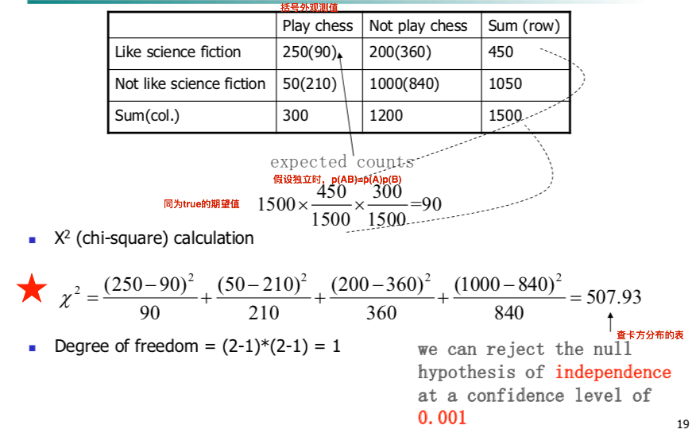
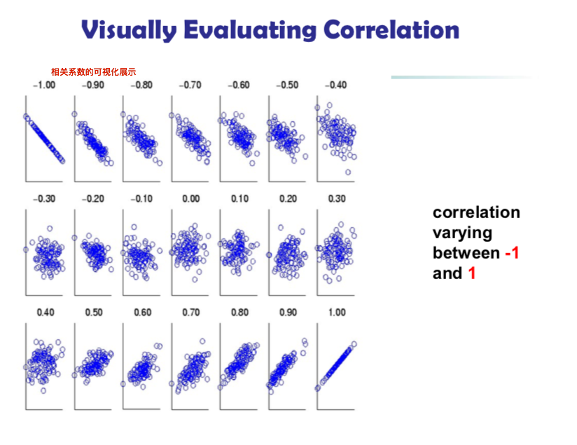
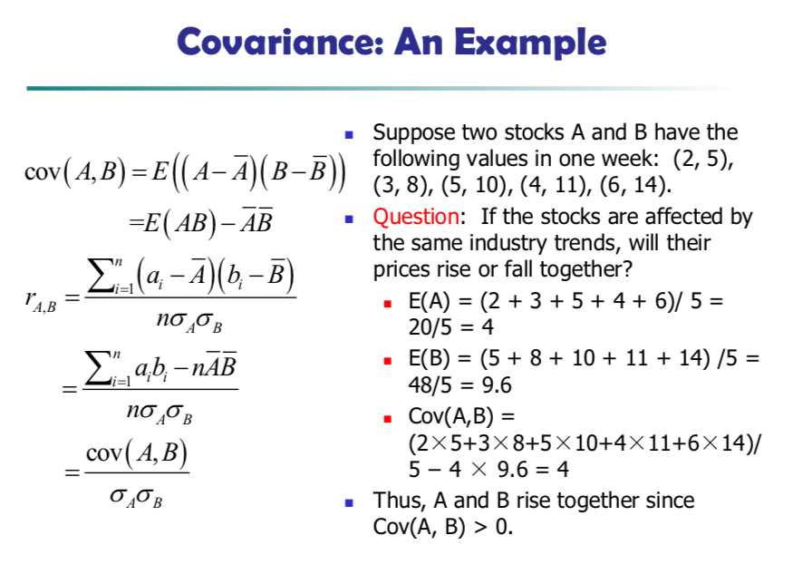
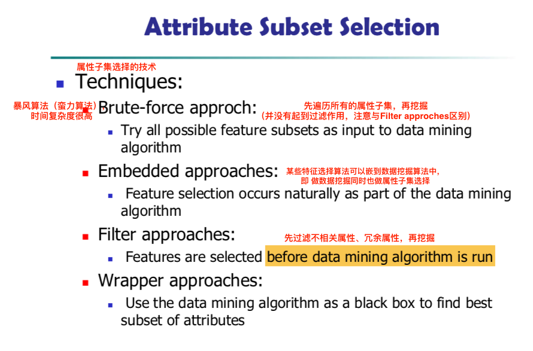
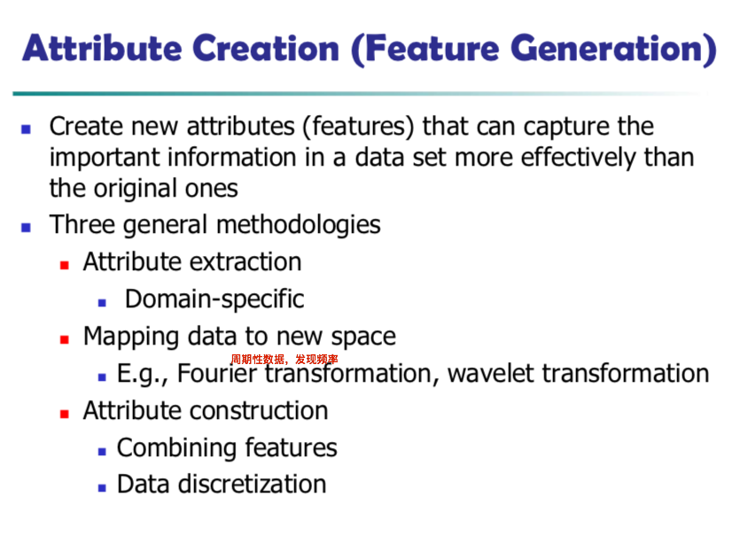

## Chapter 3. 数据预处理 

<h3 id='3.1.'>一、数据预处理(Data Preprocessing:An Overview)</h3>

1. 数据预处理的目的：提高数据质量；
2. 数据质量的衡量标准：**准确性(Accuracy)、完整性(Completeness)、一致性(Consistency)**、时效性(Timeliness)、可信度(Belivability)、可解释性(Interpretability)；
3. 数据预处理的主要工作：数据清理、数据集成、数据归约、数据变换与数据离散化

<h3 id='3.2.'>二、数据清理(Data Cleaning)--解决不准确、不完整、不一致</h3>

<h4 id='3.2.1.'>1. 填充 缺失属性值--数据不完整(Incompleteness)</h4>

1. 数据缺失（不完整）Missing Data情形：缺失属性值，缺失整个属性，只包含聚合数据...
2. 处理方法：
    1. 直接丢弃数据对象：可能会丢弃非缺失的、有价值的属性；
    2. 人工补全：
    3. 自动补全：
        1. 使用全局常量来补全："Unknown"或"-∞"；
            + 不要直接添0，因为0有时候是有意义的；
            + 当所有缺失值都用"Unknown"补全时，挖掘程序可能认为其是一个新的概念，效果不好；
        2. 使用所有数据对象的该属性的中心度量（均值、中位数、众数）来补全（一类数据情况）；
        3. 使用属于同一类的数据对象的该属性的中心度量（均值、中位数、重视）来补全（多类数据情况）；
        4. 使用最可能值来补全（贝叶斯公式、决策树）：

<h4 id='3.2.2.'>2. 平滑噪声数据--数据不准确(Inaccuracy)</h4>

1. 噪声Noise：属性测量值的随机误差与方差；
2. 处理方法：
    1. 分箱(Bining)：
        1. 排序数据，并分组数据至**等频率**的箱子；
        2. 在箱子内使用均值或中位数或箱子边界来平滑箱内数据，实现局部平滑；
    2. 回归(Regression)：使用回归函数来拟合数据，偏离回归函数的数据可以丢弃或者使用回归函数上的数据来平滑噪声；
    3. 聚类(Clustering)：检测并去除异常值，平滑噪声
    4. 半监督方法(Semi-supervised)：

<h4 id='3.2.3.'>3. 数据清理是一个不断反复迭代的过程</h4>

1. 数据清理步骤1--偏差检测(Data discrepancy detection)：
    + 使用元数据（数据的数据，例如数据的定义域、范围、依赖性、分布）检查；
    + 检查字段过载(Field overloading)：新属性的定义挤进已经定义的属性的未使用位；
    + 检查唯一性规则(Uniqueness rule)、连续性规则(Consecutive rule)、空值规则(null rule)；
    + 使用商业软件检查：
        + 数据清洗工具(Data scrubbing tools)：使用简单的领域知识来检查偏差；
        + 数据审计工具(Data auditing tools)：通过分析数据得到规则与联系来检查偏差；
2. 数据清理步骤2--数据变换(Data Transformation)：用以纠正偏差；
    + 数据迁移工具(Data migration tools)：
    + 抽取/变换/载入工具(Extraction/Transformation/Loading)：
3. 两个步骤迭代执行

<h3 id='3.3.'>三、数据集成(Data Integration)--解决不一致、冗余</h3>

<h4 id='3.3.1.'>1. 实体识别问题</h4>

1. 模式集成(Schema integration)：从不同数据源集成元数据有助于模式集成；
2. 对象匹配(Object matching)：
3. 实体识别(Entity identification)：从多个数据源中识别（或者说匹配）现实世界中的实体；

<h4 id='3.3.2.'>2. 数据值冲突的检测与处理</h4>

数据值冲突原因：不同表达式、不同编码、不同度量单位（例如，公制与英制）

<h4 id='3.3.3.'>3. 冗余和相关分析</h4>

<h5 id='3.3.3.1.'>3.1. 数据集成后，冗余来源：</h5>

1. 不同数据源的属性命名不一致；
2. 衍生属性(Derived attributes)：可从其他属性继承/衍生得到的属性；

<h5 id='3.3.3.2.'>3.2. 标称数据的相关分析Correlation Analysis(Nominal Attr)</h5>

使用[Pearson卡方$\chi^2$相关检验](https://baike.baidu.com/item/%E7%9A%AE%E5%B0%94%E6%A3%AE%E5%8D%A1%E6%96%B9%E6%A3%80%E9%AA%8C/22660784)(chi-squared test)：就是概率论里的假设检验，pearson卡方检验可用于独立性检验；

1. 零假设(Null hypothesis)：假设两个属性相互独立（或者不相关）；
2. 画两个属性的相依表（类似于离散随机变量的联合分布律）

    

3. 计算卡方检验(chi-squared test)值（回想卡方分布：n个iid标准正态随机变量的平方和）：卡方检验值的分布可近似于卡方分布

    $$\chi^2 = \sum_i^n \sum_j^n \frac{(O_{ij} - E_{ij})^2}{E_{ij}}$$
    
    + 观测频度$O_{ij}$：相依表中每格的数；
    + 期望频度$E_{ij}$：假设两个属性独立时，数据总数 * 联合概率（边缘概率连乘积）$E_{ij} = n * p_{ij} = n * p_i * p_j$；

4. 计算自由度：（属性A类别数-1）*（属性B类别数-1）；
5. 根据自由度、卡方值查表，判断能否拒绝假设：
    + 卡方值越大，越相关；
    + 对$\chi^2$值贡献最大的标称属性的类别是其观测频度（实际计数）与期望频度（期望计数）最不相同的类别；

<h5 id='3.3.3.3.'>3.3. 数值属性的相关分析Correlation Analysis(Numeric Attr)</h5>

使用[皮尔斯点乘（内积）相关系数](https://baike.baidu.com/item/%E7%9A%AE%E5%B0%94%E6%A3%AE%E7%9B%B8%E5%85%B3%E7%B3%BB%E6%95%B0/4222137)(Correlation coefficient, Pearson's product moment coefficient)：两个变量的线性相关程度

(右侧等式很容易推导)

$$r_{A,B} = \frac{\sum_{i=1}^n (a_i - \overline{A})(b_i - \overline{B})}{n \delta_A \delta_B} = \frac{\sum_{i=1}^n (a_i b_i) - n \overline{A} \overline{B}}{n \delta_A \delta_B}$$

+ n：数据量/样本数目；
+ $\overline{A}, \overline{B}$：是A、B属性的样本均值；
+ $\delta_A, \delta_B$：是A、B属性的样本标准差；
+ $\sum (a_i b_i)$：是A、B属性的叉乘；

Pearson相关系数>0, 两属性正相关；Pearson相关系数<0, 两属性负相关；Pearson相关系数=0，两属性独立

<h5 id='3.3.3.4.'>3.4. 数值属性的协方差分析Covariance Analysis(Numeric Attr)</h5> 

使用协方差(Covariant)：

$$Cov(A, B) = E[(A - \overline{A})(B - \overline{B})] = \frac{\sum_{i=1}^n (a_i - \overline{A})(b_i - \overline{B})}{n}$$

协方差与Pearson相关系数的关系：

$$r_{A, B} = \frac{Cov(A, B)}{\delta_A \delta_B}$$

协方差>0, 正相关；协方差<0, 负相关；协方差=0，不相关，但不说明独立，多元高斯分布情况下，不相关==独立；

<h3 id='3.4.'>四、数据归约(Data Reduction)--解决冗余-->降低计算量、减短分析时间、避免维数灾难</h3>

<h4 id='3.4.1.'>1. 维归约(Dimension Reduction)--降维</h4>

<h5 id='3.4.1.1.'>1.1. 属性子集选择(Attribute Subset Selection)</h5>

1. 降维手段：删除不相关属性（对数据挖掘任务无用的属性）与冗余属性（包含的信息与其他属性相冗余的属性）；
2. 属性子集选择的相关技术：
    1. Brute-force approaches（蛮力方法）：先遍历所有属性子集，再挖掘（并没有起到过滤作用，注意与Filter approaches区别）；
    2. Embedded approaches：嵌到数据挖掘算法中，即数据挖掘同时也完成属性子集选择；
    3. Filter approaches：先过滤不相关属性、冗余属性，再挖掘；
    4. Wrapper approaches：...

<h5 id='3.4.1.2.'>1.2. 属性构造(Attribute Creation)</h5>

构造的属性要比原属性更能表达数据集中重要信息；

<h5 id='3.4.1.3.'>1.3. 主成分分析(Principle Component Analysis</h5>
 
1. PCA背景：采集数据的方式决定原始数据集的维数（基），因此，数据维度往往存在冗余；
2. PCA目标：计算一组最小化误差向量的超平面的基来表示原向量；
    + 拓展：计算一组最小化误差向量的低相关性的向量组来表示原向量；
3. PCA思想：通过正交变换（线性的，正交矩阵, 特征值分解），将一组可能存在相关性的变量转换为一组（维数更低）线性不相关的变量；
    + 拓展：通过线性变换（伪逆矩阵？SVD?），将一组高维高相关性的变量转换为一组低维低相关性的变量；
4. 最小化误差向量的基的衡量标准：
    1. 最大化信噪比（，即最大化新基的方差）：选择前k个方差最大的方向为主成分；
    2. 最小化冗余度（，即最小化新基的协方差）：协方差表示两属性之间的线性相关程度（冗余程度）；
5. 算法实现：
    1. 数据去中心化：二阶中心矩变二阶原点矩—>协方差矩阵 = 数据矩阵内积；
    2. 计算协方差矩阵$C_X = \frac{1}{n}XX^T$；
    3. 对协方差矩阵$C_X$做特征值分解(拓展：SVD)-->对角化；
    4. 取前m个最大特征值的特征向量构成正交矩阵P；
    5. m的选取：能够保证协方差足够小；

<h4 id='3.4.2.'>2. 数量归约(Numerosity Redcution)--降数据量</h4>

<h5 id='3.4.2.1.'>2.1. 数量归约方法分类</h5>

1. 参数方法(Parametric methods)：**使用模型估计数据，进而存储模型参数来代替（存储）原始数据，使用模型参数再生数据。**例如，回归和对数线性模型(Log-linear models)；
2. 非参数方法(Non-parametric methods)：不使用模型；

<h5 id='3.4.2.2.'>2.2. 数量归约参数方法：回归</h5>

1. 回归定义：对一个或多个相互独立属性建模，来预测一个与上述属性相关的连续属性；
2. 使用回归进行数量归约思想：使用回归函数参数来替代原始数据；

<h5 id='3.4.2.3.'>2.3. 数量归约非参数方法：直方图</h5>

1. 分间隔规则：等宽度、等频；

<h5 id='3.4.2.4.'>2.4. 数量归约非参数方法：聚类</h5>

1. 使用聚类进行数量归约思想：使用聚类得到的每一个类的参数（例如，中心与直径）来替代原始数据；
2. 当聚类结果有重叠时效果不好；

<h5 id='3.4.2.5.'>2.5. 数量归约非参数方法：抽样</h5>

1. 必要性：降低数据量，有些算法的复杂度与数据量呈线性关系；
2. 抽样方法：
    1. 简单随机抽样(Simple random sampling, SRS):样本分布--iid-->总体分布；
        + 在有偏数据中表现不佳； 
    2. 无放回简单抽样(Simple sampling without replacement, SRSWOR)；
    3. 有放回简单抽样(Simple sampling with replacement, SRSWR)；
    4. 分层抽样(Stratified sampling)：先分组，再在组内简单随机抽样；
        + 通常用于有偏数据；

<h5 id='3.4.2.3.'>2.3. 数量归约非参数方法：数据立方</h5>

<h4 id='3.4.3.'>3. 数据压缩(Data compression)</h4>

<h3 id='3.5.'>五、数据变换与数据离散化(Data Transformation and Data Discretization)</h3>

变换方法：

1. 光滑(smoothing)：与数据清理中重叠，分箱、回归、聚类；
2. 属性构造(feature construction)：与数据归约重叠；
3. 聚集(aggregation)：
4. 规范化(normalization)：
    1. 最大-最小规范化
        $$v' = \frac{v-min_A}{max_A-min_A}(new\_max_A - new\_max_A)+new\_min_A$$
    2. z分数规范化
        $$v' = \frac{v - \mu_A}{\delta_A}$$
    3. 移小数点规范化
        $$v' = \frac{v}{10^j}$$
        + j是使得max(|v'|) < 1 的最小整数；
5. 离散化(discretization)：
6. 概念分层(concept hierarchical generation)：标称属性泛化至更高层的概念