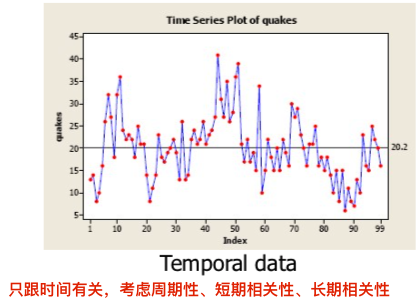
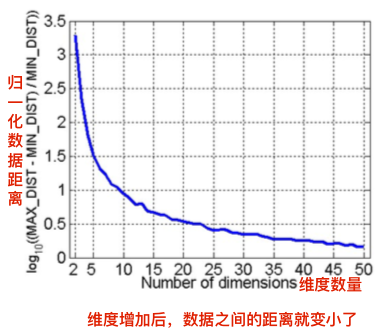
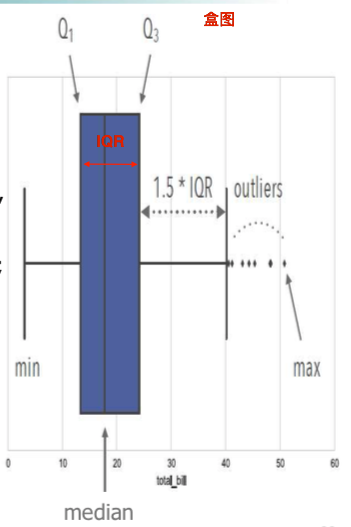
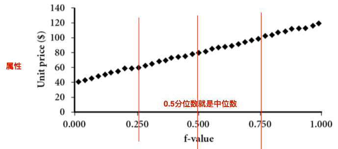

## Chapter 2. 认识数据

<h3 id='2.1.'>一、数据对象与属性类型(Data Objects and Attribute Types)</h3>

<h4 id='2.1.1.'>1. 数据集的类型</h4>

1. 记录record：
    1. 关系记录relational record：关系数据库的记录；
    2. 数据矩阵data matrix：矩阵处理；
    3. 文档数据document data：即第一手、纯文本、原始数据；
        PS: 可以将文档数据转换成词频向量(term-frequency vector)，通过每个词的词频可以一定程度判断数据类型；

          
    4. 事务数据transaction data：略

2. 图与网络数据graph and network：略
3. 有序数据ordered：
    1. 视频数据video data：图片序列；
    2. 时间数据temporal data：只跟时间有关，通常考虑周期性、短期相关性、长期相关性；
    
        
        
    3. 序列数据：如事务（交易类型）序列，例如电商购买顺序；
4. 空间、图像、多媒体数据：空间数据(spatial data)...

<h4 id='2.1.2.'>2. 结构化数据的重要属性</h4>

1. 维度的灾难：当数据的维度增加后，1、数据在其维度空间中就变得稀疏了（想象一下高维空间和点即可知）；2、数据之间的距离就变小了；

    

2. 结构化数据的重要属性：
    1. 稀疏性；
    2. 结果：得到的模式结果取决于数据粒度，不同粒度下得到的模式可能不同；
    3. 分布：中心位置和离散程度；

    

<h4 id='2.1.3.'>3. 数据对象</h4>

1. 含义：一个数据对象代表一个实体；
2. 别名：样本samples，例子examples，实例instances，数据点datapoints，对象objects，元组tuples

<h4 id='2.1.4.'>4. 数据属性</h4>

1. 含义：表示数据对象的一个特征的数据字段；
2. 别名：维度dimenstions，特征features，变量variables；
3. 属性类型：
    1. 标称属性nominal：表示类别、状态的，无序的，不定量的属性；
        1. PS: ID虽然是数字，但是ID只是用来区分（分类）数据对象，其数值大小和数学运算没有意义；
        2. 平均数、中位数无意义，众数有意义；
    2. 二元属性binary：只有0或1两种状态的标称属性；
        1. 对称二元属性：两种状态同样重要，0、1随意编码；
        2. 非对称二元属性：两种状态重要程度不同，用1编码更重要的状态，更关心1状态；
        3. 平均数、中位数无意义，众数有意义
    3. 序数属性ordinal：有序的、不定量的属性；
        1. 平均数无意义，中位数、众数有意义；
    4. 数值属性numeric：用整数或实数表示的、定量的属性；
        1. 区间标度属性interval-scaled：用相同尺度单位度量的、有序的（可加减）、无真实零点（不可乘除）的属性；
        2. 比率标度属性ratio-scaled：有序的（可加减）、有固定零点（可乘除）的属性；
        3. 平均值、中位数、众数有意义；
    5. 离散属性与连续属性

<h3 id='2.2.'>二、数据的统计描述方法(Basic Statistical Descriptions of Data)</h3>

可以了解数据归纳、总结的结果，以及分析异常值。

<h4 id='2.2.1'>1. 中心趋势度量：均值mean、中位数median、众数mode、中列数midrange</h4>

1. 均值mean（n表示样本大小，N表示总体大小）：

    + 总体的数学期望population mean:
    
        $$ \mu = \frac{1}{N} \sum_{i}^N x_i$$
        
    + 样本均值sample mean:
        
        $$ \overline{x} = \frac{1}{n} \sum_{i=1}^n x_i $$
        
    + 算术加权平均weighted arithmetic mean：均值受异常值影响大，算术加权平均对异常值影响小，截尾均值不受异常值影响；
    
        $$ \overline{x} = \frac{\sum_{i=1}^n w_i x_i}{\sum_{i=1}^n w_i} $$
    
    + 截尾均值trimmed mean：去掉异常值再求平均；
    
2. 中位数median：

    + 定义：数据属性量为奇数，则为中间值；数据属性量为偶数，则为中间两数值的平均值（对于数值数据而言，对于有序数据看课本`p31`）
    + **对于分组数值属性，中位数的估算方法**：当数据量很大时，中位数的计算开销很大，可以估算
    
        $$ median = L_1 + (\frac{n/2 - \sum_{l}freq_l}{freq_{median}}) * (L_2 - L_1) $$
        
        + 中位数区间：包含中位数频率的区间；
        + $L_1$：中位数区间下界；
        + $L_2$：中位数区间上界；
        + $L_2 - L_1$：中位数区间宽度；
        + $freq_{median}$：中位数区间频率；
        + $\sum_{l}freq_l$：中位数区间之前的区间频率和；

3. 众数mode：

    + 定义：出现最频繁的值；
    + n峰：数据集有n个众数；单峰unimodal，双峰bimodal，三峰trimodal；
    + 对于适度倾斜（非对称）的单峰数据，众数的经验公式（已知均值、中位数，估算众数）
    
        $$ mean - mode \approx 3 * (mean - median) $$
        
    + 对称数据与倾斜数据：正倾斜--众数小于中位数；负倾斜--众数大于中位数
    
4. 中列数midrange：最大值与最小值求均值

<h4 id='2.2.2.'>2. 散布情况：极差range、四分位数quartile、四分位数极差inter-quartile range、五数概括、奇异值outlier、方差variance、标准差stadard deviation</h4>

 1. 极差（范围）range：最大值 - 最小值；
 2. 四分位数quartile：主要使用4分位数，
     1. q分位数定义：第k个q分位数为x，则小于x的数据值最多为k/q，大于x的数据值最多为(q-k)/q，$k \in Z, 0 < k < q$；
 3. 四分位数极差inter-quartile range: $IQR = Q_3 - Q_1$；
 4. 五数概括five number summury：min、max、median、两个四分位数；
 5. 奇异值outlier：超出1.5倍IQR的数据值；
 6. 方差与标准差：
     + 总体方差：
     
        $$ \sigma^2 = \frac{1}{N} \sum_{i=1}^N(x_i-\mu)^2 $$
     
     + 样本方差：
     
         $$ s^2 = \frac{1}{n-1} \sum_{i=1}^n(x_i-\overline{x})^2 $$
         
     + PS: $\mu$是总体的期望；$\overline{x}$是样本均值；样本方差除的是n-1
 7. 正态分布3$\sigma$原则：0.68, 0.95, 0.997
 8. 中心极限定理：

<h4 id='2.2.3.'>3. 统计描述的可视化</h4>

1. 盒图boxplot：五数概括的可视化

    

    

2. 直方图histogram：能表示离散属性的概率分布，表示连续属性的概率分布的估计；

    1. 构建直方图：
        + 划分间隔：间隔宽度的选择很重要，不能太窄也不能太宽；
        + 计算间隔中的频率值
    2. 直方图比盒图提供更多信息：盒图相同时，直方图可能不同

    

3. 分位数图quantile plot：能表示单数据变量（属性）的概率分布，与cdf图是反过来的

    

4. QQ图quantile-quantile plot：两个属性的分位图，能表示和比较两个属性的概率分布；（当属性观测数量不同时该如何画qq图，请参阅`p35`）

    

5. 散点图scatter plot：表示两个数值变量（属性）是否存在联系、相关性、模式或趋势；
    
    

    

    

<h3 id='2.3.'>三、数据可视化(Measuring Data Similarity and Dissimilarity)</h3>

数据可视化的关键在于决定可视化何种数据属性，以及使用何种可视化技术；

<h4 id='2.3.1.'>1. 基于像素的可视化技术pixel-oriented visualization techniques</h4>

1. 数据集的n个维度（属性）创建n个窗口图，一个维度（属性）对应一个窗口图；
2. n个窗口图上对应位置的n个像素点表示一个数据对象；
3. 像素点的颜色表示属性的值；

    

4. 维数高了可以转着圈画；

    

<h4 id='2.3.2.'>2. 几何投影可视化技术geometric projection visualization</h4>

基于像素可视化技术--无法显示多维子空间稠密区域-->散点图矩阵--维数增加，不太有效-->平行坐标--无法有效表示大数据量的数据集-->

1. 散点图矩阵scatter plot matrix：主对角线为某属性直方图，其余为两属性的散点图；n维属性-->(n-1)x(n-1)维矩阵，剩下一维属性在图中用颜色区分；

    
2. Landscapes:

    

3. 平行坐标parallel coordinates：使用n个等距、平行的竖轴表示n个数据属性，横轴表示数值大小，一条线表示一个数据对象；

    

<h4 id='2.3.3.'>3. 基于图符的可视化技术icon-based visualization techniques</h4>

1. 切尔诺夫脸chernoff face：
2. 人物线条图stick figure：

<h4 id='2.3.4.'>4. 层次可视化技术hierarchical visualization techniques</h4>

层次可视化技术把所有维度划分成子集（子空间），这些子空间按层次可视化；

1. 维度嵌套dimensional stacking：大格子（部分维度）嵌套小格子（另一部分维度）
2. 世界中的世界world-within-world：
3. 树图tree map：

<h4 id='2.3.5.'>5. 可视化复杂对象和关系</h4>

1. 词云：用大小、颜色来表示频率大小，可以表示热门话题
2. 网络：节点大小、连线粗细、颜色

<h3 id='2.4.'>四、数据相似性与相异性的测量方法</h3>

如何衡量推荐系统中两个用户的购买习惯（数据对象）是否相似？

<h4 id='2.4.1.'>1. 相似性与相异性</h4>

1. 相似性similarity：0到1之间，值越大越相似；
2. 相异性dissimilarity：从0开始，值越大越不相似；
3. 邻近性proximity：表示相似性或相异性

<h4 id='2.4.2.'>2. 数据矩阵与相异性矩阵</h4>

1. 数据矩阵：两模，行表示数据对象，列表示数据属性，~~或者，行表示数据属性，列表示数据对象~~；
2. 相异性矩阵：单模，行列都是数据对象，元素为数据对象的距离；对称矩阵，也可用下三角矩阵表示；

<h4 id='2.4.3.'>3. 不同属性的相似性与相异性计算方法</h4>

使用属性来衡量数据对象的相似性与相依性

1. 标称类型属性的邻近性度量

    1. 方法一：不匹配率$d(i, j) = \frac{p-m}{p}$；简单匹配率$SMC = \frac{m}{p}$；p是属性总数，m是匹配的属性数；
    2. 方法二：将标称类型属性-->非对称二元属性编码（每一位代表一个类型，置1，其余位置0）-->非对称二元属性度量方法

2. 二元类型属性的邻近性度量

    1. 画两个数据对象的二元属性列联表；
    2. 对称二元相异性：$d(i, j) = \frac{r+s}{q+r+s+t}$；非对称二元相异性：$d(i, j) = \frac{r+s}{q+r+s}$；非对称二元相似性（Jaccard coefficient）：$sim(i, j) = 1 - d(i, j) = \frac{q}{q+r+s}$

3. 数值类型属性的邻近性度量

    1. z分数规范化数值属性：变成均值为0，方差为1的分布；
        
        $$z = \frac{x - \overline{x}}{s} \qquad or \qquad z = \frac{x - \overline{x}}{s_f}$$
        
        + $s$: 标准差，含平方项，对异常值敏感；
        + $s_f$: 平均绝对差$s_f = \frac{1}{n} \sum_{i}^n |x_i - \overline{x}|$，不含平方项，对异常值敏感度低
            
    2. 距离度量：本质上就是向量范数，一范数--曼哈顿距离，二范数--欧式距离，$l$范数--闵可夫斯基距离，无穷范数--上确界距离；
    3. 闵可夫斯基距离的属性：非负性，对称性，三角不等式

4. 有序类型属性的邻近性度量

    1. 转换成区间标度interval-scaled数值属性；
    2. 使用数值属性方法度量邻近性（规范化（映射到[0, 1]）$z_i = \frac{r_i - 1}{M - 1}$，计算闵可夫斯基距离）

5. 混合类型属性的邻近性度量

    1. 分别计算各种类型属性的相异性$d(x, y)^{(i)}$;
    2. 加权得到混合类型属性的邻近性度量：
        
        $$d(x, y) = \frac{\sum_{i=1}^p w_i d(x, y)^{(i)}}{\sum_{i=1}^p w_i}$$
        
        + 权重$w_i$可以是人为选择的，也可以是机器学习得到的；
 
6. 余弦相似度
     
    1. 当数据对象的属性维度非常大时，出现维度灾难，数据之间的距离变小，不再适合使用距离度量数据对象相异性，引入余弦相似性；
    2. 使用夹角而不是距离来度量相似度；   
    3. 余弦相似度：$s(x, y) = cos(\theta) = \frac{<x, y>}{||x|| ||y||}$
    4. 余弦距离：$d(x, y) = 1 - s(x, y)$
        
<h3 id='2.5.'>五、总结</h3>

<h3 id='2.6.'>六、相关链接</h3>

1. 可视化工具：
    + <https://www.tableau.com>
    + <https://seaborn.pydata.org>
    + <http://bokeh.pydata.org/en/latest/>