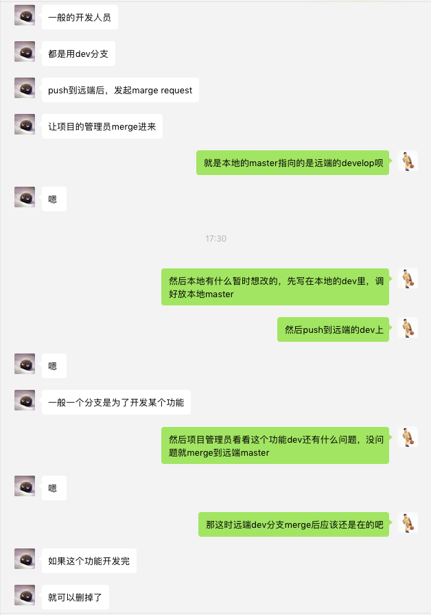

## Git学习笔记

### 一、Git基础---Git工作流

本地仓库由 git 维护的三棵“树”组成。第一个是你的 工作目录，它持有实际文件；第二个是 缓存区（Index），它像个缓存区域，临时保存你的改动；最后是 HEAD，指向你最近一次提交后的结果。

1. 工作目录working directory
2. 缓存区
3. 项目历史


> 事实上，第三个阶段是 commit history 的图。HEAD 一般是指向最新一次 commit 的引用。现在暂时不必究其细节。

### 二、Git基础--Git简单指令介绍与简单使用流程

1. 本地仓库创建:
    1. `git init`;
    2. `git clone`: 本地只clone远端develop分支，不能是主master分支, `-b`指定克隆某一分支;
2. 本地仓库配置:
    1. `git config`: 配置基本配置文件;
    2. 配置`.gitignore`文件;
3. 工作目录文件添加至缓存区：
    1. `git add`
4. 将未跟踪untracked的文件从工作目录中移除:
    1. `git clean`;
5. 查看工作目录、缓存区:
    1. `git status`;
6. 缓存区提交至项目历史：
    1. `git commit`;
7. 查看项目历史:
    1. `git log`;
8. 切换分支:
    1. `git checkout`;
9. 创建分支:
    1. `git branch`;
    2. `git checkout -b`;
10. 回滚:
    1. `git revert`: 回滚公有项目历史
    2. `git reset`: 回滚本机项目历史log、从缓存区移除特定文件不改变工作目录、工作目录、只影响被跟踪的文件
11. 本地分支合并: 
    1. `git merge`: 将本地测试分支develop_local与本地分支develop合并，再push
12. 与远端仓库交互：
    1. `git pull`: 从远端拉取;
    2. `git push`: 推送;
    3. 打开merge request（本地开发者向远端仓库发起merge request)
    4. 项目管理员将请求在远端合并

Git指令详情，请参考[git-recipes](https://github.com/geeeeeeeeek/git-recipes/wiki);

### 三、Git进阶---同步本地仓库与多个远程仓库

(下述两方法只能pull某一个远端仓库，但是能同时push多个远端仓库)

**方法一:** 通过`git remote add`与`git remote set-url add`;

```
D:\代码\Git\learngit
λ git remote  rm github

D:\代码\Git\learngit
λ git remote rm gitosc

D:\代码\Git\learngit
λ git remote add all https://gitee.com/hongdada/learngit.git

D:\代码\Git\learngit
λ git remote set-url --add all https://github.com/hongdada/learngit.git
```

达到一次性推送两个仓库效果：

```
D:\代码\Git\learngit
λ git push all --all
Counting objects: 2, done.
Delta compression using up to 4 threads.
Compressing objects: 100% (2/2), done.
Writing objects: 100% (2/2), 269 bytes | 0 bytes/s, done.
Total 2 (delta 0), reused 0 (delta 0)
To https://gitee.com/hongdada/learngit.git
   af6a587..48a0880  master -> master
Counting objects: 2, done.
Delta compression using up to 4 threads.
Compressing objects: 100% (2/2), done.
Writing objects: 100% (2/2), 269 bytes | 0 bytes/s, done.
Total 2 (delta 0), reused 0 (delta 0)
To https://github.com/hongdada/learngit.git
   af6a587..48a0880  master -> master
```

看到有2个推送说明

修改前打开项目.git文件夹内的config文件

```
[core]
    repositoryformatversion = 0
    filemode = false
    bare = false
    logallrefupdates = true
    symlinks = false
    ignorecase = true
[branch "master"]
    remote = gitosc
    merge = refs/heads/master
[branch "dev"]
[remote "github"]
    url = https://github.com/hongdada/learngit.git
    fetch = +refs/heads/*:refs/remotes/github/*
[remote "gitosc"]
    url = https://gitee.com/hongdada/learngit.git
    fetch = +refs/heads/*:refs/remotes/gitosc/*
```

 修改后查看
 
 ```
 [core]
    repositoryformatversion = 0
    filemode = false
    bare = false
    logallrefupdates = true
    symlinks = false
    ignorecase = true
[branch "master"]
[branch "dev"]
[remote "all"]
    url = https://gitee.com/hongdada/learngit.git
    fetch = +refs/heads/*:refs/remotes/all/*
    url = https://github.com/hongdada/learngit.git
 ```

**方法二:** 通过编辑git配置文件~/.git/config; 
 

修改配置文件为:

```
[core]
    repositoryformatversion = 0
    filemode = false
    bare = false
    logallrefupdates = true
    symlinks = false
    ignorecase = true
[branch "master"]
[branch "dev"]
[remote "all"]  
    url = https://github.com/hongdada/learngit.git  # 远端仓库url1
    url = https://gitee.com/hongdada/learngit.git   # 远端仓库url2
```


### 四、Git理解

