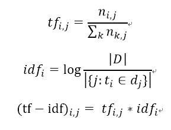
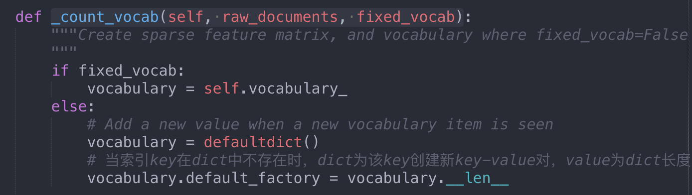
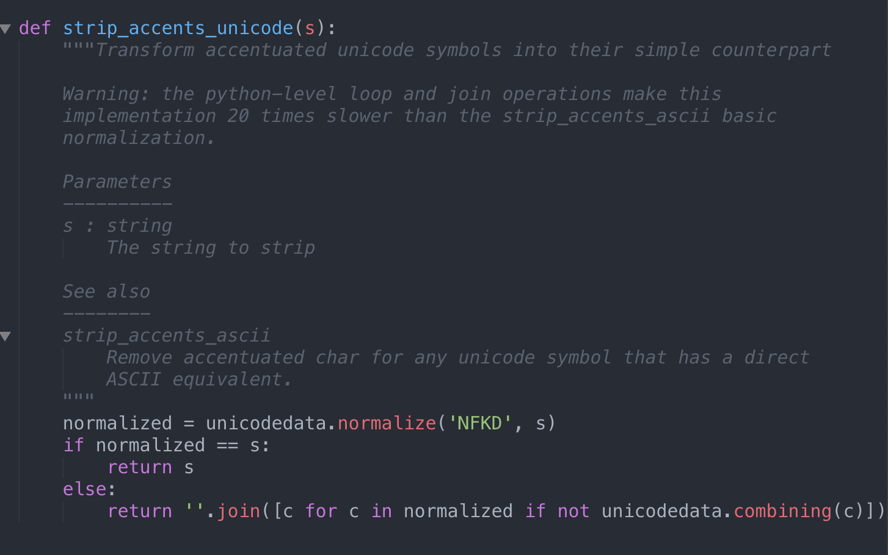
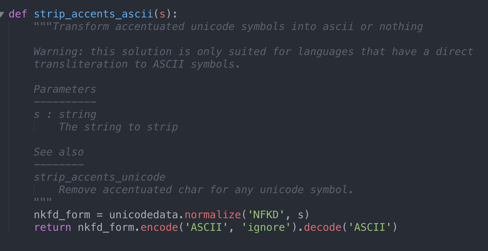
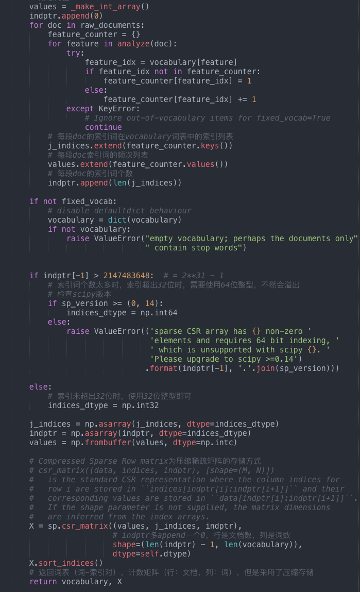

## sklearn源码笔记（一）--- feature_extraction.text

本文主要阅读词包模型和tf-idf词包模型在sklearn中的实现代码`CountVectorizer`和`TfidfVectorizer`

TF-IDF公式的计算是对两个部分进行乘积，第一个部分称为词频部分（即TF部分），表示文本中某个词在该文本中出现的频率，计算上是用该词在该文本中出现的次数除以该文本包含的词的个数；第二个部分称为逆文本部分（即IDF部分），表示在语料库中有多少篇文本包含了这个词，计算上是用总文本数除于含该词的文本数再取对数，两个部分的计算公式以及总的计算公式如下（i代表词语，j代表文本，(i,j)代表第j个文本的第i个词）：



`sklearn.feature_extraction.text.py`源文件包含一些函数和text vectorizer，text vectorizer主要为`VectorizerMixin`, `CountVectorizer`, `TfidfVectorizer`, `TfidfTransformer`, `HashingVectorizer`。`CountVectorizer`和`TfidfVectorizer`的基类包含`VectorizerMixin`。


源码阅读顺序：`CounterVectorizer.fit_transform(self, raw_documents, y=None)`-->`Vectorizer._validate_vocabulary(self)`--->`CountVectorizer._count_vocab(self, raw_documents, fixed_vocab)`--->`VectorizerMixin.build_analyzer(self)`(analyzer=='word'时，获取停止词，获得正则表达式，小写预处理、分词并去停止词)--->`Vectorizer.build_preprocessor(self)`（去重音符号或小写化或什么也不做）--->`VectorizerMixin.get_stop_words(self)`--->`VecotrizerMixin.build_tokenizer(self)`（获得正则表达式分词函数）--->`Vectorizer._word_ngrams(self, tokens, stop_words=None)`（去停止词，并ngram）


<h3>一、CountVectorizer._count_vocab(self, raw_documents, fixed_vocab)中的coding trick</h3>

当初始化时参数vocabulary为None时，即没提供固定词表时，使用collections包中的defaultdict类型来初始化空词表vocabulary，并且自动从输入文档中构建关键词集。

defaultdict类型字典与普通dict类型字典的不同：

1. 普通字典：当使用不存在的键进行索引时会抛出KeyError异常；
2. defaultdict：它的其他功能与dict相同，但会为一个不存在的键提供默认值；

当输入文档中存在一个新的单词/特征时，则为该新单词创建默认值--词表索引（当前词表字典的长度vocabulary.__len__），并返回该索引。



参考资料：[Python中的defaultdict方法](https://blog.csdn.net/u014248127/article/details/79338543)；


<h3>二、Vectorizer.build_preprocessor(self)中的coding trick</h3>

构建预处理时，若初始化参数strip_accents非None，则需要处理accetuated unicode symbols，使用unicodedata包中来实现





参考资料：[python unicodedata用法](https://blog.csdn.net/xc_zhou/article/details/82079753)


<h3>三、Vectorizer.build_tokenizer(self)中的coding trick</h3>

使用初始化参数token_pattern的正则表达式来分词，默认值为`r"(?u)\b\w\w+\b"`，表示匹配至少两个字母构成的单词;

1. \b 匹配单词的开始或结束;
2. \w 匹配字母或数字或下划线或汉字 等价于 ‘[A-Za-z0-9_]’。


参考资料：
1. [正则表达式 \w \d . \s常用字符的简写](https://blog.csdn.net/yy493004893/article/details/78580475)；
2. [sklearn: TfidfVectorizer 中文处理及一些使用参数](https://blog.csdn.net/blmoistawinde/article/details/80816179):jieba分词；


<h3>四、CountVectorizer._count_vocab(self, raw_documents, fixed_vocab)中的计数矩阵coding trick</h3>

在为每个单词计数并且构成词-文档矩阵时，由于词-文档矩阵是高度稀疏的，源码实现中使用了scipy.sparse包中的压缩稀疏行矩阵csr_matrix来存储词-文档矩阵，减少存储空间占用。

```
csr_matrix((data, indices, indptr), [shape=(M, N)])
 |  is the standard CSR representation where the column indices for
 |  row i are stored in ``indices[indptr[i]:indptr[i+1]]`` and their
 |  corresponding values are stored in ``data[indptr[i]:indptr[i+1]]``.
 |  If the shape parameter is not supplied, the matrix dimensions
 |  are inferred from the index arrays.
```




参考资料：
1. [sparse.csr_matrix矩阵的压缩存储](https://blog.csdn.net/sinat_22659021/article/details/78803647)；
2. [csr_matrix和csc_matrix简析](https://blog.csdn.net/sinat_33741547/article/details/79878547)；

