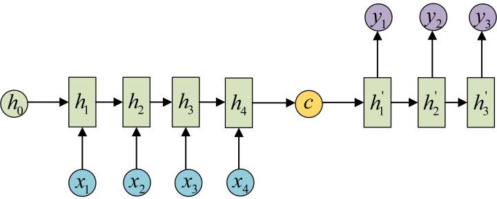

<h1>知识图谱理论篇(七) --Bi-GRU Word Attention模型、Entity-centric Attention模型远程监督关系抽取</h1>

<h2>1. 论文阅读 -- Improving Distantly Supervised Relation Extraction using Word and Entity Based Attention（2018年 AAAI）</h2>

1. introduction
    1. 远程监督存在误标注问题，导致数据集引入噪声，远程监督假说过于strong，Riedel et al. (2010); Hoffmann et al. (2011); Surdeanu et al. (2012)等研究放宽了DS assumption；
        1. Riedel et al. (2010) --> expressed-at-least-once assumption: 如果两个实体在知识库中存在关系r，则**至少一句**提及这两个实体的句子表达了关系r --> 多实例单标签学习multi-instance single-label learning；
        2. Hoffmann et al. (2011) --> 关系可能会重叠：一对实体e1，e2可能会存在多种关系 --> 多实例多标签学习multi-instance multi-label learning；
    2. Riedel2010数据集中50%的句子超过40个词，长句子中并不是所有词都对表达关系语义有贡献，因此词级别的注意力机制可提升关系抽取性能；
    3. 远程监督数据集中，存在at-least-one假设不成立的情况，即一个instance set中的所有instance都不表示关系r，这导致multi-instance learning失效，这在测试集中是致命的，阻碍正确评估；
    4. 论文贡献：
        1. 为解决at-least-one假设不成立情况，避免multi-instance learning失效，发布Google-IISC Distant Supervision dataset，保证每一个instance set中至少有一个instance表示指定关系r；
        2. 提出两个词级别注意力模型，Bi-GRU(word attention)和EA(entity-centric attetion)；
        3. 组合现有模型与新模型，提出一个weighted ensemble model；
2. 模型介绍：
    1. 基于Bi-GRU的词级别注意力模型（BGWA）：
        1. 核心思想：句子中的一些关键短语有利于关系抽取，BGWA利用词级别注意力机制来发现这些关键短语以学习更好的句子表示；
        2. 模型架构：
        3. 模型细节：
            1. 使用Bi-GRU编码句子中双向依赖语义，通过拼接两个GRU隐含层状态向量，学习更高级的、带有依赖语义的注意力之前的句子表示$S$、词表示$$w_i = [h^f_i, h^b_i] \in R^{1*g}, h^f_i, h^b_i \in R^{1 * (g/2)}$$；
            2. 词级别注意力机制：使用如下公式，计算词向量与关系的相关度，并计算softmax得到注意力权重$$u_i = w_i * A * r; a_i = \frac{exp(u_i)}{\sum_{j=1}^k exp(u_j)}; \hat w_i = a_i * w_i$$；
            3. 尽管基于注意力的模型大量使用加权求和来得到上下文嵌入，但是本文使用分段最大池化方法来保留实体对之前，之间，之后的结构属性$$s_1 = [\hat w_1; ...; \hat w_{p_1-1}],s_2 = [\hat w_{p_1}; ...; \hat w_{p_2}], s_3 = [\hat w_{p_2 + 1}; ...; \hat w_k]$$
            4. 最后句子表示为$$S_{wa} = <max(s_1), max(s_2), max(s_3)> \in R^{3*g}$$

    2. 以实体为中心的注意力模型(Entity-centric-Attention)：
        1. 核心思想：句子中的一些关键词能够提供实体类型信息，EA利用词级别注意力机制来发现这些关键词以学习更好的句子表示；
        2. 模型架构：
        3. 模型细节：
            1. EA模型由两部分组成：PCNN层和Entity Attention层；
            2. 

    3. Ensemble Model：
        1. 使用weighted voting来ensemble模型，模型的权重是通过线性回归学习到的；
        2. 同时实验了联合学习来ensemble模型，效果没有weighted voting ensemble好；
3. 远程监督关系抽取数据集--GIDS：远程监督关系抽取数据集是有噪的，**训练集中存在噪声是可以接受的，但是在测试集中存在噪声则是很麻烦的，这会导致不正确的评估**；
    1. 已有的远程监督关系抽取数据集的噪声统计：
        1. 引入噪声的两种因素：
            1. 知识库缺失关系事实(KB fact)导致误标注样例samples with incorrect labels due to missing KB fact；
            2. 语料库中缺乏表达该关系事实(KB fact)的实例句子samples with no instance supporting the KB fact；
            3. 两种因素引入的噪声例子：

        2. 噪声的几种情形：见文末表格，很重要；
        3. 上述因素引入了False Negative例子，正确的模型应该能够“错误”分类这些误标注数据，性能上表现为False Negative，但实际上是正确分类，如果训练的模型最终“正确”分类这些误标注数据，则说明得到的模型性能不好；
    2. GIDS数据集构建：
        1. 核心思想：保证每一个instance set中至少存在一个instance表示指定关系r;
        2. 构建流程：（本质就是将有监督数据集拓展成远程监督数据集，往里面加噪声）
            1. 选取[human-judege Google Relation Extraction corpus](https://ai.googleblog.com/2013/04/50000-lessons-on-how-to-read-relation.html)数据集作为基础，$D_{GRE} = {(x_i, e_{i1}, e_{i2}, r_i)}$（GRE是一个有监督的关系抽取数据集）
                1. GRE定义了5种关系(1) perGraduatedFromInstitution, (2) perHasDegree, (3) perPlaceOfBirth, (4) perPlaceOfDeath, and (5) none of the above (NA)
                2. GRE中一个关系事实包含5个句子，至少存在一个句子表示该关系，保证multi-instance learning不失效；
                3. GRE格式：
            2. 检索包含实体对$(e_{i1}, e_{i2})$的文档/网页，从文档/网页中摘取出包含实体对$(e_{i1}, e_{i2})$的不超过500词的文本片段(snippets)，构成文本片段集合$S_i = \{(s_i)\}$（这些文本片段可能表达关系r，也可能不表达关系r，引入DS噪声）；
            3. 将检索到的文本片段与GRE中的句子集合取并集$S_i^{'} = \{\{x_i\} \cup S_i \}$，用以构成新的instance set $B_i = \{(S_i^{'}, e_{i1}, e_{i2}, r_i)\}$，最后构成GIDS数据集$D_{GIDS} = \{  B_i \}$
        3. GIDS意义：无需额外的人工评估（现有数据集均采用top 1000置信预测的人工评估），直接使用held-out评估实现自动化评估；

4. 实验与结果：在GIDS和Riedel2010两个数据集上测试了词注意力模型、实体注意力模型和ensemble model；
    1. 评判准则：held-out evaluation，使用PR曲线评估模型性能；
    2. 模型超参数选择：
        1. 
        2. 

5. 相关工作：略
6. 总结：
    1. 模型很好blabla；
    2. 数据集很牛逼blabla；
    3. 未来还要研究将提出的几个词级别注意力模型与句子级别注意力相结合的模型；

<h2>附录 Native RNN</h2>

<h3>1. 引言</h3>

传统神经网络模型采用从输入层到隐含层再到输出层的结构，层间节点存在连接，层内节点无连接。这样的模型不具备记忆性，但处理序列数据时往往需要记忆性。

<h3>2. RNN</h3>

循环神经网络RNN是一种具有记忆能力，应用于序列数据的神经网络，隐含层层内节点可自连或互连，引入循环/记忆能力。该网络记忆前面的输入信息应用于当前输出的计算；

1. 结构图：
    1. 
2. 结构公式$h^t, y^t = f(h^{t-1}, x^t)$：
    1. 当前时刻状态$h^t$由上一时刻状态$h^{t-1}$与当前时刻输入$x^t$决定：$$h^t = \delta(w^h h^{t-1} + w^i x^t)$$
    2. 当前时刻输出$y^t$由当前时刻状态$h^t$决定（g为非线性激活函数）：$$y^t = g(w^o h^t)$$
3. 按时序展开：RNN可以按时序展开成一个多层神经网络；
    1. eg，对一个包含n个单词/时刻的输入语句，RNN可以展开成一个n层/时刻神经网络，每一层代表一个单词/时刻。
    2. 
4. 参数共享：
    1. RNN每一个时刻都共享模型参数$w^h, w^i, w^o$，减少网络需要学习的参数
    2. 为什么可以参数共享的简单理解:
        1. 对于一个句子或者文本，RNN模型参数可以看成是语法结构或者一般规律，而下一个单词的预测必须是上一个单词和一般规律或者语法结构向结合的。我们知道，语法结构和一般规律在语言当中是共享的，所以，参数自然就是共享的！
        2. 例1:演奏音乐时，乐器将力转成相应的震动产生声音，而整个演奏拥有一个主旋律贯穿全曲。其中乐器的物理特性就相当于参数，同一乐器在各个时刻物理特性在各个时刻都是共享的。其内在也有一个隐藏的主旋律基准（主题），旋律信息（上一个状态乘与主题）与音乐信息（输入称与参数）共同决定下一时刻的实际声音。
        3. 例2:捏陶瓷的例子可能更容易体会共享特性对于数据量的影响，不同角度相当于不同的时刻
            1. 若用前馈网络：网络训练过程相当于不用转盘，而是徒手将各个角度捏成想要的形状。不仅工作量大，效果也难以保证。
            2. 若用递归网络：网络训练过程相当于在不断旋转的转盘上，以一种手势捏造所有角度。工作量降低，效果也可保证。
    3. **CNN、RNN的参数共享**：
        1. **CNN是在空间上共享参数**；
        2. **RNN是在时间上（顺序上）共享参数**；
        3. 
5. RNN训练：反传Back Propagation Through Time(BPTT)
6. RNN架构：RNN并不是每一步都需要输入/输出，根据输入输出可以将RNN分成几种架构：
    1. 常用架构：图1是普通的单个神经网络，图2是把单一输入转化为序列输出。 图3是把序列输入转化为单个输出 图4是把序列转化为序列，也就是seq2seq的做法。 图5是无时差的序列到序列转化，可以作为普通得语言模型；
    2. **1 to N**:输入向量，输出序列。分两种情况
        1. 一种是只在序列开始进行输入
        2. 一种是把输入信息X作为每个阶段的输入
        3. 1toN的结构可以处理的问题有挺多的，比如图片标注，输出的X是图像的特征，而输出的y序列是一段句子或者从类别生成语音或音乐，输入的x是类别，输出的y是一串文字。
    3. **N to 1**:输入序列，输出向量。
        1. 这种结构通常用来处理序列分类问题。如输入一段文字判别它所属的类别，输入一个句子判断其情感倾向，输入一段文档并判断它的类别等等。
    4. **N to N**:输入/输出等长序列。
        1. 这种可以作为简单的Char RNN可以用来生成文章，诗歌，甚至是代码，非常有意思）。 
    5. **N to M**：又叫Encoder-Decoder模型，也可以称之为Seq2Seq模型。输入输出不等长序列。
        1. 在实现问题中，我们遇到的大部分序列都是不等长的，如机器翻译中，源语言和目标语言的句子往往并没有相同的长度。而Encoder-Decoder结构先将输入数据编码成一个上下文向量c，之后在通过这个上下文向量输出预测序列。
        2. 
        3. 
        4. seq2seq的应用的范围非常广泛，机器翻译，文本摘要，阅读理解，对话生成....，之后会找机会详细说明其中的知识，包括各种attention，不同结构等。
7. **RNN缺陷--长依赖问题**：
    1. 因为BPTT存在梯度消失或梯度爆炸，BPTT无法解决长时依赖问题(即当前的输出与前面很长的一段序列有关，一般超过十步就无能为力了)；

参考链接：
1. [全面理解RNN及其不同架构](https://zhuanlan.zhihu.com/p/34152808);

<h2>附录 LSTM及其变种GRU</h2>

<h3>1. 引言</h3>

LSTM，及其变种--GRU，是为解决Native RNN长依赖问题而提出的神经网络模型。

Native RNN可按时序展开成链式形式，其循环单元是单一的简单tanh层；

LSTM也可按时序展开成链式形式，其循环单元不再是单一神经网络层，而是四个神经网络层（三个“门”+tanh层）；

本文模型图的一些注释如下：

1. 箭头：一个结点的输出到另外的结点的输入；
2. 粉色的圆圈：结点操作，比如向量相加；
3. 黄色的长方形：神经网络层；
4. 线的合并代表链接concatenate，而箭头的分叉代表内容复制后流向不同的位置。

<h3>2. LSTM</h3>

1. 核心思想：
    1. 引入cell状态。cell状态贯穿所有时刻，在每一时刻只发生**小的线性改变**。cell状态像是一条传送带，信息流过这条线而不改变是非常容易的（可学习长期依赖），也就是下图中贯穿顶部的那条水平线。
    2. 使用**门结构**以移除或添加信息到cell状态。
        1. 门由一个sigmoid神经网络层和一个点乘操作组成
        2. sigmoid非线性输出一个[0, 1]区间的因子，点乘操作将因子作用于矩阵的每一个元素，以实现选择性移除/添加。
    3. cell状态使得模型可以学习长期依赖，门结构，即选择性的移除或添加，使得模型可以学习短期依赖；
2. 模型细节：
    1. LSTM第一步--选择遗忘cell状态的哪些信息
        1. 由**遗忘门**实现：sigmoid层，输入$h_{t-1}$和$x_t$，输出一个0和1之间的数。1代表“完全保留这个值”，而0代表“完全扔掉这个值”。$$f_t = \delta(W_f [h_{t-1}, x_t] + b_f)$$
        2. 
        3. 例子：对于一个基于上文预测最后一个词的语言模型。cell的状态可能包含当前主题的信息，来预测下一个准确的词。而当我们得到一个新的语言主题的时候，我们会想要遗忘旧的主题的记忆，应用新的语言主题的信息来预测准确的词。

    2. LSTM第二步--更新cell状态的部分信息；
        1. 由**输入门**和**tanh层**实现；
        2. **输入门**--“选择更新cell状态的哪些信息”：sigmoid层，输入$h_{t-1}$和$x_t$，输出一个0和1之间的数。1代表“完全更新这个值”，而0代表“不更新这个值”。$$i_t = \delta(W_i [h_{t-1}, x_t] + b_i)$$
        3. **tanh层**--“生成cell状态更新量$ \widetilde C_t$”：根据上一时刻状态与当前输入计算当前时刻cell状态的更新量$$\widetilde C_t = tanh(W_c [h_{t-1}, x_t] + b_c)$$
        4. 
        5. 例子：比如还是语言模型，可以表示为想要把新的语言主题的信息加入到cell state中，以替代我们要遗忘的旧的记忆信息。
    3. 一、二步综合更新cell状态：$$C_t = f_t * C_{t-1} + i_t * \widetilde C_t$$
    4. LSTM第三步--选择输出的内容：
        1. 由**输出门**和**tanh层**构成；
        2. 输出门--“选择输出哪些信息”：$$o_t = \delta(W_o [h_{t-1}, x_t] + b_o)$$；
        3. tanh层--“将cell状态数值压缩到-1和1之间”：$$h_t = o_t * tanh(C_t)$$；
        4. 

3. lstm如何避免梯度消失和梯度爆炸，如何解决长依赖问题？
    1. 先上两篇论文：`An Empirical Exploration of Recurrent Network Architectures``Empirical Evaluation of Gated Recurrent Neural Networks on Sequence Modeling.`
    2. 详细的说明请看上面的两篇论文，然后具体的来说，传统的RNN是用覆盖的的方式计算状态：$S_t = f(S_{t-1}, x_t)$，也就是说，这有点类似于复合函数，那么根据链式求导的法则，复合函数求导：设f和g为x的可导函数，则$(f \circ g)'(x) = f'(g(x))g'(x)$，他们是一种乘积的方式，那么如果导数都是小数或者都是大于1的数的话，就会使得总的梯度发生vanishing或explosion的情况，当然梯度爆炸(gradient explosion)不是个严重的问题，一般靠裁剪后的优化算法即可解决，比如gradient clipping（如果梯度的范数大于某个给定值，将梯度同比收缩），但是梯度消失做不到，这个时候就要用lstm了。
    3. 在lstm中，我们发现，状态S是通过累加的方式来计算的，$S_t = \sum_{\tau=1}^t \Delta S_{\tau}$。那这样的话，就不是一直复合函数的形式了，它的的导数也不是乘积的形式，这样就不会发生梯度消失的情况了。

<h3>3. GRU</h3>

1. 核心思想：
    1. 组合了遗忘门和输入门到一个单独的“更新门”中；
    2. 合并了cell state和hidden state；
    3. GRU比标准LSTM模型更简单，需要学习的参数更少；
2. 模型细节：
    1. 更新门--“选择遗忘hidden状态的哪些信息，选择更新hidden状态的哪些信息”（两者是对偶的）：sigmoid层，输入$h_{t-1}$和$x_t$，输出一个0和1之间的数。$$z_t = \delta(W_z [h_{t-1}, x_t])$$
    2. 重置门--“选择hidden状态的哪些信息来计算hidden状态更新量”：$$r_t = \delta(W_r [h_{t-1}, x_t])$$
    3. tanh层--“计算候选隐藏层（candidate hidden layer）/hidden状态更新量”：候选隐藏层 和LSTM中的 $\tilde{c}_t$ 是类似，可以看成是当前时刻的新信息，其中 $r_t$ 用来控制需要保留多少之前的记忆来计算候选隐藏层，比如如果 $r_t$ 为0，那么 $\tilde{h}_t$ 只包含当前词的信息：$$\widetilde h_t = tanh(W_h [r_t * h_{t-1}, x_t])$$
    4. 综合上述更新hidden状态：$z_t$ 控制需要从前一时刻的隐藏层 $h_{t−1}$ 中遗忘多少信息，需要加入多少当前 时刻的隐藏层信息 $\tilde{h}_t$ ，最后得到 $h_t$ ，直接得到最后输出的隐藏层信息， 需要注意这里与LSTM的区别是GRU中没有output gate：$$h_t = (1-z_t)*h_{t-1} + z_t * \tilde h_t$$

> 一般来说那些具有短距离依赖的单元reset gate比较活跃（如果 $r_t$ 为1，而 $z_t$ 为0 那么相当于变成了一个标准的RNN，能处理短距离依赖），具有长距离依赖的单元update gate比较活跃。

参考链接：
1. [深入理解lstm及其变种gru](https://zhuanlan.zhihu.com/p/34203833);
2. [Illustrated Guide to LSTM’s and GRU’s: A step by step explanation](https://towardsdatascience.com/illustrated-guide-to-lstms-and-gru-s-a-step-by-step-explanation-44e9eb85bf21);
3. [LSTM和GRU的解析从未如此清晰（动图+视频）](https://blog.csdn.net/dqcfkyqdxym3f8rb0/article/details/82922386);
4. [Understanding LSTM Networks](http://colah.github.io/posts/2015-08-Understanding-LSTMs/);
5. [LSTM_RNN_Tutorials_with_Demo](https://github.com/omerbsezer/LSTM_RNN_Tutorials_with_Demo);

<h2>附录 True Positive、False Positive、True Negative、False Negative、Precision、Recall、F1与ROC曲线、PR曲线</h2>

1. 不平衡数据：
    1. 例如：一个产品生产的不合格产品数量会远低于合格产品数量。信用卡欺诈的检测中，合法交易远远多于欺诈交易。这时候，**准确率Accuracy的度量会出现一些问题，因为她把每个类都看得同等重要**。例如，1%的信用卡交易是欺诈行为，则预测每个交易都是合法的模型有99%的**准确率Accuracy**，它也可能检测不到任何欺诈交易。
2. 混淆矩阵
    1. **在不平衡数据中，稀有类比较有意义，对于二元分类，稀有类通常记为正类，而多数类被认为是负类。**下面显示了**混淆矩阵**：
3. 根据混淆矩阵，分类器分类结果分为以下4种：
    1. 真正（true positive，TP）：实例是正类且被预测成正类；
    2. 假正（false positive，FP）：实例是负类且被预测成正类；
    3. 真负（true negative，TN）：实例是负类且被预测成负类；
    4. 假负（false negative，FN）：实例是正类且被预测成负类；
4. 根据4种分类结果，我们可以得到如下针对不平衡数据的分类器评价标准：
    1. 真正率（true positive rate，TPR）或灵敏度（sensitivity）或召回率(Recall)：正例中有多少被正确预测为正例$$TPR=\frac{TP}{TP+FN}=\frac{(++)}{(++)+(+-)}$$
    2. 真负率（true negative rate，TNR）或特指度（specificity）：负例中有多少被正确预测为负例$$TNR=\frac{TN}{TN+FP}=\frac{(--)}{(--)+(-+)}$$
    3. 假正率（false positive rate，FPR）：负例中有多少被错误预测为正例$$FPR=\frac{FP}{TN+FP}=\frac{(+-)}{(--)+(-+)}$$
    4. 假负率（false negative rate，FNR）：正例中有多少被错误预测为负例$$FNR=\frac{FN}{FN+TP}=\frac{(-+)}{(-+)+(++)}$$
    5. 精度（precision）：预测为正的例子中有多少是真正的正例$$p=\frac{TP}{TP+FP}=\frac{(++)}{(++)+(-+)}$$
    6. 召回率（recall）即为真正率：正例中有多少被正确预测为正例$$r=\frac{(TP)}{(TP)+(FN)}=\frac{(++)}{(++)+(+-)}$$
    7. F1 统计量：F1 是召回率和精度的调和平均数，F1 趋近于它们之间的较小值，因此，一个高的 F1 确保精度和召回率都高。$$F_{1}=\frac{2rp}{r+p}=\frac{2\times TP}{2\times TP+FP+FN}=\frac{2}{\frac{1}{r}+\frac{1}{p}}$$
5. 接受者操作曲线（ROC）：是真正率和假正率取折中的一种图形化方法。真正率为 y 轴，假正率为 x 轴。
    1. ROC的几个关键点：
        1. 坐标原点（TPR=0,FPR=0）:把所有的都预测为负
        2. 右上角点（TPR=1,FPR=1）:把所有的都预测为正
        3. 左上角点（TPR=1,FPR=0）:理想模型。只要是正的，都预测为正。
    2. 一个好的分类器，尽量靠近左上角，随机猜想为对角线。
    3. 
    4. ROC曲线绘制方法：按正样本概率从高到低排序样本结果，将分类器阈值设为正样本概率最大的的正样本的概率，依次选取样本并将阈值降为选取样本的正样本概率，并更新TPR和FPR，直到遍历完所有样本；
6. PR曲线：Precision Recall曲线，PR曲线用来衡量分类的性能，纵坐标为Precision，横坐标为Recall。
    1. PR曲线绘制方法：按正样本概率从高到低排序样本结果，将分类器阈值设为正样本概率最大的的正样本的概率，依次选取样本并将阈值降为选取样本的正样本概率，并更新Precision和Recall，直到遍历完所有样本；

参考链接：
1. [分类（6）：不平衡和多分类问题](https://www.jianshu.com/p/15185f0ecb57);
2. [多分类ROC曲线](https://blog.csdn.net/u011047955/article/details/87259052);
3. [ROC曲线、PR曲线](https://www.cnblogs.com/houkai/p/3330061.html);

<h2>附表  噪声的几种情形</h2>

| 本体关系定义（schema级别） | 关系事实 | 误标注情况 | 导致因素 |
| --- | --- | :-- | :-- |
| a, b只有一种A关系 | (a, A, b)存在 | 将(a, NA, b)的instance误标注成(a, A, b)；正确的分类器应仍可正确分类成(a, NA, b)，引入False Negative samples | (samples with no instance supporting KB fact) |
| a, b只有一种A关系 | (a,A,b)不存在 | 将(a, A, b)的instance误标注成(a, NA, b)；正确的分类器应仍可正确分类成(a, A, b)，引入False Negative samples | (samples with incorrect labels due to missing KB fact) |
| a, b有多种A、B关系 | (a, A, b)存在 (a, B, b)不存在 | 将(a, B, b)的instance误标注成(a, A, b)；正确的分类器应仍可分类成(a, B, b)，同引入False Negative samples | (samples with no instance supporting KB fact & smaples with incorrect labels due to missing KB fact) |