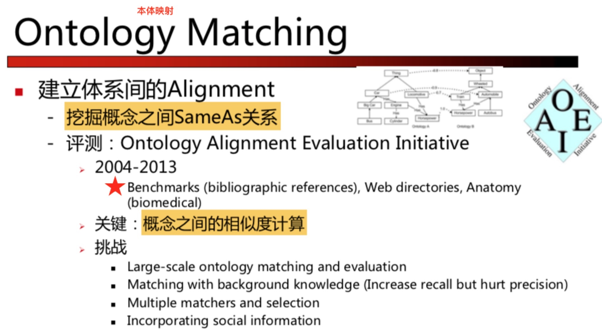
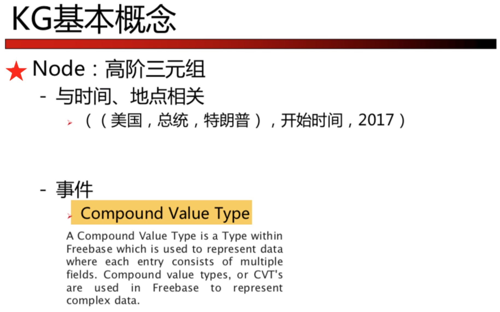
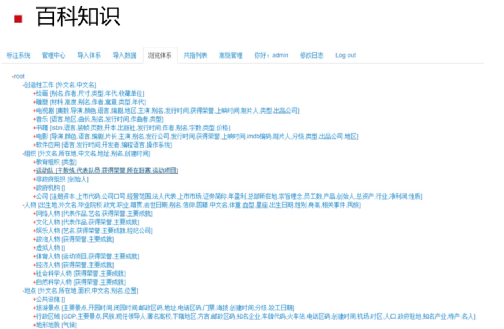
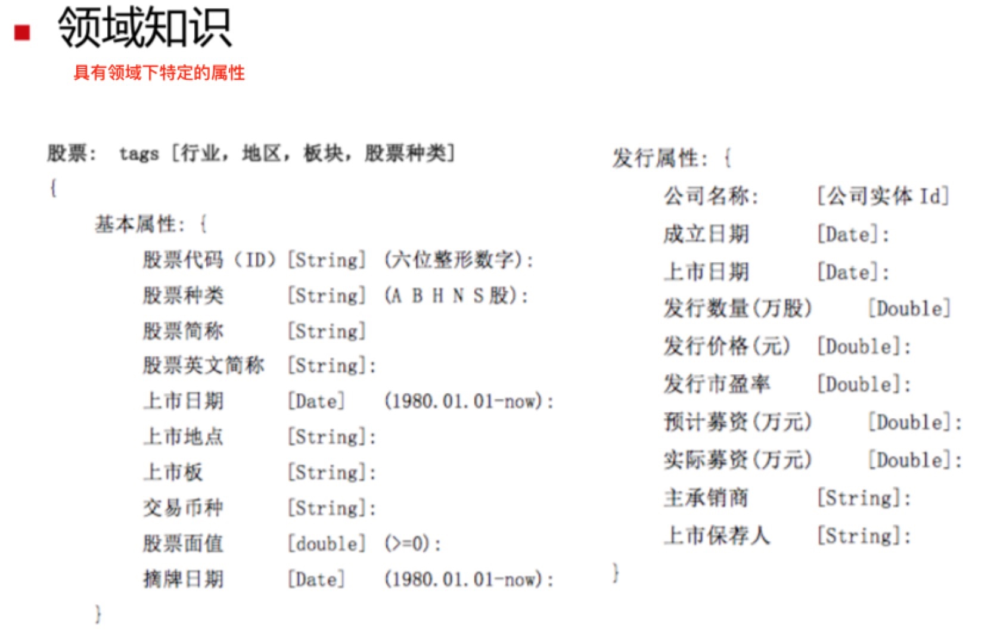
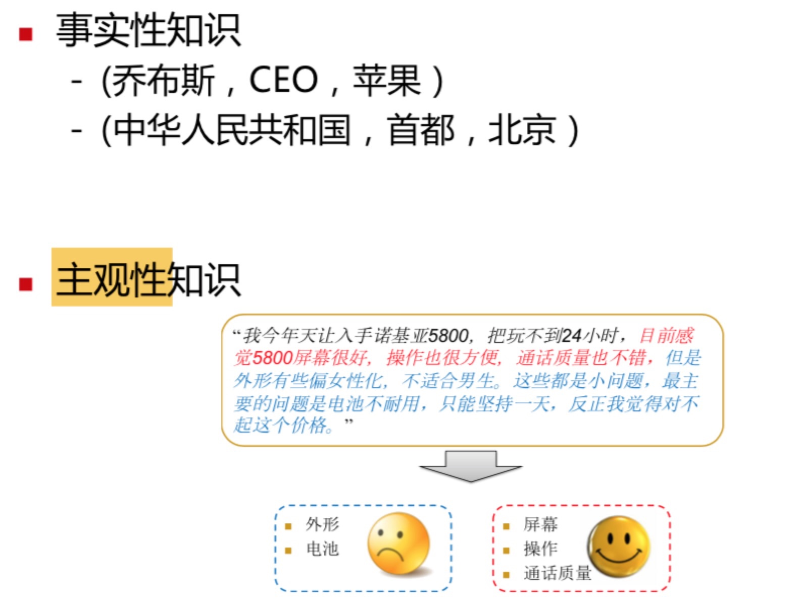
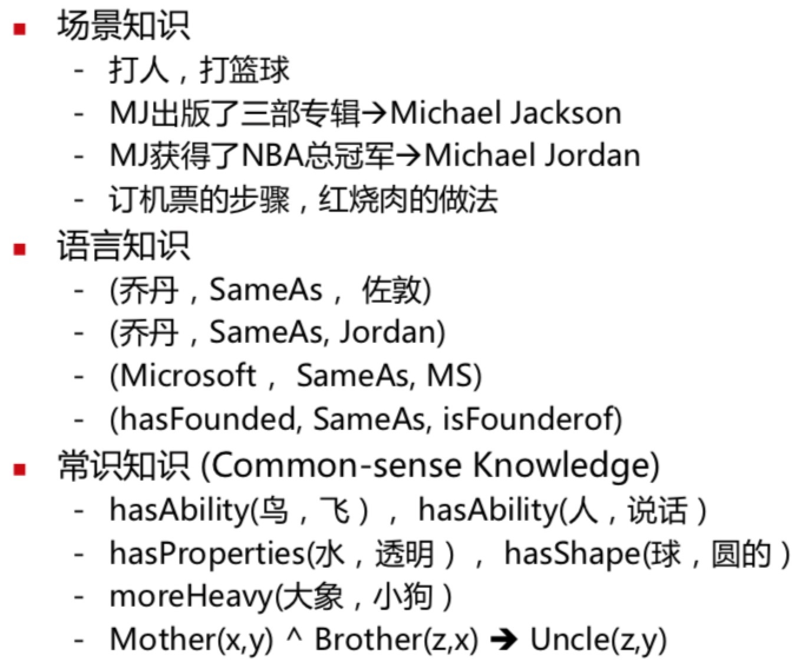
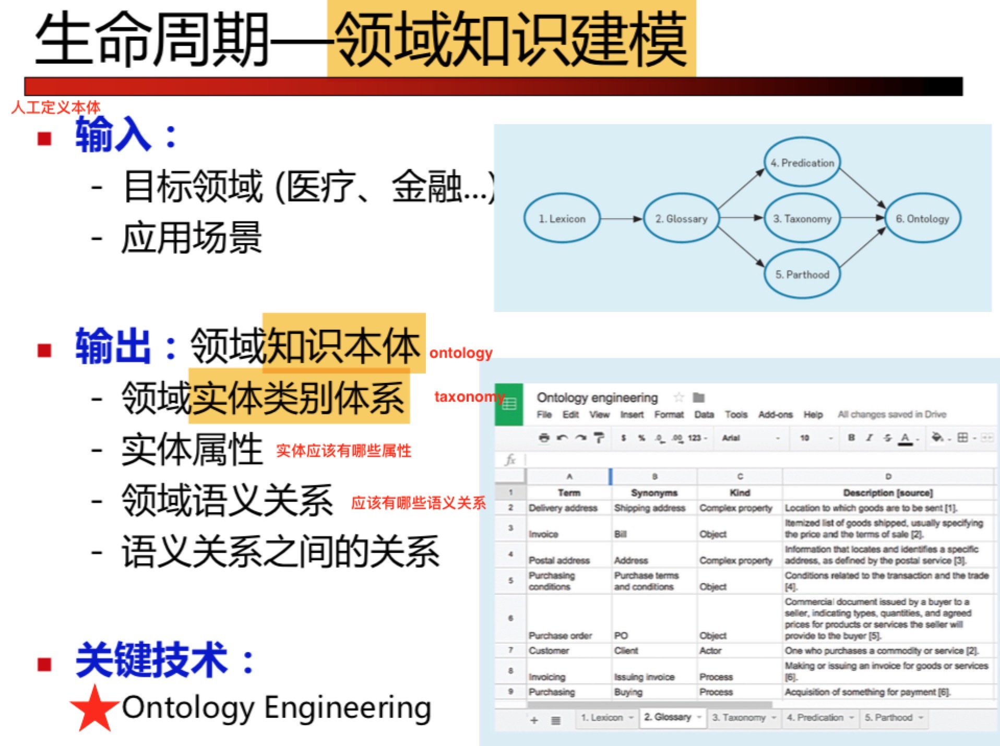
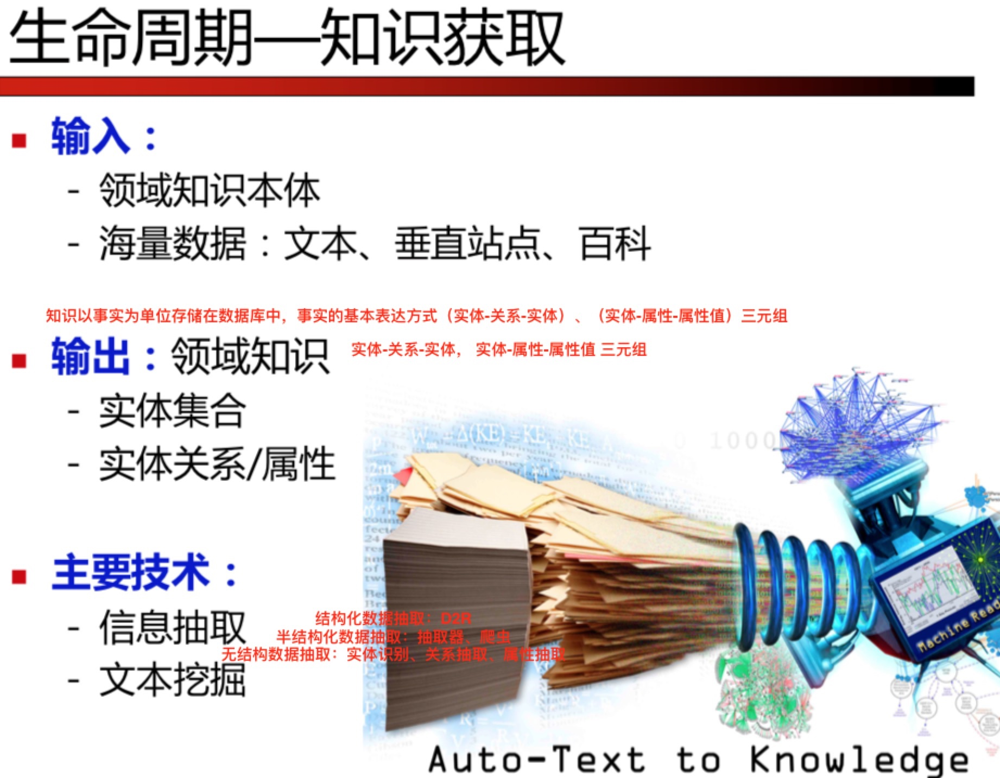
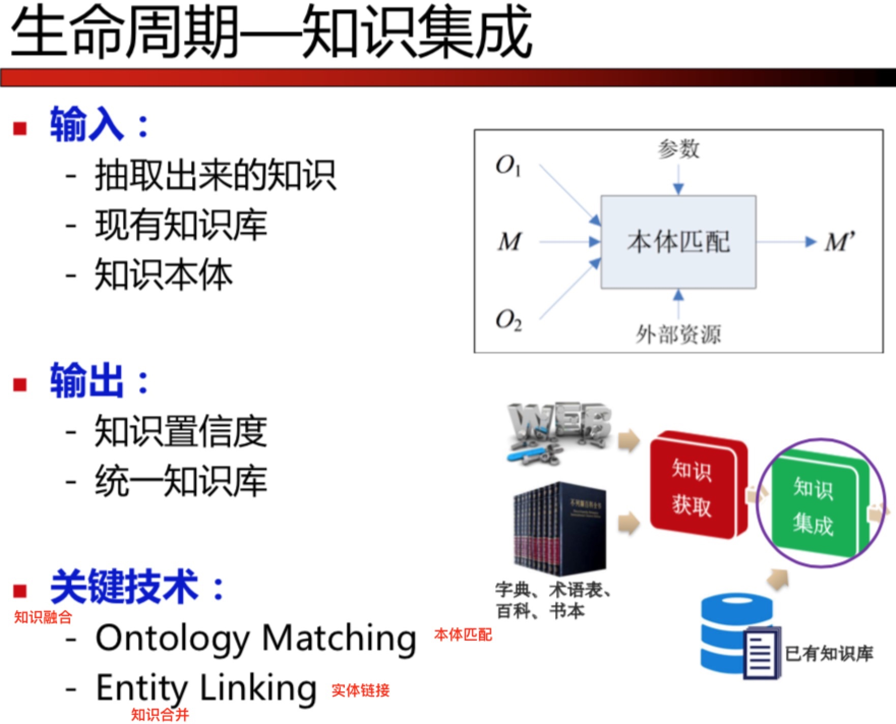
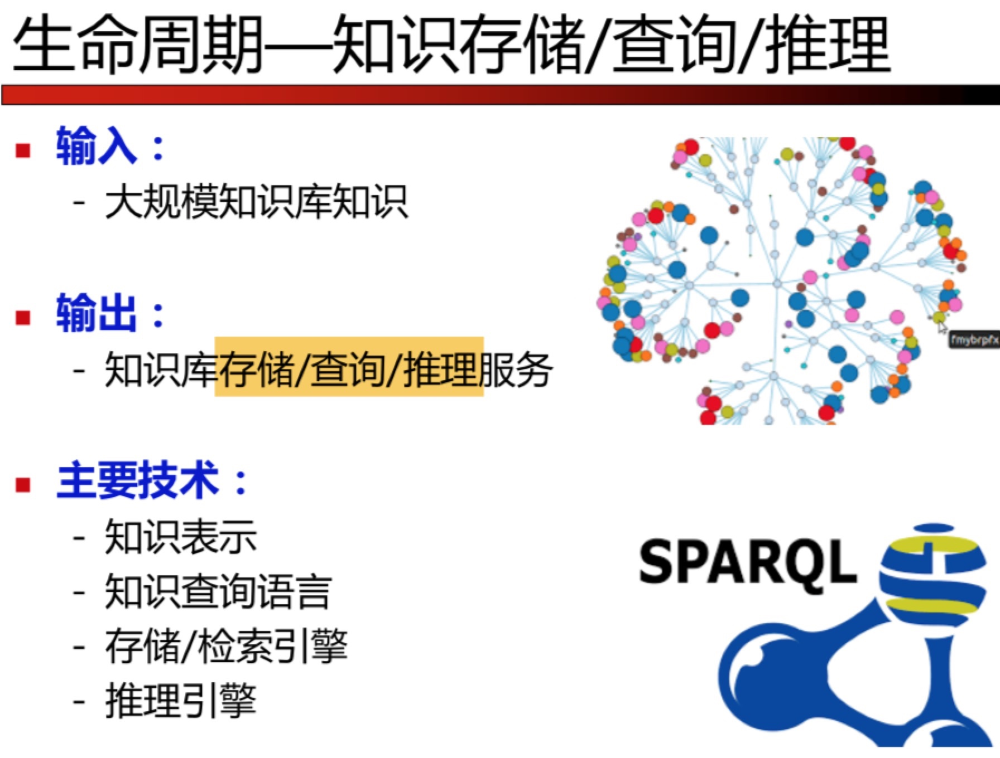

<h1>知识图谱理论篇（三）--刘康：知识图谱导论</h1>

学习中科院自动化所刘康博士在CCKS 2017讲习班上的讲义，学习知识图谱导论

<h2>知识图谱基本概念</h2>

<h3>知识体系组织形式</h3>

1. **本体**与**知识库**：
    1. 本体：本体是对概念建模的规范，以形式化方式明确定义概念及其之间的联系；
    2. 知识库：服从本体控制的知识单元的载体；
    3. eg, 本体类似蛋糕的磨具，知识库类似于蛋糕；
2. 本体分类：
    1. Formal Ontology：大量使用公理；
    2. Lightweight Ontology：不用或很少使用公理；
3. 知识体系分类：
    1. 本体Ontology：
        1. 树状结构，不同层节点之间--严格的IsA关系；
        2. 优：适用于知识推理；
        3. 缺：无法表示概念的二义性；
    2. Taxonomy：
        1. 树状结构，不同层节点之间--非严格的IsA关系；
        2. 优：表示概念的二义性；
        3. 缺：不适用于知识推理；
    3. 开放分类Folksonomy：
        1. 类别标签，更加开放；
        2. 优：涵盖更多的概念；
        3. 缺：如何进行标签管理；
4. 现状：目前的知识资源多是采用Folksonomy与Taxonomy相结合的组织形式；
    1. 问题：覆盖类别少；标签存在冗余、不规范、缺乏关联；类别属性定义不统一；
    2. 本体映射Ontology Matching：

<h3>知识图谱的组成单元</h3>

1. 节点：
    1. 概念(Concept)；
    2. 领域(Domain/Topic)；
    3. 实体/实例(Entity/Objects/Instance)；
    4. 值(Value)：
        1. 实体(Entity)：eg，（**姚明**，出生地，**上海市**）；
        2. 字符串(String)：eg，（北京大学，学术传统，**兼容并包、思想自由**）；
        3. 数字(Number)：eg，
            1. （北京市，面积，**1.641万**）；
            2. （姚明，体重，**140公斤**）；
            3. （姚明，身高，**2.29米**）；
        4. 时间(Date)：eg，（姚明，出生年份，**1981年**）；
        5. 枚举(Enumerate)：eg，（姚明，性别，**男**）；
    5. 高阶三元组：

2. 边：
    1. 关系：
        1. 包括Subclass, Type, Relation, Property/Attribut...
        2. 分类：Taxonomic Relation和Non-taxonomic Relation
            1. Taxonomic Relation：概念之间的上下位，eg，is-a/Hypernym-Hyponym
            2. Non-taxonomic Relation：概念之间的相互作用，eg，Meoronymy部分整体，Thematic roles论旨角色，Attribute属性，Possession领属，Casuality因果

<h3>知识分类</h3>

1. 百科知识&领域知识：
    1. 
    2. 
2. 事实性知识&主观性知识：
    1. 
3. 场景知识&语言知识&常识知识：
    1. 

<h2>知识图谱的生命周期(构建过程)</h2>

1. 知识建模--建模领域知识结构
    1. 

2. 知识抽取--获取领域内的事实知识
    1. 

3. 知识融合--估计知识的可信度，将碎片知识组装成知识网络
    1. 

4. 知识存储--提供高性能知识服务
    1. 

<h2>知识图谱表示与推理</h2>

<h2>基于符号的知识表示与推理</h2>

<h2>基于分布式的知识表示与推理</h2>

