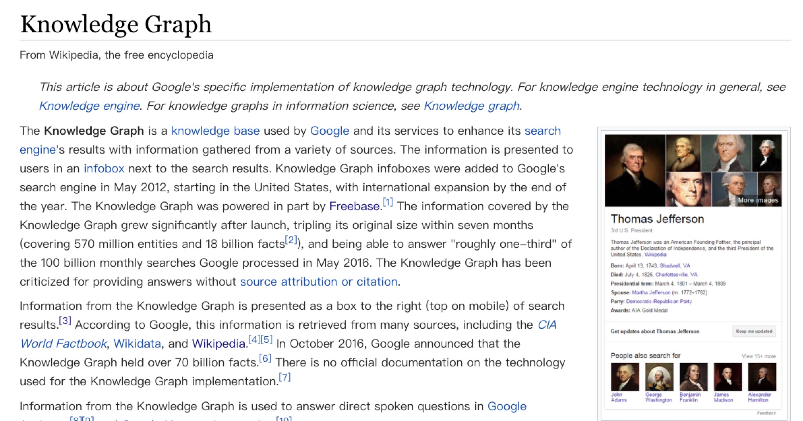
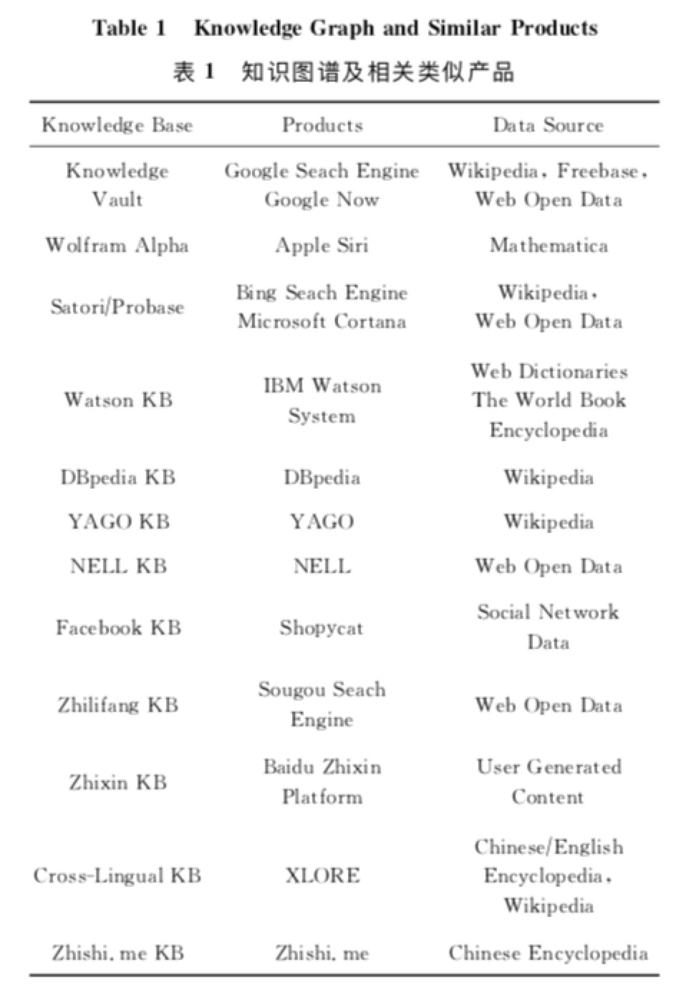
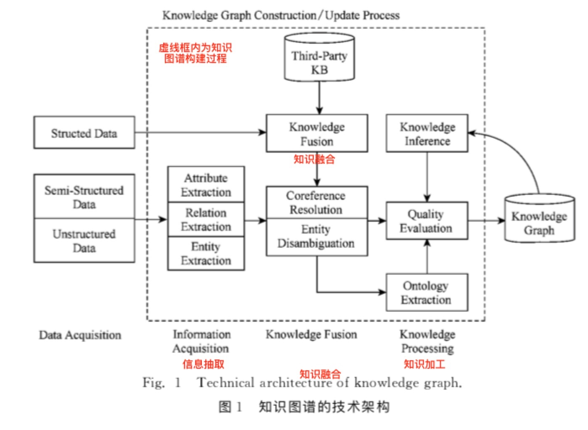

<h1>知识图谱学习(一)--知识图谱构建技术综述</h1>

阅读CNKI上的知识图谱中文综述性论文来学习知识图谱， 知识图谱构建技术综述是一篇2016年的综述性论文，在技术方面可能存在滞后。

<h2>知识图谱简介</h2>

1. Web技术发展：网页的链接(Web 1.0) --> 数据的链接(linked data) --> Web之父Berners-Le[1]设想中的语义网络(semantic Web)
2. 知识图谱前世：2006年 ，Berners-Lee提出数据链接(linked data)的思想，呼吁推广和完善相关 的技术标准如URI(uniform resource identifier)，RDF(resource description framework)，OWL(Web ontology language)，为迎接语义网络时代的到来做好准备；
3. 知识图谱的概念是由谷歌公司提出的。2012年5月17日，谷歌发布知识图谱项目，并宣布以此为基础构建下一代智能化搜索引擎；
    1. 关键技术包括从互联网的网页中抽取出实体及其属性信息，以及实体间的关系；
    2. 

4. 中文知识图谱发展：
    1. 商业应用：百度知心、搜狗知立方；[百度知识图谱](https://tupu.baidu.com/xiaoyuan/)；[搜狗知识图谱-任务关系](https://www.sogou.com/tupu/person.html)；
    2. 学术界：清华大学--第1个大规模[中英文跨语言知识图谱XLore](https://xlore.org/?lang=cn)、中国科学院计算技术研究所--基于开放知识网络(OpenKN)的“人立方、事立方、知立方”原型系统、中国科学院数学与系统科学研究院陆汝钤院士--知件(Knowware)、上海交通大学--中文知识图谱研究平台[zhishi.me](http://zhishi.me/)、复旦大学GDM实验室--中文知识图谱项目(现在的[知识工场](http://kw.fudan.edu.cn/))等；
    3. 国内也涌现出一些知识图谱产品和应用，如搜狗的知立方，侧重于**图的逻辑推理计算**，能够**利用基于语义网三元组推理补充实体数据**，**对用户查询进行语义理解以及句法分析**等;
    4. 

<h2>知识图谱定义</h2>

1. 定义1.知识图谱是结构化的语义知识库，用于以符号形式描述物理世界中的概念及其相互关系。其**基本组成单位是“实体-关系-实体”三元组，以及实体及相关属性-值对**，实体间通过关系相互联结，构成网状的知识结构；
2. 定义1包含3层含义: 
    1. 知识图谱本身是一个**具有属性的实体通过关系链接而成的网状知识库**。从图的角度来看，知识图谱在本质上是一种**概念网络**，其中的节点表示物理世界的实体(或概念)，而实体间的各种语义关系则构成网络中的边。由此，知识图谱是对物理世界的一种符号表达.
    2. 研究价值：知识图谱是构建在当前Web基础之上的一层覆盖网络(overlay network)，在Web网页之上建立概念间的链接关系，以最小的代价将互联网中积累的信息组织起来，成为可以被利用的知识.
    3. 应用价值：知识图谱能够改变现有的信息检索方式，一方面通过推理实现概念检索(相对于现有的字符串模糊匹配方式而言);另一方面以图形化方式向用户展示经过分类整理的结构化知识，从而使人们从人工过滤网页寻找答案的模式中解脱出来。
    
<h2>知识图谱的结构</h2>

1. 逻辑结构：
    1. 数据层：知识以事实(fact)为单位存储在图数据库；
        1. 以“实体-关系-实体”或者“实体-属性-性 值”三元组作为事实的基本表达方式；
    2. 模式层：存储的是经过提炼的知识；
        1. 通常采用本体库来管理知识图谱的模式层，借助本体库对公理、规则和约束条件的支持能力来规范实体、关系以及实体的 类型和属性等对象之间的联系；
2. 技术架构：
    1. 知识图谱技术架构：
        1. 
    2. 知识获取逻辑：信息抽取-知识融合-知识加工（如上图所示）；
    3. 构建方案：自顶向下和自底向上；

<h2>知识图谱的自底向上构建技术</h2>

<h3>信息抽取(information extraction)</h3>

1. 异构数据源数据-->候选知识单元；
2. 自动化地从半结构化、无结构数据中抽取实体、关系以及实体属性等结构化信息；
3. **实体抽取**：即命名实体识别（name entity recognition，NER）是指从文本数据集中自动识别出命名实体。实体抽取的质量(准确率和召回率)对 后续的知识获取效率和质量影响极大；
    1. 命名实体识别发展：
4. **关系抽取**：从相关语料中提取出实体之间的关联关系；
    1. 关系抽取发展：
5. **属性抽取**：从不同信息源中采集特定实体的属性信息；
    1. 属性抽取发展：

<h3>知识融合(knowledge fusion)</h3>

1. 低质量知识：冗余、错误实体信息 + 扁平的、缺乏层次性和逻辑性的关系 --> 高质量知识；
2. **实体链接**：对于从文本中抽取得到的实体对象，将其链接到知识库中对应的正确实体对象的操作；
    1. 实体链接的基本思想：首先根据给定的实体指 称项，从知识库中选出一组候选实体对象，然后通过相似度计算将指称项链接到正确的实体对象；
    2. 实体链接的一般流程是:
        1. 从文本中通过实体抽取得到实体指称项;
        2. 进行实体消歧和共指消解，判断知识库中的同名实体与之是否代表不同的含义以及知识库中是否存在其他命名实体与之表示相同的含义;
        3. 在确认知识库中对应的正确实体对象之后，将该实体指称项链接到知识库中对应实体；
    3. **实体消歧**（entity disambiguation）：解决一词多义，一个实体指称项mention-对应-多个实体entity；
        1. 
    4. **共指消解**（entity resolution）：解决一义多词，一个实体entity-对应-多个实体支撑项mention，也即对象对齐（object alignment）、实体匹配（entity matching）以及实体同义（entity synonyms）；
        1. blabla
3. **知识合并**：从第三方知识库产品或已有结构化数据获取知识输入。例如，关联开放数据项目(linked open data)会定期发布其经过积累和 整理的语义知识数据，其中既包括前文介绍过的通用知识库DBpedia和YAGO，也包括面向特定领域的知识库产品，如MusicBrainz和DrugBank等。
    1. 合并外部知识库：
        1. 将外部知识库融合到本地知识库需要处理2个层面的问题。
            1. 数据层的融合，包括实体的指称、属性、关系以及所属类别等，主要的问题是如何避免实例以及关系的冲突问题，造成不必要的冗余;
            2. 通过模式层的融合，将新得到的本体融入已有的本体库中；
        2. 为促进知识库融合的标准化，Mendes等人提出了开放数据集成框架(linked data integration framework，LDIF)，用于对LOD知识库产品进行融合。其中包括4个步骤:
            1. 获取知识;
            2. 概念匹配，由于不同本体库中的概念表达使用的词汇可能不同，因此需要对概念表达方式进行统一化处理;
            3. 实体匹配，由于知识库中有些实体含义相同但是具有不同的标识符，因此需要对这些实体进行合并处理;
            4. 知识评估，知识融合的最后一步是对新增知识进行验证和评估，以确保知识图谱的内容一致性和准确性，通常采用的方法是在评估过程中为新加入的知识赋予可信度值，据此进行知识的过滤和融合；
    2. 合并关系数据库：RDB/CSV/XML/JSON --> RDF --> 实体链接 --> 合并到知识图谱；

<h3>知识加工(knowledge processing)</h3>

1. **本体构建**：
2. **知识推理**：
3. **质量评估**：

<h3>知识更新(knowledge updating)</h3>

