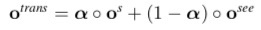
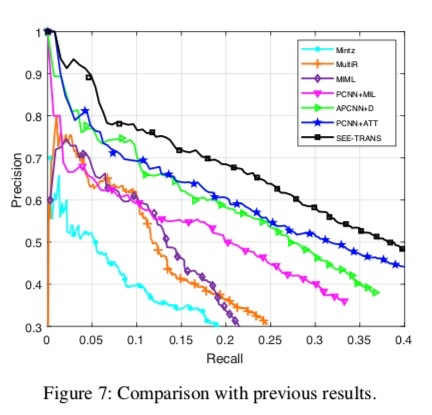

<h1>知识图谱理论篇(八) --SEE模型远程监督关系抽取</h1>

<h2>1. 一点思考</h2>

远程监督关系抽取模型(Distantly Supervision RE)本质上是学习多个关系$r_i$的关系定义函数$R_i(e_h, e_t, sentences, ...)$，这些$R_i$将高维特征high dimensional features映射为关系表示，根据关系表示划分几类关系，可视为高维关系特征空间中的超曲面。

关系定义函数$R_i(e_h, e_t, sentences, ...)$应有哪些输入变量/特征仍属于开放话题，现有方法在头实体名$e_h$，尾实体名$e_t$，实例句子sentences的基础上研究添加了关系别名relation_alias，关系简介relation_intro，实体类型$t_{e_h}, t_{e_t}$等变量；

关系定义函数可看作是多层复合函数

$$R_i(e_h, e_t, sentences) = f\{Entity(e_h), Entity(e_t), Sentence(sentence, ...)\}$$

（具体复合形式由模型结构决定，此处只是举个例子）

1. Entity(entity_mention)：实体指称项$e_h, e_t$ --> 高维实体嵌入entity embedding
    1. 旨在编码实体类型等信息，在高维实体嵌入空间中，实体类型语义相似的实体嵌入之间“距离”近，聚在一块；
    2. 
2. Sentence(sentence, ...)：句子词序列 --> 高维句子嵌入sentence embedding
    1. 旨在编码句子中的句法语义，句法语义一定程度上反应关系语义；
    2. 
3. f(...)：编码实体类型信息的实体嵌入，编发句子语义的句子嵌入 --> 关系嵌入relation embedding
    1. 旨在将高维特征嵌入映射到关系表示空间
    2. 

<h2>2. 论文阅读 -- SEE: Syntax-aware Entity Embedding for Neural Relation Extraction（2018 AAAI）</h2>

1. introduction
    1. 远程监督存在误标注问题，导致数据集引入噪声，远程监督假说过于strong，Riedel et al. (2010); Hoffmann et al. (2011); Surdeanu et al. (2012)等研究放宽了DS assumption；
        1. Riedel et al. (2010) --> expressed-at-least-once assumption: 如果两个实体在知识库中存在关系r，则**至少一句**提及这两个实体的句子表达了关系r --> 多实例单标签学习multi-instance single-label learning；
        2. Hoffmann et al. (2011) --> 关系可能会重叠：一对实体e1，e2可能会存在多种关系 --> 多实例多标签学习multi-instance multi-label learning；
    2. 传统方法使用的一些人工定义的句法特征有助于关系抽取；神经关系抽取也开始关注学习句法特征以辅助关系抽取；
        1. 例如：实体对间的最短依赖路径(Miwa and Bansal 2016)
    3. 先前研究主要关注学习句子表示，但忽略实体表示的学习；先前工作单纯使用顺序词本身学习的实体嵌入难以泛化至未知实体，使用句法上下文学习的实体嵌入泛化能力更强；
        1. **使用句法上下文（依存树）编码实体嵌入能够捕捉上下文距离更长的信息**，因此，**实体在句子中的句法角色为关系抽取提供辅助信息**，例如，使用句法依存树上以实体`Khosla Ventures`和`Vinod Khosla`为根的子树来编码实体嵌入可获得更长的上下文信息，如下图；
    4. 论文贡献
        1. 论文开创性地使用句法信息来编码实体嵌入；
        2. 在依存树上使用tree-GRU编码实体的上下文作为句子级别sentence-level的实体嵌入；
        3. 利用句内、句外注意力来获得句子集级别sentence-set level的实体嵌入；
            1. 句内注意力：在依存树各子节点嵌入上使用注意力以突出有价值的子节点；
            2. 句外注意力：缓解远程监督误标注问题；
        4. 使用PCNN得到的句子嵌入与SEE得到的实体嵌入共同进行关系分类；
2. Baseline模型
    1. 本质就是PCNN+ATT模型，注意力机制做了简化，使用了self-attention(Lin et al. 2017)[A Structured Self-Attentive Sentence Embedding 论文阅读](https://zhuanlan.zhihu.com/p/47226281)；
3. SEE模型介绍
    1. Baseline模型只利用了词序列的信息，最近研究发现，句法结构可以探索词间依赖关系，进一步辅助关系抽取。不像先前研究只关注于最短依赖路径，**SEE模型使用依存树上以实体节点为根节点的子树来编码syntax-aware context of entities**；
    2. 实体嵌入--给定句子与其parse tree，编码得到两个实体的密集向量；
        1. 循环神经网络可以有效的编码树形结构，受Tai, Socher, and Manning (2015)启发，**SEE使用基于注意力的树状GRU，以自底向上的顺序，从实体的依赖子树上编码出其实体上下文嵌入**，下图展示基于注意力的tree-GRU的结构，每个GRU节点包含两个输入：$x_i$（由词嵌入、位置嵌入、依存嵌入组成）和$h_{ch(i)}$（所有子节点$ch(i)$的hidden向量的加权求和）；
        2. **依赖嵌入dependency embedding**：**在所有依存树上下文上编码head-modifier word pair**，依赖嵌入可以表示比词嵌入更丰富的语义，特别是长距离信息，**依赖嵌入学习方法**如下：
            1. 首先，使用off-shelf Stanford Parser来解析NYT语料；
            2. 其次，给定一个father-child依赖$p \rightarrow c$，使用skip-gram模型预测其所有上下文依赖，上下文依赖定义如下：
                1. 所有祖父节点到父节点的head-modifier word pair
                2. 所有子节点到孙子节点的head-modifier word pair
                3. $$gp \rightarrow p, c \rightarrow gc1 ... c \rightarrow gc_{\#gc}$$
        3. 子节点嵌入上的注意力机制($ATT_{CE}$)：使用self-attention机制
            1. 
            2. 作用：a）自动检测informative children；b) 减少解析错误而引入的错误依赖的影响；
        4. GRU节点内部细节：
            1. 给定输入向量$\vec x_i$和加权后的子节点隐向量$\vec h_{ch(i)}$，使用如下GRU公式计算当前节点隐向量
    3. Augmented Relation Classification
        1. 实例集中第i个实例的头、尾实体嵌入：
            1. 
            2. 
        2. 给定实体对的实例集的所有句子嵌入、头实体嵌入、尾实体嵌入：
            1. 
        3. 实体嵌入上的注意力机制：也是使用self-attention
        4. 串接策略CAT：简单串接句子嵌入、头实体嵌入、尾实体嵌入，并用于计算关系表示
        5. TRANS策略：受Trans系列嵌入的启发，将实体嵌入的差向量作为关系类型嵌入，并进一步经过线性变换得到基于SEE的关系分数向量relation score vector：
        6. 最终，综合句子嵌入得到的关系分数向量和SEE得到的关系分数向量计算得到关系表示，并经过softmax得到输出：
4. 实验：
    1. 数据集：Riedel2010
    2. evaluation metrics:
        1. held-outevaluation--precision-recall curves;
            1. 

        2. manual evaluation--Top-N precision P@N;
            1. 
            2. 

