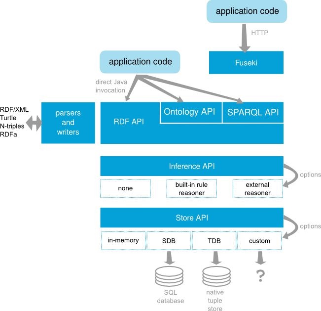
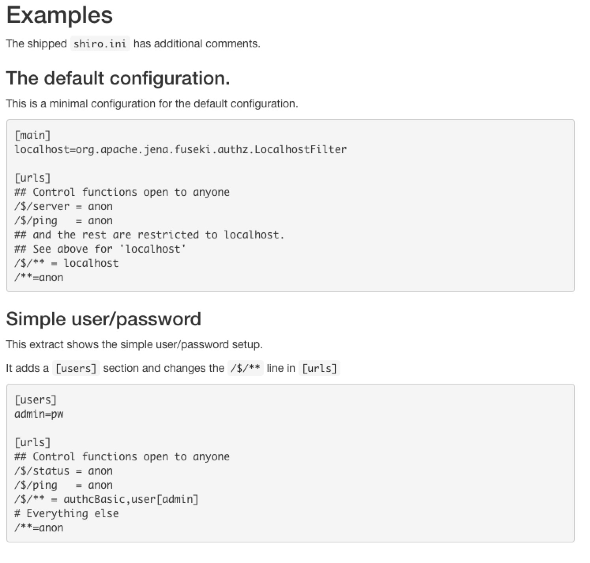
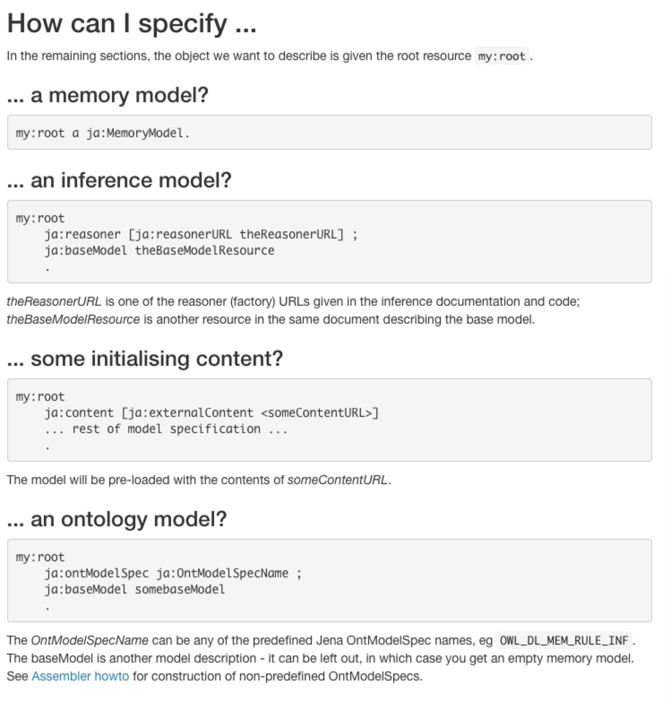
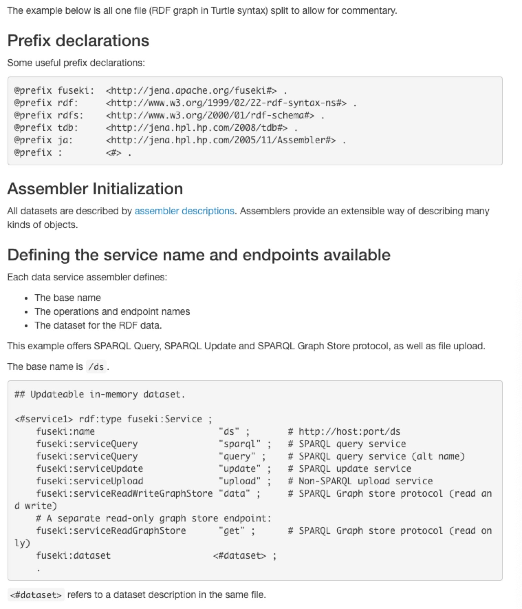
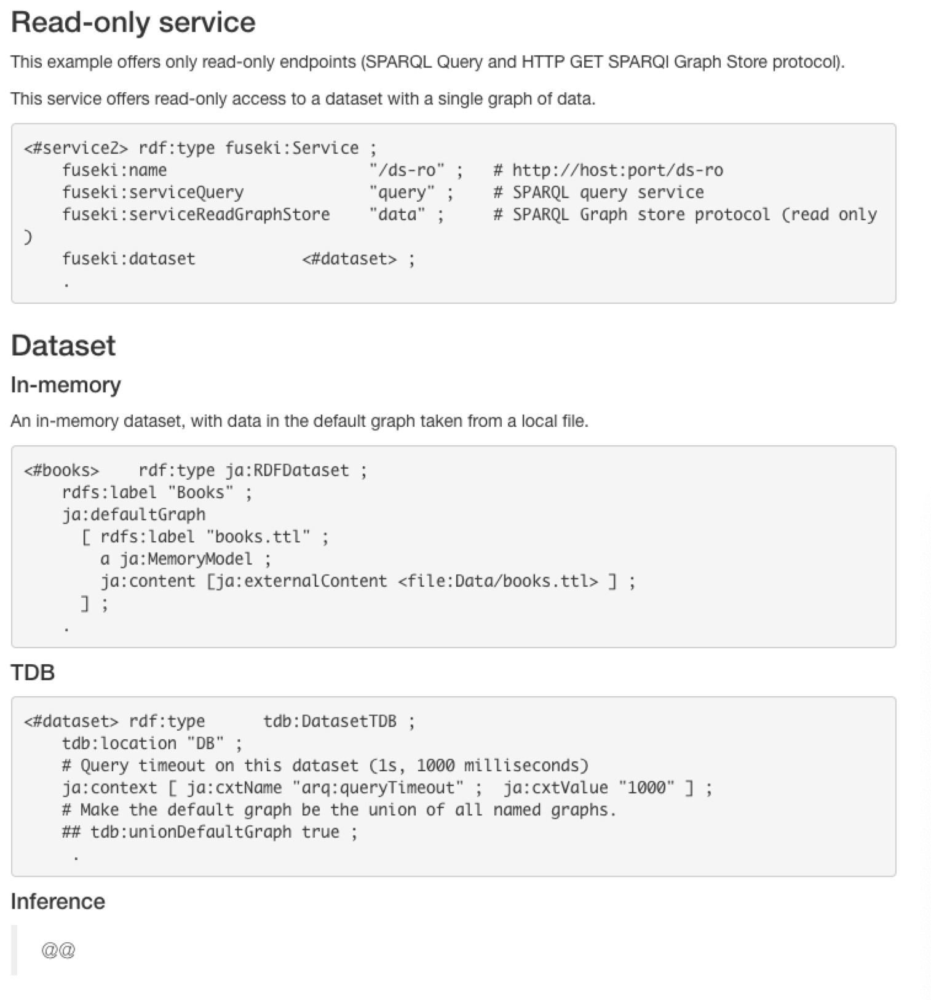
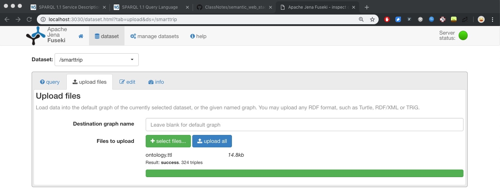
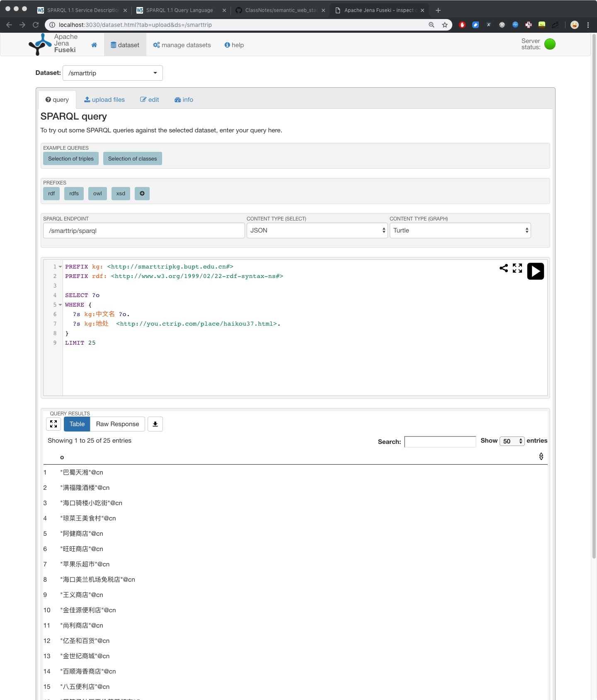
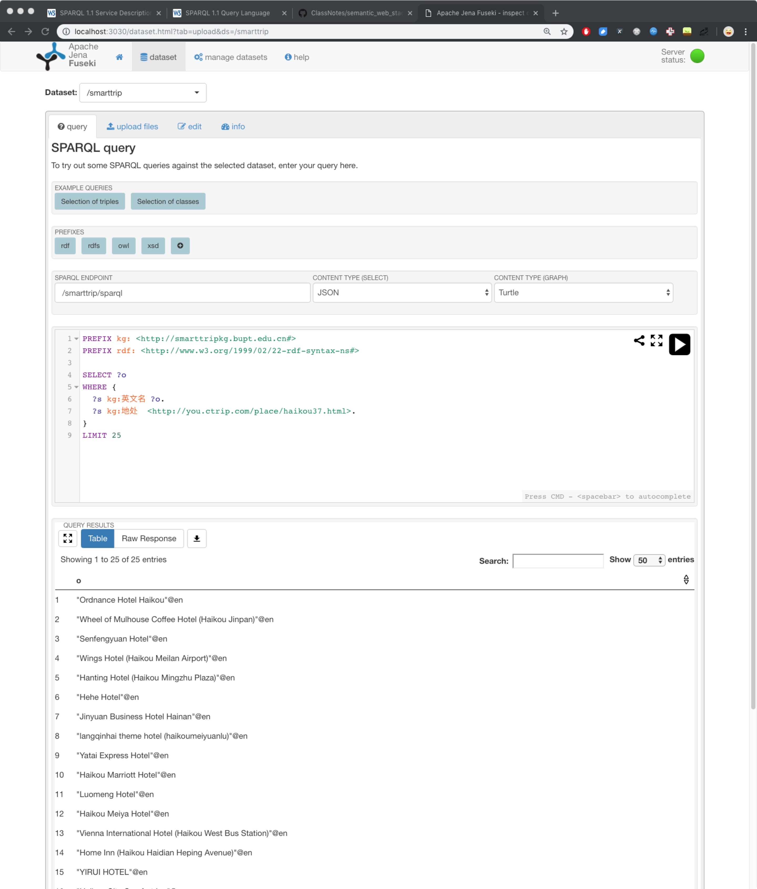
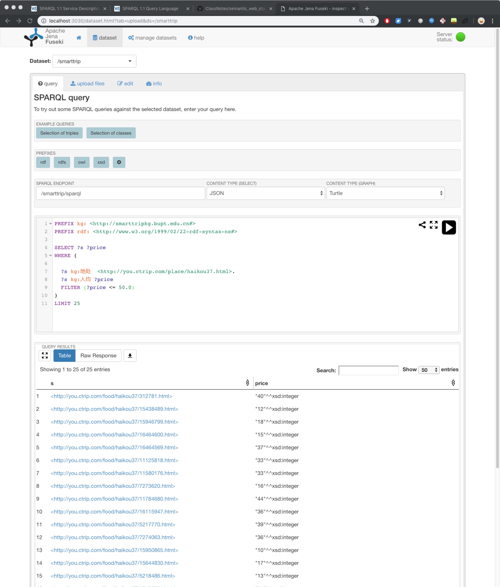

<h1>知识图谱实践篇（三）--Apache Jena</h1>

经过[旅游知识图谱实践篇（二）--结构化数据到RDF](https://github.com/charosen/ClassNotes/blob/master/knowledge_graph/structure2rdf.md)，项目得到了N-Triples序列化的海南携程旅游RDF Graph数据文件。本篇中，我们将介绍使用Apache Jena框架来将海南携程旅游RDF Graph数据作为SPARQL服务发布；

<h2>1. Apache Jena简介</h2>

Apache Jena（后文简称Jena），是一个开源的Java语义网框架（open source Semantic Web Framework for Java），用于构建语义网和链接数据应用。Jena框架由多个API组成，API相互协作，共同处理RDF数据。下图展示了Jena的整体架构以及不同API模块之间的交互：



在发布携程海南旅游知识图谱SPARQL服务的实践中，本项目将使用的API组件包括：TDB、Inference API和Fuseki。

<h2>2. TDB</h2>

Jena的Store API提供了多种存储组件，包括基于内存的存储、SDB存储、TDB存储以及自定义存储。其中，本篇将介绍TDB存储组件。

TDB是Jena用于存储RDF的组件，是属于存储层面的技术。它支持所有Jena API。在单机情况下，它能够提供非常高的RDF存储性能。目前TDB的标准版本是TDB1，最新版本是TDB2，且与TDB1不兼容。

可以使用**命令行脚本**以及**Jena API**来访问与管理TDB。使用[transaction](http://jena.apache.org/documentation/tdb/tdb_transactions.html)来操作TDB，可避免数据崩溃、意外进程终止、系统崩溃以保护TDB数据。

TDB数据集应该一次只能从一个JVM直接访问，否则可能会发生数据损坏。从1.1.0版本开始，TDB添加了针对多JVM访问的自动保护，在大多数情况下可以防止多JVM同时操作TDB导致数据损坏的情况发生。

如果您希望在多个应用程序之间共享TDB数据集，请使用Fuseki组件，该组件提供1）使用TDB进行持久存储的SPARQL服务器，2）SPARQL协议以通过HTTP进行查询，更新和REST更新。

下面主要介绍通过**命令行脚本**来访问TDB数据集，其他访问方式请读者参考Apache Jena TDB官方文档。

`tdbloader`: RDF转TDB的批量加载程序和索引构建器。

```
tdbloader --loc /path/for/database ...input files ...
```
input files可以是以任何RDF语法格式序列化的RDF文件；将triple系列格式（例如，N-Triples，Turtle）加载到默认图；将quad系列格式（例如，N-Quads，TriG）加载到数据集中的name graph或默认图。

`tdbloader2`: 同`tdbloader`，但是更高效；

```
tdbloader2 --loc /path/for/database input1.ttl input2.ttl ...
```

此批量加载程序只能用于创建数据库。它可能会覆盖现有数据。

`tdbquery`: 在TDB存储上执行SPARQL查询；

`tdbdump`: 以N-Quads格式导出TDB中存储的RDF数据；

`tdbstats`: 返回TDB数据集的统计信息；

参考链接：
1. [使用Jena-TDB存储RDF本体、知识图谱文件](https://blog.csdn.net/svenhuayuncheng/article/details/78751300)；
2. [TDB官方文档](http://jena.apache.org/documentation/tdb/)；

<h2>3. Inference API</h2>

Jena的Inference API支持多种推理机，包括内置的规则推理机、外部推理机。

Jena提供了RDFS、OWL和通用规则推理机。其实Jena的RDFS和OWL推理机也是通过Jena自身的通用规则推理机实现的。

关于Jena Inference API的更多信息，请查看[Reasoners and rule engines: Jena inference support](http://jena.apache.org/documentation/inference/)；

<h2>4. Fuseki</h2>

Fuseki是Jena提供的SPARQL服务器，其提供了四种运行模式：单独服务器、作为系统的一个服务运行、作为web应用运行或者作为一个嵌入式服务器运行。Fuseki提供[Apache Shiro](https://shiro.apache.org/)用以安全控制，提供用户界面用以监视和管理服务器，以及提供SPARQL 1.1 protocols for query and update和SPARQL Graph Store protocol协议用以查询和更新；


<h3>Fuseki可以使用多种方式运行：</h3>

1. 以独立服务器方式运行：
    1. 在命令行中输入以下命令，可使用独立服务器方式运行Fuseki：
    
    ```
    fuseki-server [--mem | --loc=DIR] [[--update] /NAME]
    
    fuseki-server --config=CONFIG
    ```
    
    `/NAME`表示SPARQL服务器URI中的数据集发布名称（eg. http://ip/NAME），同config文件中的fuseki:name字段；

    `--tdb2`表示使用tdb2模式；

    `--loc`用于指定TDB数据集；

    `--config`用于指定配置文件；

2. 以系统服务方式运行：
    1. Fuseki可以作为操作系统服务运行，在服务器机器启动时自动启动。脚本fuseki是一个Linux init.d，带有start和stop的公共辅助参数。在命令行中输入以下fuseki脚本，可使用系统服务方式运行Fuseki：

    ```
    fuseki {start|stop|restart|run|status}
    ```
    
    从/etc/default/fuseki读取`FUSEKI_HOME`、`FUSEKI_BASE`等进程参数，包括。`FUSEKI_HOME`应该是Fuseki被解压的目录。
    
3. 以Web应用运行：
    1. Fuseki可以从WAR文件运行。Fuseki至少需要支持Servlet 3.0 API（例如Apache Tomcat 7或Jetty 8）以及Java8；
    2. `FUSEKI_HOME`不可用；
    3. `FUSEKI_BASE`默认是/etc/fuseki，必须是可写目录。它在Fuseki第一次运行时初始化，包含一个十分简单的Apache Shiro安全文件，只提供将Admin UI的使用限制在本地计算机上；

关于Fuseki的几种启动方式，请看[Running Fuseki](http://jena.apache.org/documentation/fuseki2/fuseki-run.html)；

<h3>Fuseki安全配置</h3>

Fuseki2使用Apache Shiro提供安全性。Fuseki使用位于`$FUSEKI_BASE/shiro.ini`的配置文件`shiro.ini`进行权限控制。如果未找到该文件，则服务器使用默认配置进行初始化。`shiro.ini`可以根据需要进行替换或编辑。服务器永远不会覆盖现有`shiro.ini`文件。

1. 默认配置：SPARQL endpoint对公众开放，但管理功能仅限于localhost。可以通过`http:// localhost:.../...`或相应的IPv4或IPv6地址访问它，例如`127.0.0.1`（IPv4）或`[:: 1]`（IPv6）。从外部计算机访问不被视为localhost，因此受到限制。

2. 简单身份认证例子：



关于Fuseki的安全配置，请看[Security in Fuseki2](http://jena.apache.org/documentation/fuseki2/fuseki-security.html)；

<h3>Fuseki配置</h3>

Fuseki配置包括定义数据服务data service（数据和数据上可用的操作）以及配置服务器configuring the server。通常不需要显式配置服务器，只需要配置数据服务。

数据服务配置可以来自：

1. 目录`FUSEKI_BASE/configuration/`，且每个数据服务装配器data service assembler有一个配置文件（包括端点详细信息和数据集描述）；
2. 系统数据库。这包括上传的装配器assembler文件。它还记录每个数据服务的状态（无论是活动还是离线）；
3. 服务配置文件。为了兼容性，服务配置文件也可以具有数据服务。见下文。
4. 命令行，如果Fuseki不是作为Web应用程序从.war文件运行。

`FUSEKI_BASE`具体位置见[Fuseki run area](http://jena.apache.org/documentation/fuseki2/fuseki-layout.html)；

**数据服务装配器Data Service Assembler**

1. [Fuseki Data Service](http://jena.apache.org/documentation/fuseki2/fuseki-data-services.html)：Fuseki可以提供许多“数据服务”（对应于fuseki配置文件中的一个fuseki:service） - 每个数据服务都是一个RDF数据集和一组可配置的端点，端点用于各种操作，如SPARQL查询，SPARQL更新和文件上传。
    1. SPARQL服务的URI根据定义的数据服务构建[Fuseki : Data Services](http://jena.apache.org/documentation/fuseki2/fuseki-data-services.html);
    2. 例子配置文件`fuseki_conf.ttl`中关于数据服务的定义：
    
        ```
        :service1        a                fuseki:Service ;  # 一个数据服务data service
    fuseki:dataset                    <#dataset> ;
    fuseki:name                       "smarttrip" ;  # 下述所有predicate-object都是端口endpoint
    fuseki:serviceQuery               "query" , "sparql" ;
    fuseki:serviceReadGraphStore      "get" ;
    fuseki:serviceReadWriteGraphStore "data" ;
    fuseki:serviceUpdate              "update" ;
    fuseki:serviceUpload              "upload" .
        ```
2. 装配器规范assembler specification是关于如何构建模型及模型相关资源的RDF描述（配置文件定义数据服务时经常涉及定义模型，eg，ja:InfModel等等），例如reasoners(对应于ja:reason)，prefix mappings(对应于ja)和initial content(对应与ja:content)。我们可以使用Assembler与定义词汇表来定义assembler specification。Assembler预定义词汇表在[Assembler Schema](http://jena.apache.org/documentation/assembler/assembler.ttl)中给出，我们将使用前缀ja作为其标识符。
    1. 如何在配置文件中使用assembler specification定义模型：

**Fuseki配置文件**

Fuseki配置文件用于定义数据服务。Fuseki配置文件本身就是用RDF写的/本身就是RDF图，一个图由一个服务器描述和许多服务组成，每个服务在数据集上提供多个端点。

配置例子如下：






关于Fuseki的服务器配置，请看[Fuseki: Configuring Fuseki](http://jena.apache.org/documentation/fuseki2/fuseki-configuration.html)；

<h2>5. 携程海南旅游知识图谱SPARQL服务发布</h2>

首先，在当前项目目录`SmarttripKG`下创建`tdb`目录，用于TDB存储。

执行如下命令，将实践二中得到的携程海南旅游知识图谱RDF数据转换成TDB数据：

```
tdbloader --loc tdb smarttrip.nt
```

接着，本项目编写fuseki的配置文件`fuseki_conf.ttl`(.ttl是turtle文件)，用于配置运行fuseki服务器：

```
@prefix :      <http://base/#> .
@prefix tdb:   <http://jena.hpl.hp.com/2008/tdb#> .
@prefix rdf:   <http://www.w3.org/1999/02/22-rdf-syntax-ns#> .
@prefix ja:    <http://jena.hpl.hp.com/2005/11/Assembler#> .
@prefix rdfs:  <http://www.w3.org/2000/01/rdf-schema#> .
@prefix fuseki: <http://jena.apache.org/fuseki#> .


:service1        a                fuseki:Service ;
fuseki:dataset                    <#dataset> ;
fuseki:name                       "smarttrip" ;
fuseki:serviceQuery               "query" , "sparql" ;
fuseki:serviceReadGraphStore      "get" ;
fuseki:serviceReadWriteGraphStore "data" ;
fuseki:serviceUpdate              "update" ;
fuseki:serviceUpload              "upload" .


<#dataset> rdf:type ja:RDFDataset ;
    ja:defaultGraph <#model_inf> ;
    .

<#model_inf> a ja:InfModel ;
    ja:baseModel <#tdbGraph> .

    # 本体文件的路径
    # ja:content [ja:externalContent <file:///Users/mac/github-local-repos/SmarttripKG/ontology.ttl> ] ;

    # 启用OWL推理机
    # ja:reasoner [ja:reasonerURL <http://jena.hpl.hp.com/2003/OWLFBRuleReasoner>] .

<#tdbGraph> rdf:type tdb:GraphTDB ;
    tdb:dataset <#tdbDataset> ;
    .

<#tdbDataset> rdf:type tdb:DatasetTDB ;
    tdb:location "/Users/mac/github-local-repos/SmarttripKG/tdb" ;
    .
```

只要配置了TDB存储的位置，具体配置方法请参见[Fuseki: Configuring Fuseki](http://jena.apache.org/documentation/fuseki2/fuseki-configuration.html)；

最后，我们在命令行中以独立服务器的方式运行fuseki：

```
fuseki-server --config=fuseki_conf.ttl
```

现在，我们就可以在本机的3030端口配置了一个携程海南旅游知识图谱的SPARQL endpoint，可以使用SPARQL来访问我们的数据；

在Python中，我们可以使用第三方库SPARQLWrapper来编写SPARQL语句来进行查询，也可以使用jena提供的用户界面来查询，如下图，我们上传自定义的携程海南旅游知识图谱本体，并使用SPARQL查询相关实体名；

1. 支持上传自定义旅游本体

2. 使用SPARQL查询位于海口市的所有中文实体名

3. 使用SPARQL查询位于海口市的所有酒店英文实体名

4. 使用SPARQL查询位于海口市的所有人均消费低于50元的餐厅


<h2>6. 总结</h2>

本篇主要介绍了如何使用Apache Jena框架将实践二中获得的RDF数据作为SPARQL服务发布，并介绍了发布过程中涉及的Apache Jena几大组件：TDB、Inference API、Fuseki；

在下一篇实践篇中，本项目将基于现有的携程海南旅游知识图谱SPARQL服务器，使用知识图谱来完成KBQA；

参考链接：

1. [实践篇（四）：Apache jena SPARQL endpoint及推理](https://zhuanlan.zhihu.com/p/33224431);
2. [从零开始构建知识图谱（二）数据库到 NTriples 以及通过Apache jena 访问NT](http://pelhans.com/2018/09/03/kg_from_0_note2/);