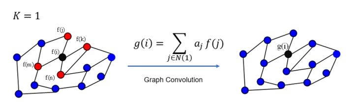
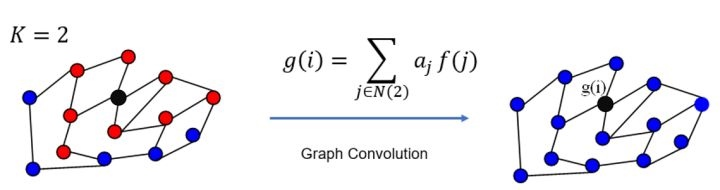
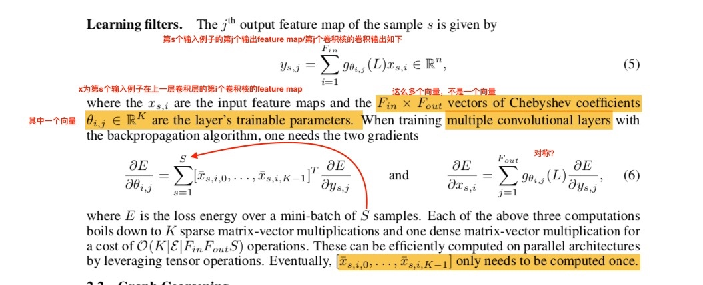
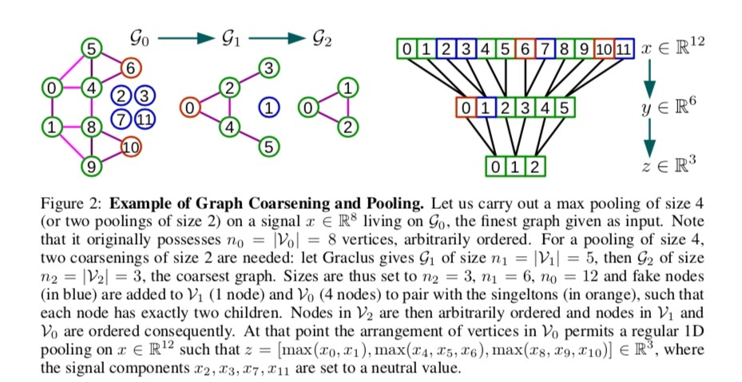

<h1>知识图谱理论篇(十一) --论文阅读Convolutional Neural Networks on Graphs with Fast Localized Spectral Filtering
</h1>

<h2>1. 论文阅读---“Convolutional Neural Networks on Graphs with Fast Localized Spectral Filtering
”</h2>

<h3>1. abstract</h3>

1. 论文提出了一种把(欧式空间/矩形网格)传统CNN扩展到非欧空间/非矩形域上卷积网络的方法；
2. 谱图理论为设计图上的局部卷积提供数学支撑；

<h3>2. introduction</h3>

1. CNN通过发现数据中共享的局部特征local features来抽取数据的local stationary structure，而这些局部特征是使用局部卷积核发现的；
2. 为什么卷积核能在不同空间位置抽取相同特征？
    1. 卷积核具有平移不变性，意味着一个卷积核能够独立于空间位置的影响而发现相同的特征；
3. 迫切需要将卷积神经网络泛化到图结构上；
    1. 只在欧式空间/矩形网格中定义了卷积和pooling操作，需要拓展卷积、pooling定义--局部图卷积核、二叉树pooling；
    2. 谱图理论提供了数学工具；
4. 论文贡献：论文提出了一种把(欧式空间/矩形网格)传统CNN扩展到非欧空间/非矩形域上卷积网络的方法；
    1. 谱公式spectral formulaition：利用谱图理论，定义了新的图CNN公式；
    2. 严格的局部卷积核strictly localized filters：作者扩展了（Bruna, Joan, et al. "Spectral networks and locally connected networks on graphs." arXiv preprint arXiv:1312.6203 (2013).d)的工作；提出的谱卷积核可证明为严格局部在半径为K的球内，即中心节点的K跳范围内；
    3. 低计算复杂度：论文提出的卷积复杂度与卷积核大小K与边集大小$|\varepsilon|$成线性关系。因为现实世界中的图大部分是高度稀疏的，例如大量存在的k近邻图的边集大小$|\varepsilon| \ll n^2 且 |\varepsilon| = kn$，所以最终导致复杂度与数据量n成线性关系，另外，这个方法避免计算傅里叶基向量组（需要计算和储存傅里叶基向量组，计算复杂度与空间复杂度都是$O(n^2)$）。这个方法只用储存一个拉普拉斯矩阵，这是一个稀疏矩阵，只有边数个非零元素；
    4. 高效pooling：通过构建一个二叉树进行pooling；
    5. 实验结果：作者在MNIST上做了实验，取得了和传统CNN相当的实验结果；

<h3>3. 技术细节</h3>

1. 实现图上的CNN需要实现以下步骤：(1)设计图上局部卷积核(2)图粗化/相似点聚类(3)图pooling操作；
2. 快速局部谱卷积核的设计与训练方法
    1. 提取拓扑图空间特征的两种方式/两种卷积方式—spatial approach & spectral approach
    2. spatial domain
        1. 核心思想：
            1. 按照什么条件去找中心vertex的neighbors，也就是如何确定感受野receptive field？[感受野参考文章--关于感受野 (Receptive field) 你该知道的事](https://iphysresearch.github.io/posts/receptive_field.html)
            2. 确定receptive field，按照什么方式处理包含不同数目neighbors的特征？
        2. 优点：
            1. 通过指定核的size来轻松实现局部卷积；
            2. spatial domain上的卷积很直观
        3. 缺点：
            1. 按照什么条件匹配中心点的邻居，既确定感受野
            2. 每个节点提取出来的邻居不同，使得计算必须针对每个节点，没有统一的数学公式
    3. spectral domain
        1. 核心思想
            1. 利用谱图理论来实现图上的卷积操作，转换到spectral domain上进行操作，而不是spatial domain；
        2. 优点：
            1. 图谱理论为所有节点卷积操作提供统一的公式；
        3. 缺点：
            1. 之前提出的spectral domain的卷积不是局部的，且计算复杂度为$O(n^2)$；
    4. 关于图傅立叶变换和图卷积的内容，请参考下述GCN小结
    5. 第一代GCN--[Spectral Networks and Locally Connected Networks on Graphs](https://link.zhihu.com/?target=https%3A//arxiv.org/abs/1312.6203)
        1. 将卷积核g的图傅立叶变换GFT$g_{\theta}(\lambda)$设计成自由卷积核，参数$\theta$在空间中无约束取值$$ \begin{aligned} g_\theta(\land) = \left(\begin{array}{ccc} \theta_0 &\\\\ &\ddots &\\\\ &&\theta_{N-1} \end{array}\right) \end{aligned}$$
        2. 神经网络公式：$$y_{output}=\sigma \left(U g_\theta(\Lambda) U^T x \right)$$
        3. 弊端：
            1. 需要计算拉普拉斯矩阵特征分解，即计算与存储正交特征向量基U，计算$U,diag(\theta_l )$及$U^T$三者的矩阵乘积的计算复杂度为$O(n^2)$，存储复杂度为$O(n^2)$；
            2. 卷积核的spatial localization不好
            3. 卷积核需要n个参数，卷积复杂度为$O(n^2)$，学习复杂度为$O(n)$

    6. 本文/第二代GCN--[Convolutional Neural Networks on Graphs with Fast Localized Spectral Filtering](https://link.zhihu.com/?target=http%3A//papers.nips.cc/paper/6081-convolutional-neural-networks-on-graphs-with-fast-localized-spectral-filtering)
        1. 多项式参数化局部卷积核：
            1. 参数$\theta$取值约束为K阶多项式的值$$ \begin{aligned} g_\theta(\Lambda) = \left( \begin{matrix} \sum_{j=0}^K \theta_j \lambda^j_0 &\\\\ &\ddots \\\\ &&\sum_{j=0}^K \theta_j \lambda^j_{N-1} \end{matrix}\right) =  \sum_{j=0}^K \theta_j \Lambda^j \end{aligned}$$
            2. 神经网络公式：$$\begin{aligned} y_{output} &= \sigma \left(U  g_\theta(\Lambda)  U^T x \right) \\\\ &= \sigma \left(U  \sum_{j=0}^K \theta_j \Lambda^j  U^T x \right) \\\\ &= \sigma \left( \sum_{j=0}^K \theta_j  U \Lambda^j  U^T x \right) \\\\ &= \sigma \left( \sum_{j=0}^K \theta_j L^j x \right) \\\\ &= \sigma \left( g_\theta(L) x \right) \end{aligned}$$
                1. 对于拉普拉斯矩阵L有如下性质，任意两节点i，j的最短路径大于k时，即$\forall d_G(i, j) > k$，则$(L^k)_{i,j} = 0, where d_G(i,j)$是i，j节点的最短路径
                2. 当k=1时，卷积输出为各节点与其1-hop邻居节点的卷积结果...以此类推
                3. 当k=i时，卷积输出为各节点与其i-hop邻居节点的卷积结果...
                4. 因此，总的卷积输出为各节点与k-hop$(k \in [1, K])$邻居节点的所有卷积结果加权和，最远K跳，局部化
            3. 优点：
                1. 不需要做特征分解，直接用拉普拉斯矩阵L计算卷积，仍需要计算$L^j$，计算复杂度还是$\mathcal{O}(n^2)$，但无需计算与存储正交特征向量基；
                2. 卷积核的spatial localization很好，K就是卷积核的receptive field，每次卷积会将中心顶点K-hop neighbor上的feature进行加权求和，权系数就是$\theta_j$
                3. 卷积核需要K个参数，学习复杂度为$O(K)$
        2. 递推公式实现快速卷积：
            1. 使用[切比雪夫多项式近似原幂级数多项式](https://baike.baidu.com/item/%E5%88%87%E6%AF%94%E9%9B%AA%E5%A4%AB%E5%A4%9A%E9%A1%B9%E5%BC%8F/9390867?fr=aladdin)$g_\theta(\Lambda)=\sum_{k=0}^{K-1}{\beta_k T_k (\tilde{\Lambda})}$，切比雪夫多项式可通过递推公式$T_k (\tilde{\Lambda})x=2\tilde{\Lambda}T_{k-1} (\tilde{\Lambda})x-T_{k-2} (\tilde{\Lambda})x, T_{0} (\tilde{\Lambda})=I,T_{1} (\tilde{\Lambda})=\tilde{\Lambda}$计算，而无需每次都计算矩阵乘积，$T_k(\tilde{\Lambda})$是取 $\tilde{\Lambda}=2\Lambda/\lambda_{max}-I$的Chebyshev多项式，进行这个shift变换的原因是Chebyshev多项式只能$\left[ -1,1\right]$区间近似幂级数多项式；
            2. 优点：无需重复矩阵乘积，只计算矩阵与向量乘积。计算一$T_k (\tilde{\Lambda})x$的复杂度$\mathcal{O}(\left| E \right|)$，  E是图中边的集合，则整个运算的复杂度是$\mathcal{O}(K\left  | E \right|)$。当graph是稀疏图的时候，计算加速尤为明显，这个时候复杂度远低于$\mathcal{O}(n^2)$
        3. 卷积核参数学习：mini-batch SGD
            1. 
    7. 图粗化（对卷积输出做池化）
        1. 在多个层上做池化相当于一个保持图局部几何结构的多维图聚类
        2. 多维聚类算法能够在每层生成更粗粒度的图，对应于数据域上更高解析度/更高层特征
        3. 使用Graclus multilevel clustering算法--该图粗化算法能够将节点数目近似减半
            1. 选择一个未标记节点i，匹配它的其中一个邻居节点j，该匹配使得local normalized cut最大，之后这两个节点被标记，并且其权重设置为它们权重之和不断重复匹配，直至所有节点都被标记
        4. 快速图池化--使用平衡二叉树数据结构rearrange节点使得图pooling变换为1维pooling，高效
        5. 

参考链接：
1. [Convolutional Neural Networks on Graphs with Fast Localized Spectral Filtering](Convolutional Neural Networks on Graphs with Fast Localized Spectral Filtering)

    
<h2>2. GCN小结</h2>

<h3>1. 基础--向量分解</h3>

1. 原则：误差向量最小
2. 相关系数：$C_{12} = \frac{\vec{V_1} \cdot \vec{V_2} cos(\vec{V_1}\land \vec{V_2})}{\vec{V_2} \cdot \vec{V_2}}$
3. 向量正交：$\vec{V_1} \cdot \vec{V_2} = 0$，即$C_{12} = 0$

<h3>2. 基础--信号分解</h3>

1. 原则：误差信号的平均功率最小，即$\bar{f_e^2}(t) = \frac{1}{t_2 - t_1} \int_{t_1}^{t_2} f_e^2(t) dt$最小，进一步得$\frac{d}{d C_{12}} \{ \int_{t_1}^{t_2} f_e^2(t) dt \} = 0$
2. 相关系数：$C_{12} = \frac{\int_{t_1}^{t_2} f_1(t) f_2(t) dt}{\int_{t_1}^{t_2} f_2(t) f_2(t) dt}$
3. 信号正交：$\int_{t_1}^{t_2} f_1(t) f_2(t) dt = 0$或$C_{12} = 0$(实信号)，$\int_{t_1}^{t_2} g_1(t) g_2^*(t) dt = 0$或$C_{12} = 0$(复信号)
4. 任意信号$f_1(t), f_2(t)$不正交，则$f_1(t)$一定能够分解出$f_2(t)$分量
5. 任一信号可按正交函数集分解

<h3>3. 基础--傅立叶级数</h3>

1. 条件：周期信号，且满足狄利克雷条件(充分不必要条件)
2. 核心思想：信号的正交分解，复指数完备正交函数集：$\{e^{jnw_1t}\}, n=0, \pm1, \pm2, ..., w_1 = \frac{2 \pi}{T}$

3. 公式：$$f_T(t) = \sum_{n=-\infty}^{\infty} F(nw_1) e^{jnw_1t} \\\\ F(nw_1) = \frac{\int_0^T f_T(t) e^{-jnw_1t} dt}{\int_0^T e^{jnw_1t} e^{-jnw_1t} dt} = \frac{1}{T} \int_0^T f_T(t) e^{-jnw_1t} dt$$

<h3>4. 基础--傅立叶变换</h3>

1. 条件：非周期信号，且满足狄利克雷条件(充分不必要条件)
2. 核心思想：使用正交完备特征向量基（不同频率指数信号）$\{ e^{jwt} \}$，对应特征值（频率）w来正交分解信号；
3. 公式：
    1. 傅立叶变换：$$F(w) = \int_{-\infty}^{+\infty} f(t) e^{-jwt} dt$$
    2. 傅立叶逆变换：$$f(t) = \frac{1}{2\pi} \int_{-\infty}^{+\infty} F(w) e^{jwt} dt$$
4. 完备正交证明：
    1. 相关系数法：$\int e^{jwt} e^{-jwt} dt = 0$ => 正交
    2. 特征方程法：[广义特征方程](https://baike.baidu.com/item/%E7%89%B9%E5%BE%81%E6%96%B9%E7%A8%8B/2678218?fr=aladdin)为$A \cdot V = \lambda V$，A是一种变换，V是特征向量（对应矩阵特征方程）或特征函数（对应微分特征方程，积分特征方程），$\lambda$是特征值；
        1. 由于$e^{-jwt}$是[拉普拉斯算子](https://baike.baidu.com/item/%E6%8B%89%E6%99%AE%E6%8B%89%E6%96%AF%E7%AE%97%E5%AD%90/7261323?fr=aladdin)$\triangle = \nabla^2$（即欧式空间中的二阶微分）的特征函数，$-w^2$是特征值，即$$\triangle e^{-jwt} = \nabla^2 e^{-jwt} = -w^2 e^{-jwt}$$
        2. 所以，由复变函数，对应不同特征值的特征函数正交且完备

<h3>5. 推广傅立叶变换FT到图傅立叶变换GFT</h3>

1. 核心思想：使用正交完备特征向量基（不同谱向量）$\{ u_l \}_{l=0}^{N-1}$，对应特征值（谱）$\{ \lambda_l \}_{l=0}^{N-1}$来正交分解图信号，空间域变换到谱域来解决问题；
2. 公式：图可以用矩阵表示（邻接矩阵，拉普拉斯矩阵），因此是离散积分(积分变求和)
    1. 图傅立叶变换GFT：$$\hat f(\lambda_l) = \sum_{i=0}^{N-1} f(i) u_l^*(i)$$（对i求和）
    2. 图傅立叶逆变换GIFT：$$f(i) = \sum_{l=0}^{N-1} \hat f(\lambda_l) u_l(i)$$(对l求和)
    3. 矩阵形式：$$\hat f = \begin{bmatrix}{\hat f(\lambda_0) \\\\ \hat f(\lambda_1) \\\\ \vdots  \\\\ \hat f(\lambda_l) \\\\ \vdots \\\\ \hat f(\lambda_{N-1})}\end{bmatrix} = \begin{bmatrix} u_0(0) & u_0(1) & \cdots & u_0(i) & \cdots & u_0(N-1) \\\\ u_1(0) & u_1(1) & \cdots & u_1(i) & \cdots & u_1(N-1) \\\\ \vdots & \vdots & \cdots & \vdots  & \cdots & \vdots\\\\ u_{l}(0) & u_{l}(1) & \cdots & u_{l}(i) & \cdots & u_{l}(N-1) \\\\ \vdots & \vdots & \cdots & \vdots  & \cdots & \vdots\\\\ u_{N-1}(0) & u_{N-1}(1) & \cdots & u_{N-1}(i) & \cdots & u_{N-1}(N-1)\end{bmatrix} \begin{bmatrix} {f(0) \\\\ f(1) \\\\ \vdots  \\\\ f(i) \\\\ \vdots \\\\ f(N-1)}\ \end{bmatrix} = U^T f \\\\ f = \begin{bmatrix} {f(0) \\\\ f(1) \\\\ \vdots  \\\\ f(i) \\\\ \vdots \\\\ f(N-1)} \end{bmatrix} = \begin{bmatrix} u_0(0) & u_1(0) & \cdots & u_l(0) & \cdots & u_{N-1}(0) \\\\ u_0(1) & u_1(1) & \cdots & u_l(1) & \cdots & u_{N-1}(1) \\\\ \vdots & \vdots & \cdots & \vdots  & \cdots & \vdots\\\\ u_0(i) & u_1(i) & \cdots & u_l(i) & \cdots & u_{N-1}(i) \\\\ \vdots & \vdots & \cdots & \vdots  & \cdots & \vdots\\\\ u_0(N-1) & u_1(N-1) & \cdots & u_l(N-1) & \cdots & u_{N-1}(N-1)\end{bmatrix} \begin{bmatrix}{\hat f(\lambda_0) \\\\ \hat f(\lambda_1) \\\\ \vdots  \\ \hat f(\lambda_l) \\\\ \vdots \\\\ \hat f(\lambda_{N-1})}\end{bmatrix}= U \hat f$$
3. 如何获得图的正交完备特征向量--拉普拉斯矩阵L（[离散拉普拉斯算子](https://en.wikipedia.org/wiki/Discrete_Laplace_operator)）的特征分解/谱分解（**GCN的核心**）
    1. 由于无向图拉普拉斯矩阵半正定对称，有如下性质：
        1. **对称矩阵一定n个线性无关的特征向量（可以特征分解）**
        2. **半正定矩阵的特征值一定非负**
        3. **对阵矩阵的特征向量相互正交，即所有特征向量构成的矩阵为正交矩阵**
    2. 谱分解：$$L= U\left(\begin{matrix}\lambda_1 & \\\\&\ddots \\\\ &&\lambda_n \end{matrix}\right) U^{-1}$$
        1. $U=(\vec{u_1},\vec{u_2},\cdots,\vec{u_n})$，是列向量为单位特征向量的矩阵，也就说$\vec{u_l}$是列向量。
        2. $\left(\begin{matrix}\lambda_1 & \\\\&\ddots \\\\ &&\lambda_n \end{matrix}\right)$是n个特征值构成的对角阵。
        3. 由于U是正交矩阵，即$UU^{T}=E$，所以特征分解又可以写成：$$L= U\left(\begin{matrix}\lambda_1 & \\\\ &\ddots \\\\ &&\lambda_n \end{matrix}\right) U^{T}$$

<h3>6. 推广卷积Convolution到图卷积Graph Convolution</h3>

1. 卷积定理：函数卷积的傅里叶变换是函数傅立叶变换的乘积，即$f \otimes g = F^{-1}\{F[f(t)] \cdot F[g(t)] \}$；
2. 公式：图可以用矩阵表示（邻接矩阵，拉普拉斯矩阵），因此是离散卷积
    1. $(f*h)_G=U((U^Th)\odot (U^Tf))$，$\odot$表示hadamard product（哈达马积），对于两个向量，就是进行内积运算；对于维度相同的两个矩阵，就是对应元素的乘积运算。
    2. $\hat g(\lambda_l) = \sum_{i=0}^{N-1} g(i)u_l^*(i) => \hat g = U^T g$是待设计卷积核g的图傅立叶变换GFT，将卷积核g的图傅立叶变换GFT写成对角矩阵形式： $$\left(\begin{matrix}\hat g(\lambda_0) & \\\\ &\ddots \\\\ &&\hat g(\lambda_{N-1}) \end{matrix}\right)$$，则有$$(U^T f) \odot (U^T g) =  \left(\begin{matrix}\hat g(\lambda_0) & \\\\ &\ddots \\\\ &&\hat g(\lambda_{N-1}) \end{matrix}\right)U^Tf$$，所以图信号f与卷积核g的卷积为$$(f \odot g)_G= U\left(\begin{matrix}\hat g(\lambda_0) & \\\\ &\ddots \\\\ &&\hat g(\lambda_{N-1}) \end{matrix}\right) U^Tf = Ug_{\theta}(\land)U^T f = g_{\theta}(U \land U^T) f = g_{\theta}(L) f$$
3. **GCN中设计卷积核就是直接设计卷积核g的图傅立叶变换GFT**$g_{\theta}(\land)$
    1. 第一代GCN，$g_{\theta}(\land) = \left(\begin{matrix}\theta_0 & \\\\ &\ddots \\\\ && \theta_{N-1} \end{matrix}\right)$
    2. 第二代GCN，$$g_{\theta}(\land) = \left(\begin{matrix} \sum_{j=0}^{K-1} \theta_j \lambda_0^j & \\\\ &\ddots \\\\ && \sum_{j=0}^{K-1} \theta_j \lambda_l^j \\\\ &&&\ddots \\\\ &&&& \sum_{j=0}^{K-1} \theta_j \lambda_{N-1}^j \end{matrix}\right)$$

+ Q1-什么是[谱图理论spectral graph theory](http://www.math.ucsd.edu/~fan/research/revised.html)?：**借助于图的拉普拉斯矩阵的特征值和特征向量来研究图的性质**
+ Q2-GCN为什么要利用Spectral graph theory？：将图卷积从空间域变换到谱域，便于分析图与GCN设计
+ Q3-什么是拉普拉斯矩阵？：本质离散拉普拉斯算子
+ Q4-为什么GCN要用拉普拉斯矩阵？：无向图的拉普拉斯矩阵有很多良好的性质：
    + 拉普拉斯矩阵是对称矩阵，可以进行特征分解（谱分解），这就和GCN的spectral domain对应上了
    + 拉普拉斯矩阵只在中心顶点和一阶相连的顶点上（1-hop neighbor）有非0元素，其余之处均为0（稀疏矩阵，且表征了图的一跳性质）
    + 通过拉普拉斯算子与拉普拉斯矩阵进行类比

参考链接：
1. [如何理解 Graph Convolutional Network（GCN）？](https://www.zhihu.com/question/54504471/answer/332657604)
2. [spectral graph theory](http://www.math.ucsd.edu/~fan/research/revised.html)

