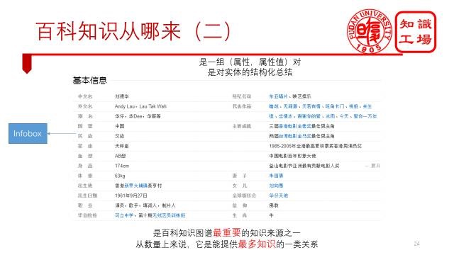
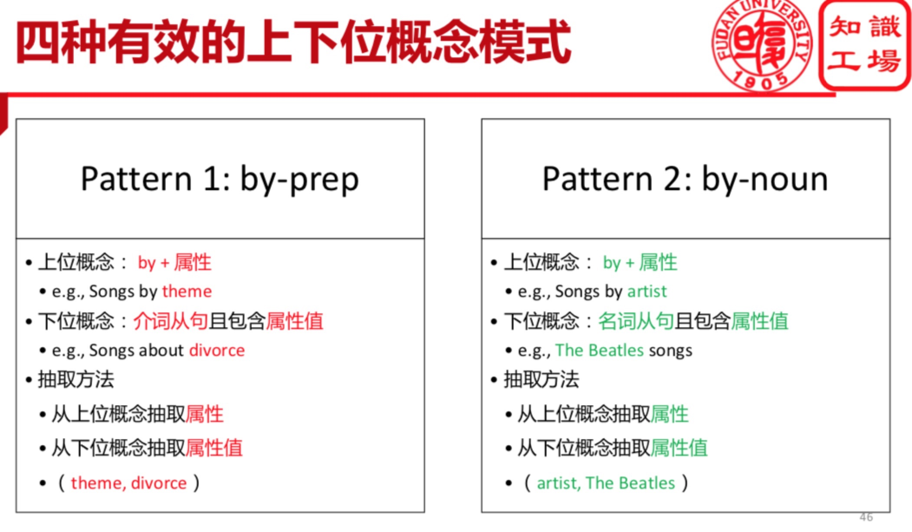
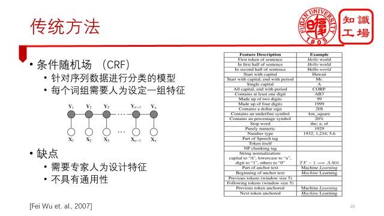
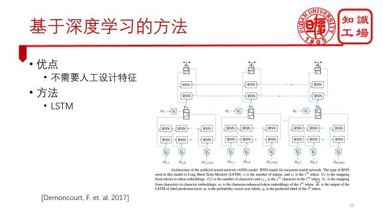
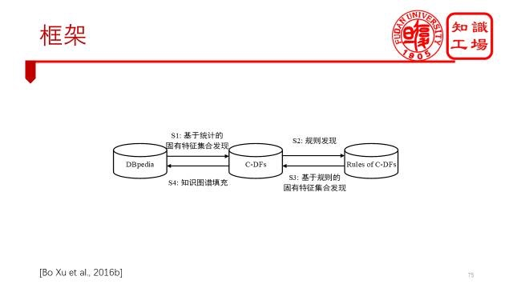

<h1>知识图谱学习（二）--徐波：百科知识图谱构建</h1>

学习复旦大学知识工厂实验室在CCKS 2017讲习上的讲义，探寻百科知识图谱构建方法。

参考链接：[徐波：百科知识图谱构建](https://mp.weixin.qq.com/s/zIqjO8fgC8N0VKnJiLJa1g)

<h2>百科知识图谱简介</h2>

1. 定义：==从百科类网站抽取知识构建而成的知识图谱==；
2. 百科网站有哪些：
    1. 典型：百度百科、维基百科、互动百科...
        1. 

    2. 电影：IMDB、猫眼、豆瓣...
        1. 

    3. 购物网站：京东、亚马逊...
        1. 

    4. 旅游网站：携程、马蜂窝...（着手要做的）
    5. 等等...
3. 百科网站特点：
    1. 每个页面都是围绕一个实体的全方面介绍；网页链接=网页前缀+实体名；
    2. 抽取简单：包含格式统一的半结构化文本；
    3. 内容质量高：众包/专业人员编辑；
4. 百科知识图谱分类：
    1. 单数据源百科图谱：
        1. 侧重：单数据源的知识抽取、深度挖掘；
        2. 举例：DBpedia, YAGO/[YAGO2: A spatially and temporally enhanced knowledge base from Wikipedia](https://www.sciencedirect.com/science/article/pii/S0004370212000719), CN-DBpedia...
    2. 多数据源百科图谱：
        1. 侧重：多数据源的知识融合；
        2. 举例：BabelNet/[BabelNet: The automatic construction, evaluation and application of a wide-coverage multilingual semantic network](http://www.aclweb.org/anthology/P10-1023), Zhishi.me, XLORE（跨语言知识图谱）...
    3. 领域百科知识图谱：按各个领域划分...
        1. 

<h2>单数据源百科知识图谱构建</h2>

1. 构建流程：
    1. 知识获取：通过自动的方法将网页数据转化为高质量的结构化数据；
    2. 知识补充：现有数据的基础上加以完善，得到更多结构化的知识；
    3. 知识更新：保证所获得的知识永远是最新的；

<h3>知识获取</h3>

1. 知识抽取：
    1. 知识抽取分类：
        1. 结构化数据的知识抽取（t5 知识图谱虚拟化）：
            1. eg：数据库
        2. 半结构化数据的知识抽取（t2 百科知识图谱构建）：
            1. eg：表格，infobox
            2. 

        3. 非结构化数据的知识抽取（t3 知识获取方法）：
            1. eg：文本
    2. 百科知识来源：
        1. 
        2. 
        3. 
        4. 知识体系分为：
            1. 本体Ontology：严格is-A关系，适用知识推理；
            2. Taxonomy：非严格is-A关系，可表示概念的二义性；
            3. Folksonomy：开放分类，可以涵盖更多概念，但难以进行标签管理；
2. 数据清洗：
    1. 属性不一致：
        1. 解决方案--**单数据源属性融合**：
            1. 找到候选属性对：
                1. 属性名相似性：通过属性相似性来找候选属性对，eg，英文名和英文名称；
                2. 外部知识库：同义词字典、百度汉语等地方来找同义词，eg，妻子和老婆；
                3. 人工录入；
            2. 删除错误属性对：
                1. 基于启发式规则：
                    1. 等价属性不能同时出现在一个实体中。eg，复旦大学这个实体中不可能同时出现“英文名”和“英文名称”这两个属性。
                    2. 等价属性的domain和range要相同等等
                2. 人工删除；
    2. 数值属性值格式不一致：
        1. 解决方案--**数值属性值归一化**：
        2. 
    3. 多个对象属性值未分割：
        1. 解决方案--**对象属性值分割**：
        2. 

<h2>知识填充</h2>

1. 知识缺失问题：
    1. 单个实体的知识缺失：
        1. 

    2. 实体分类知识缺失：所有实体都缺少的分类知识；缺失概念及概念间的关系？
        1. 

    3. 概念表示知识缺失：概念怎么形成的？缺失一些概念的属性信息？
        1. 
2. 知识填充方案--解决知识缺失问题：
    1. 实体属性-值关系填充（infobox completion/slot filling）--解决单个实体的知识缺失；
    2. 实体分类entity typing--解决实体分类知识缺失：选择不直接构建本体，而是使用其他知识图谱中构建好的本体；
    3. 概念符号表示--解决概念表示知识缺失；

<h3>实体属性-值关系填充infobox completion</h3>

1. 利用其他知识图谱进行填充：
    1. 主要思想：知识融合knowledge fusion -- 知识合并 -- 合并外部知识库；
    2. 难点：实体匹配、属性匹配、属性值融合、跨语言；
    3. 

2. 利用百科网站实体标签进行填充：
    1. 
    2. 
    3. 
    4. 
    5. 
3. 利用实体文本内容进行填充（无结构数据抽取实体、关系）：
    1. 基本思路：与DBpedia的网页抽取思路类似
        1. 为每一个属性/关系构建一个抽取器（分类器）；
        2. 每个抽取器（分类器）分别从百科文本（实体名已知）的句子中抽取出相应属性值/关系目标实体；
    2. 
    3. 
    4. 
    5. 

<h2>实体分类</h2>

我们这里研究的实体分类是指将知识图谱中的实体分类到一组预定义的概念集合中。这与传统的命名实体识别问题有一些区别，传统命名实体识别问题研究的是一个句子中的实体指称项（也称mention），考虑的也仅仅是上下文的文本特征，实体指称项的分类结果可能只是现实世界中实体分类结果的一部分。例如从句子“刘德华出生于1961年9月”中，只能推断出“刘德华”属于“人物”这个概念，其他的“演员”、“歌手”等概念都无法得到。知识图谱中的实体分类研究的对象是实体本身，考虑的是实体在知识图谱中的全部知识，包括文本特征和语义关系特征等，与真实世界中实体的分类结果理论上一致。

1. 实体分类的方法：
    1. 人工方法：通过人工方法建立infobox模版名称和概念的等价关系；
    2. 自动规则：基于等价概念、等价实体以及继承关系来进行推理；
        1. 
        2. 

    1. 有监督学习：**需要充足的已标注训练集（但是百科知识图谱缺失实体的分类知识）**，eg，SVM、逻辑回归、决策树...
    2. 弱监督学习/远程监督学习：更多情况下，我们遇到的问题是没有训练集，例如，我们要将百度百科的实体分类到英文DBpedia的本体上去。所以我们可以通过一种被称为弱监督或者远程监督的方法来构建训练集，即
        1. 步骤一：**实体链接**，建立起中文百度百科实体和英文DBpedia实体的等价关系，；
        2. 步骤二：**跨语言概念传递**，把英文实体的分类关系传递给等价的中文实体，通过这种方式就能为一些中文百度百科实体获得标记数据了；
        3. 
        4. 问题：远程监督构建的训练集存在噪声
            1. 目标知识图谱本身存在噪声
            2. 实体链接错误（链接到错误实体，导致获得的跨语言概念错误）
            3. 实体特征缺失：导致很多正确的分类错误变成了错误标记。举个极端点的例子就是，一个实体，它的所有特征都缺失了，但是根据等价关系知道它有很多分类结果，这就意味着，如果你不包含任何特征，你就能属于这些分类。这显然是错误的。
        5. 远程监督训练集存在噪声的解决方法：多分类器投票过滤
            1. 
            
<h3>CN-DBpedia中的实体分类</h3>

1. CN=DBpedia实体分类问题：将百度百科中的实体分类到DBpedia的概念集合中；
2. 实体的特征：
    1. 语义关系特征：
        1. 属性；
        2. 属性-值；
        3. 标签；
    2. 文本特征：
        1. 来自于摘要及正文信息；
3. 实体分类方法：
    1. 利用语义关系特征来进行分类：
        1. 

    2. 利用文本特征来对实体进行分类：
        1. 
        
<h3>概念表示</h3>

1. 概念的固有特征集合Defining Features：经典范畴理论认为，概念是由一组包含相同特征集合的实体组成，这组特征集合称为概念的固有特征集合Defining Features；
2. 概念的固有特征集合的性质：
    1. 性质一：如果一个实体的特征包括某个概念的固有特征集合，那么它一定属于这个概念。这个性质可以帮助我们做实体分类。
    2. 性质二：如果一个实体属于某个概念，那么它的特征也一定包含这个概念的固有特征集合。这个性质可以用来帮助我们做infobox completion.
    3. 
    4. 概念表示框架：看图片里的论文吧
        1. 

<h2>知识更新</h2>

1. 传统更新方法：
    1. 基于更新日志的更新：
        1. **DBpedia的更新策略**。wikipedia会把每天更新的内容以文件的形式发布出来，知识图谱只要更新这些文件就好了。这是最好的更新方式，但是百度百科没有，你只能去猜到底哪些实体更新过了。
    2. 周期性更新：
        1. eg，半年重新爬取一遍数据；
        2. 代价巨大，时效性同样不能保证；
2. 基于语义搜索引擎的更新：
    1. 
3. 主动更新方法：
    1. 基本思路：
        1. 监控热词（热词分为：a. 新词；b. 旧词，但信息发生了变化）；
        2. 更新热词及相关词条
    2. 更新步骤：
        1. 
        2. 优先级设置：
            1. 

