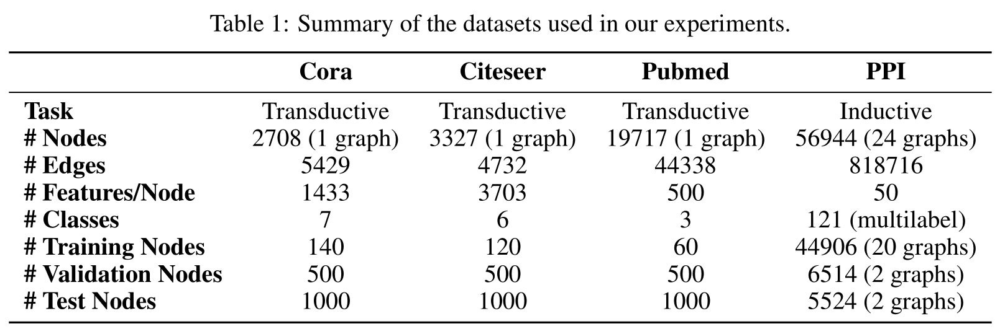

<h1>知识图谱理论篇(十三) --论文阅读GRAPH ATTENTION NETWORKS</h1>

<h2>1. 论文阅读---“GRAPH ATTENTION NETWORKS”(ICLR 2018)</h2>

参考链接：
1. [Graph Attention Networks](https://davidham3.github.io/blog/2018/07/13/graph-attention-networks/)
2. [论文 | 图注意力网络 | GRAPH ATTENTION NETWORKS](https://www.jianshu.com/p/8078bf1711e7)
3. [Graph Attention Network的本质是什么？](https://www.zhihu.com/question/275866887)

<h3>0. abstract</h3>

1. 提出**图注意力网络graph attention networks**，该网络直接**作用于图**结构**数据**，利用**自注意力层使得节点会自注意其所有邻居节点特征**，解决基于图卷积或图卷积近似的先前模型的缺点；
2. 通过堆叠层（层内节点会自注意其所有邻居节点特征），我们可以为邻居中的不同节点分配不同权重，且无需进行大量计算，无需提前知晓图结构；
3. 这样，GAT同时解决了基于谱方法的GNN的多项关键挑战，且GAT可用于inductive，或者transductive问题（inductive, transductive?）

<h3>1. introduction</h3>

1. CNN在处理欧式数据/网格数据，许多任务上性能多么多么好，但是不能处理非欧数据
2. 图神经网络GNN的发展
    1. 早期的工作使用RNN来学习**有向无环图**的特征表示。2005 年和 2009 年提出了 GNN（Graph Neural Networks），作为 RNN 的泛化，可以直接处理更一般的图结构，比如**有环图、有向图、无向图**。GNN 包含了一个迭代过程，迭代时节点状态向前传播直至稳态equilibrium，后面使用一个神经网络来依据节点状态产生节点输出。Li et al., 2016使用了Cho et al., 2014提出的门控循环单元进行改进。
3. 图卷积网络GCN的发展--将卷积应用于图数据
    1. 基于普方法的GCN
        1. 第一代GCN Bruna et al. (2014),--通过图拉普拉斯矩阵特征分解来定义谱域图卷积，需要大量计算与卷积核非空间局部
        2. 第二代GCN Defferrard et al. (2016) --使用切比雪夫多项式近似图卷积核，无需计算拉普拉斯特征分解，且卷积核空间局部化
        3. Kipf & Welling (2017) -- 使用切比雪夫**一阶**多项式近似图卷积/对一跳邻居作卷积，并通过堆叠多层卷积层，实现输入空间上k跳邻居卷积
        4. **谱方法缺点：卷积核依赖于图拉普拉斯特征向量基，即需要提前知道图拉普拉斯矩阵，即本质上需要提前知道图结构。因此，在特定结构的图上训练的模型无法直接应用于不同结构的图数据**
    2. 基于非普方法的GCN
        1. 非谱方法 (Duvenaud et al., 2015; Atwood & Towsley, 2016; Hamilton et al., 2017)方法直接在图上定义卷积操作，卷积操作于一组组空间接近的邻居节点。**非普方法的关键挑战是需要定义一个能处理不同数量邻居的卷积操作，并且保证 CNN 权重共享的性质。**在某些情况下，这需要为每个 node degree 学习一个权重矩阵 (Duvenaud et al., 2015)，在对每个 input channel 和 neighborhood degree 训练权重时，使用转移矩阵的幂定义邻居 (Atwood & Towsley, 2016)，或是对有着固定数量顶点的邻居进行提取和归一化(Niepert et al., 2016)。Monti et al., 2016提出了混合模型 CNN，(MoNet)，这个空间方法提供了一个 CNN 在图上泛化的统一的模型。最近，Hamilton et al., 2017提出了 GraphSAGE，对每个顶点采样采出一个固定数量的邻居，然后使用一个指定的聚合操作聚集他们（比如取所有采样邻居的均值，或是将他们放进RNN后产生的结果）。这个方法在几个大规模的 inductive 数据集上获得了很惊人的效果。
    3. 注意力机制
        1. 注意力机制在很多基于序列的任务中已经成为了一个标准 (Bahdanau et al., 2015; Gehring et al., 2016)。注意力机制的一个好处是可以处理变长输入，专注于输入中最相关的部分来做决策。使用注意力机制计算一个序列的表示时，一般提到的是 self-attention 或 intra-attention。与 RNN 或卷积一起使用时，self-attention 在机器阅读(Cheng et al., 2016)和学习句子表示(Lin et al., 2017)这些任务上很有用。然而，Vaswani et al., 2017的研究表明，self-attention 不仅可以提升 RNN 和卷积的模型，在机器翻译任务上也是可以构建出性能最强的模型的。
    4. 论文贡献
        1. 提出了基于attention的模型GAT对图结构的顶点进行分类。核心思想是使用self-attention机制，通过对顶点邻居的自注意，计算图中每个顶点的表示。
        2. GAT高效--可并行计算多个“顶点-邻居”对；
        3. GAT，通过对邻居指定任意的权重，可以在有着不同度的顶点上使用；
        4. **模型可以直接应用在 inductive learning 任务上**，包括模型必须要生成完整的未见过的图generalize to completely unseen graphs等任务；
        5. 在4个benchmark上验证了GAT：Cora，Citeseer，Pubmed citation networks，protein-protein interaction，获得了比肩 state-of-the-art 的结果，**展现了基于 attention的模型在处理任意结构的图的可能性**。
    
值得注意的是，如 Kipf & Welling 2017和Atwood & Towsley 2016，我们的工作可以重写为 MoNet(Monti et al., 2016)的一种特殊形式。除此以外，我们在边上共享分享神经网络计算的方法让人联想到关系网络(Santoro et al., 2017)和VAIN(Hoshen, 2017)的公式，在这两篇文章中，通过使用一种共享机制，object或agent间的关系被聚合成对，。相似地，GAT模型可以联系到 Duan et al., 2017 和 Denil et al., 2017 的工作，他们使用一个邻居注意力操作来计算一个环境中不同object的注意力系数。其他相关的方法包括局部线性嵌入(LLE)(Roweis & Saul, 2000)和记忆网络(Weston et al., 2014)。LLE 在每个数据点选择了固定数量的邻居，为每个邻居学习了权重系数，以此将每个数据点重构为邻居的加权之和。之后的优化提取了顶点嵌入的特征。记忆网络与我们的工作也有关系，如果我们将一个顶点的邻居解释为记忆，通过注意它的值可以计算顶点特征，之后通过在同样的位置存储新特征进行更新。

    
<h3>2. 图注意力网络架构GAT</h3>

**图注意力层graph attention layer**

输入是一组顶点特征${\mathbf{h}} = \lbrace \vec{h}_1, \vec{h}_2, …, \vec{h}_N \rbrace , \vec{h}_i \in \mathbb{R}^F$，其中 𝑁 是顶点数，𝐹 是每个顶点的特征数；输出为新（维度可能不同）顶点特征${\mathbf{h}’} = \lbrace \vec{h}’_1, \vec{h}’_2, …, \vec{h}’_N\rbrace , \vec{h}’_i \in \mathbb{R}^{F’}$

为了在将输入特征变换到高维特征时获得充足的表现力，至少需要一个可学习的线性变换。为了到达这个目的，每个顶点都会使用一个共享参数的线性变换，参数为${\mathbf{W}} \in \mathbb{R}^{F’ \times F}$。然后在每个顶点上做一个 self-attention ——一个共享的attention机制$a : \mathbb{R}^{F’} \times \mathbb{R}^{F’} \rightarrow \mathbb{R}$来计算注意力系数 attention coefficients：$$\tag{1} e_{ij} = a(\mathbf{W} \vec{h}_i, \mathbf{W} \vec{h}_j)$$

表示顶点j的特征对顶点i的重要性(importance)。在最一般的公式中，模型可以使每个顶点都注意其他所有顶点（与所有节点都存在边/注意力系数），扔掉所有的图结构信息。我们使用mask attention使得图结构可以注入到注意力机制中——我们只对顶点$j \in \mathcal{N_i}$计算$e_{ij}$，其中$\mathcal{N_i}$是顶点i在图中的一些邻居。在我们所有的实验中使用i的一阶邻居（包括i自身）。为了让系数在不同的顶点都可比(**归一化，在统一尺度下衡量系数的影响力**)，我们对所有的j使用 softmax 进行了归一化：

$$\tag{2} \alpha_{ij} = \mathrm{softmax}_j (e_{ij}) = \frac{\exp{e_{ij}}}{\sum_{k \in \mathcal{N}_i} \exp{e_{ik}}}$$

在我们的实验中，注意力机制a是一个单层的前向传播网络，参数为权重向量$\vec{\text{a}} \in \mathbb{R}^{2F’}$，使用LeakyReLU作为非线性层（斜率𝛼=0.2）。整个合并起来，注意力机制计算出的系数（如图1左侧所示）公式为：

$$\tag{3} \alpha_{ij} = \frac{ \exp{ ( \mathrm{LeakyReLU} ( \vec{\text{a}}^T [\mathbf{W} \vec{h}_i \Vert \mathbf{W} \vec{h}_j ] ))}}{\sum_{k \in \mathcal{N_i}} \exp{(\mathrm{LeakyReLU}(\vec{\text{a}}^T [\mathbf{W} \vec{h}_i \Vert \mathbf{W} \vec{h}_k]))}}$$

其中$·^T$表示转置，||表示concatenation操作。

得到归一化的分数后，使用归一化的注意力系数计算对应特征的线性组合，作为每个顶点最后的输出特征（最后可以加一个非线性层，$\sigma$）：$$\tag{4} \vec{h}’_i = \sigma(\sum_{j \in \mathcal{N}_i} \alpha_{ij} \mathbf{W} \vec{h}_j)$$

为了稳定 self-attention 的学习过程，我们发现使用 multi-head attention 来扩展我们的注意力机制是很有效的，就像 Vaswani et al., 2017。特别地，K个独立的 attention 机制执行 式4 这样的变换，然后他们的特征连(concatednated)在一起，就可以得到如下的输出：$\tag{5} \vec{h}’_i = \Vert^{K}_{k=1} \sigma(\sum_{j \in \mathcal{N}_i} \alpha^k_{ij} \mathbf{W}^k \vec{h}_j)$

其中||表示concatenation，$\alpha^k_{ij}$是通过第 k个注意力机制$(a^k)$计算出的归一化的注意力系数，$\mathbf{W}^k$是对应的输入线性变换的权重矩阵。注意，在这里，最后的返回输出$\mathbf{h}’$，每个顶点都会有$KF’$个特征（不是$F’$）。

特别地，如果我们在网络的最后一层使用 multi-head attention，concatenation 就不再可行了，我们会使用 averaging，并且在averaging之后再使用最后的非线性层（分类问题通常是 softmax 或 sigmoid ）：$$\vec{h}’_i = \sigma(\frac{1}{K} \sum^K_{k=1} \sum_{j \in \mathcal{N}_i} \alpha^k_{ij} \mathbf{W}^k \vec{h}_j)$$

multi-head 图注意力层的聚合过程如图1右侧所示。

**与相关工作的性能比较**

+ 计算高效：**self-attention层的操作可以在所有的边上并行，输出特征的计算可以在所有顶点上并行。**没有耗时的特征值分解。**单个的GAT计算$F'$个特征的时间复杂度可以压缩至$O(\vert V \vert F F’ + \vert E \vert F’)，F$**是输入的特征数，$\vert V \vert$和$\vert E \vert$是图中顶点数和边数。复杂度与Kipf & Welling, 2017的GCN差不多。**尽管使用multi-head attention可以并行计算，但也使得参数和空间复杂度变成了K倍。**
+ **对比GCN，GAT允许对顶点的同一个邻居分配不同的重要度**，使得模型能力上有一个飞跃。不仅如此，对学习到的attentional权重进行分析可以得到更好的解释性，就像机器翻译领域一样（比如Bahdanau et al., 2015的定性分析）。
+ 注意力机制以一种共享的策略应用在图的所有的边上，因此它并不需要在之前就需要得到整个图结构或是所有的顶点的特征（很多之前的方法的缺陷）。因此这个方法有几个影响：
    + 图不需要是无向的（如果边$j \rightarrow i$没有出现，我们可以直接抛弃掉$\alpha_{ij}$的计算）
    + 这个方法可以直接应用到inductive learning——包括在训练过程中在完全未见过的图上评估模型的任务上。

    

我们可以做出一种使用稀疏矩阵操作的GAT层，将空间复杂度降低到与顶点数和边数成正比，使得GAT模型可以在更大的图数据集上运行。然而，我们使用的tensor操作框架只支持二阶tensor的稀疏矩阵乘法，限制了当前实现的版本模型的批处理能力（尤其在有多个图的数据集上）。解决这个问题是未来的一个重要研究方向。在这些使用稀疏矩阵的场景下，在某些图结构下GPU的运算并不能比CPU快多少。另一个需要注意的地方是我们的模型的感受野的大小的上界取决于网络的深度（与GCN和其他模型相似）。像skip connections(He et al., 2016)这样的技术可以来近似的扩展模型的深度。最后，在所有边上的并行计算，尤其是在分布式计算场景下，存在很多冗余的计算，因为图中的邻居往往高度重叠（每个分布式处理器上都会重复计算这些重叠的邻居节点）。

<h3>3. Evaluation</h3>

转导学习Transductive Learning和归纳学习Inductive Learning的参考材料：
1. [如何理解 inductive learning 与 transductive learning?](https://www.zhihu.com/question/68275921?sort=created)
2. [Transductive Learning vs Inductive Learning(注意区别转导学习、归纳学习与转导推理、归纳推理)](https://blog.csdn.net/wendox/article/details/50474264)

实验部分请参考：
1. [Graph Attention Networks](https://davidham3.github.io/blog/2018/07/13/graph-attention-networks/)
2. [论文 | 图注意力网络 | GRAPH ATTENTION NETWORKS](https://www.jianshu.com/p/8078bf1711e7)

论文在四个公开图数据集任务（转导学习transductive与归纳学习inductive）上对GAT模型与baseline模型进行了评估，评估发现GAT模型在四个公开数据集上部分达到states-of-the-art性能、部分与现有states-of-the-art模型性能相近。这部分将总结实验过程与结果，并对GAT提取的特征表示做一个定性分析。

**3.1. 数据集**

**Transductive learning** 使用三个标准的citation network benchmark数据集——Cora, Citeseer和Pubmed(Sen et al., 2008)——并遵循Yang et al., 2016的transductive实验设置experiment setup进行实验。这些数据集中，顶点表示文章，边（无向）表示引用。顶点特征为文章的BOW词包特征。每个顶点有一个类标签。我们允许使用每类标签仅20个顶点用于训练，但是，遵循trasnductive学习的设置，训练算法在训练过程中能使用所有的顶点特征。我们划分1000个节点构成测试集，用于评估模型的预测性，并划分500个顶点构成验证集（同Kipf & Welling 2017）。Cora数据集包含了2708个顶点，5429条边，7个类别，每个顶点1433个特征。Citeseer包含3327个顶点，4732条边，6类，每个顶点3703个特征。Pubmed数据集包含19717个顶点，44338条边，3类，每个顶点500个特征。

**Inductive learning** 使用protein-protein interaction(PPI)数据集，这个数据集由不同的人体组织图构成（Zitnik & Leskovec, 2017）。数据集包含了20个图的训练集，2个图的验证集，2个图的测试集。关键的是，测试的图包含了训练时完全未见过的图。为了构建图，我们使用Hamilton et al., 2017预处理后的数据。平均每个图的顶点数为2372个。每个顶点有50个特征，分别由positional gene sets，motif gene sets and immunological signatures组成。根据从Molecular Signatures Database(Subramanian et al., 2005)收集的基因本体，每个顶点node sets有121个标签，由，一个顶点可以同时拥有多个标签。

各个数据集的统计数据如下图

**3.2. state-of-the-art性能的baseline模型**

**transductive learning**下的state-of-the-art模型  对于transductive learning任务，我们对比了Kipf & Welling 2017的工作，以及其他的baseline。包括了label propagation(LP)(Zhu et al., 2003)，半监督嵌入(SemiEmb)(Weston et al., 2012)，manifold regulariization(ManiReg)(Belkin et al., 2006)，skip-gram based graph embeddings(DeepWalk)(Perozzi et al., 2014)，the iterative classification algorithm(ICA)(Lu & Getoor, 2003)和Planetoid(Yang et al., 2016)。我们也直接对比了GCN(Kipf & Welling 2017)，以及对比利用了高阶切比雪夫的图卷积模型(Defferrard et al., 2016)，还有Monti et al., 2016提出的MoNet。

**Inductive learning**下的state-of-the-art模型  对于inductive learning任务，我们对比了Hamilton et al., 2017提出的四个不同的有监督的GraphSAGE inductive（归纳）方法。这些方法提供了在抽样邻居中聚合特征的各种方法：GraphSAGE-GCN（将图卷积操作扩展到inductive setting），GraphSAGE-mean（对特征向量的值取element-wise均值），GraphSAGE-LSTM（通过将邻居特征输入到LSTM进行聚合），GraphSAGE-pool（用一个共享的多层感知机对特征向量进行变换，然后使用element-wise取最大值）。其他的transductive方法要么在inductive中完全不合适，要么就认为顶点是逐渐加入到一个图中，使得他们不能在完全未见过的图上使用（如PPI数据集）。

**3.3. 实验设置（模型设置）**

**Transductive learning** 使用**两层**GAT模型，模型在Cora数据集上调优超参数，然后直接对Citeseer数据集上实验的模型重用相同的超参数。

+ 第一层包含K=8个attention head，每个attention head下计算得到F'=8个特征（总共64个特征），之后接一个指数线性单元（ELU）（Clevert et al., 2016）作为非线性单元。
+ 第二层用作分类：一个单个的attention head计算C个特征（其中C是类别的数量），之后用softmax激活。
+ 处理小训练集时，在模型上加正则化。在训练时，我们使用$L_2$正则化，正则比重为$\lambda$=0.0005。除此以外，两个层的输入，以及normalized attention coefficients上都使用了p=0.6的dropout(Srivastava et al., 2014)（也就是在每轮训练时，每个顶点只对其所有邻居的一个随机采样进行attention coefficient计算）。
+ 如Monti et al., 2016观察到的一样，我们发现Pubmed的训练集大小(60个样本)要求我们对GAT模型进行微调：我们使用K=8个attention head，加强了$L_2$正则至$\lambda$=0.001。除此以外，我们的结构都和Cora和Citeseer的一样。

**Inductive learning** 使用三层GAT模型。

+ 前两层分别包含K=4个attention head，每个attention head计算F'=256个特征（总共1024个特征），然后使用ELU非线性激活函数。
+ 最后一层用于多类别分类：包含K=6个attention head，每个attention head计算121个特征，接着，取平均后使用logistic sigmoid激活。训练集充分大所以不需要使用$L_2$正则或dropout，但是我们在attentional layer间使用了skip connections(He et al., 2016)。训练batch size设置为2个图。为了严格的衡量出使用注意力机制的效果（与一个近似等价GCN的模型相比较，就是下面提到的constant-GAT），我们也提供了constant attention mechanism，$\alpha(x, y) = 1$，使用同样的GAT架构，并且每个邻居上都有相同的权重。

两个模型都使用了Glorot初始化(Glorot & Bengio, 2010)，使用Adam SGD(Kingma & Ba, 2014)优化cross-entropy，Pubmed上初始学习率是0.01，其他数据集是0.005。 In both cases we use an early stopping strategy on both the cross-entropy loss and accuracy (transductive) or micro-F1 (inductive) score on the validation nodes, with a patience of 100 epochs1

**3.4. 实验结果**

对于transductive任务，我们提交了GAT经过100次迭代训练后在测试集上的平均分类精度（还有标准差），也延用（照搬）了Kipf & Welling., 2017和Monti et al., 2016的metrics（结果）。特别地，对于基于切比雪夫的GCN方法(Defferrard et al., 2016)，我们使用了实验结果最好的二阶和三阶卷积核。为了公平的评估注意力机制的性能，我们还评估了一个计算出64个隐含特征的GCN模型，并且尝试了ReLU和ELU激活，记录了100轮后更好的那个结果（GCN-64）（结果显示ReLU更好）。

对于inductive任务，我们计算了GAT在两个从未见过的测试图上10次平均的micro-averaged F1 score结果，其他模型结果沿用了Hamilton et al., 2017的metrics。特别地，因为我们的方法是监督的，我们对比了有监督的GraphSAGE。为了评估聚合所有的邻居的优点，我们还提供了我们通过修改架构（三层GraphSAGE-LSTM分别计算[512, 512, 726]个特征，128个特征用来聚合邻居）所能达到的GraphSAGE最好的结果（GraphSAGE）。最后，为了公平的评估注意力机制对比GCN这样的聚合方法，我们记录了我们的constant attention GAT模型的10轮结果（Const-GAT）。

结果展示出我们的方法在四个数据集上都达到或接近state-of-the-art水平，和预期一致，如2.2节讨论的那样。具体来说，在Cora和Citeseer上我们的模型上升了1.5%和1.6%，推测应该是给邻居分配不同的权重起到了效果。值得注意的是在PPI数据集上：我们的GAT模型对于最好的GraphSAGE结果提升了20.5%，这意味着我们的模型可以应用到inductive上，通过观测所有的邻居，模型会有更强的预测能力。此外，针对Const-GAT也提升3.9%，再一次展现出给不同的邻居分配不同的权重的巨大提升。

学习到的特征表示的有效性可以定性分析——我们提供了t-SNE(Maaten & Hinton, 2008)的可视化——我们对在Cora上面预训练的GAT模型中第一层的输出做了变换（图2）。representation在二维空间中展示出了可辩别的簇。注意，这些簇对应了数据集的七个类别，验证了模型在Cora上对七类的判别能力。此外，我们可视化了归一化的attention系数（对所有的8个attention head取平均）的相对强度。像Bahdanau et al., 2015那样适当的解释这些系数需要更多的领域知识，我们会在未来的工作中研究。

<h3>4. 结论</h3>

我们展示了图注意力网络(GAT)，新的卷积风格神经网络，利用masked self-attentional层。图注意力网络计算高效（不需要耗时的矩阵操作，在图中的顶点上并行计算），处理不同数量的邻居时对邻居中的不同顶点赋予不同的重要度，不需要依赖整个图的结构信息——因此解决了之前提出的基于谱的方法的问题。我们的这个利用attention的模型在4个数据集针对transductive和inductive（特别是对完全未见过的图），对顶点分类成功地达到了state-of-the-art的performance。

未来在图注意力网络上有几点可能的改进与扩展，比如解决2.2节描述的处理大批数据时的实际问题。还有一个有趣的研究方向是利用attention机制对我们的模型进行一个深入的解释。此外，扩展我们的模型从顶点分类到图分类也是一个更具应用性的方向。最后，扩展我们的模型到整合边的信息（可能制视了顶点关系）可以处理更多的问题。

<h2>5. 论文复现---“GRAPH ATTENTION NETWORKS”(ICLR 2018)</h2>

### 到底何为transductive learning & inductive learning？
1. [Quora上的答案--What-is-the-difference-between-inductive-and-transductive-learning](https://www.quora.com/What-is-the-difference-between-inductive-and-transductive-learning)：无非就是利用了无标签数据的特征，transductive认为无标签的数据也能够为任务提供有利信息
2. transductive & inductive这部分还是不太理解
3. 对于gcn到底能不能用于inductive还是不太理解
    1. 

### 数据集：

(transductive部分)

沿用论文`SEMI-SUPERVISED CLASSIFICATION WITH GRAPH CONVOLUTIONAL NETWORKS(kipf&welling ICLR2017)`中使用的preprocessed的cora, citeseer, pubmed**引文网络**数据集；

当然，kipf&welling也是摘取论文`Revisiting Semi-Supervised Learning with Graph Embeddings. Zhilin Yang, William W. Cohen, Ruslan Salakhutdinov. ICML 2016.`中数据集的inductive部分，数据集的preprocessed工作就是这篇ICML 2016论文完成的；（怀疑这篇ICML把transductive和inductive概念弄反了）

附上两篇论文的github链接，可以观察数据集：
1. <https://github.com/tkipf/gcn/tree/master/gcn>
2. <https://github.com/kimiyoung/planetoid>

通过diff比较kipf&welling数据集和zhilin yang数据，发现inductive部分是完全一样的（kipf&welling就是沿用的zhilin yang的数据集）

再diff比较kipf&welling数据集和GAT数据集（只提供了cora部分代码与数据集），发现cora数据是完全一样的（GAT就是沿用的kipf&welling的数据集）

到这思路就很清晰了，使用kipf&welling数据集来复现GAT未开源的citeseer, pubmed部分代码；

cora原始数据集
1. 分析
    1. cora.content: 论文id，论文词包特征，论文类别 <论文id> <特征> <标签>
    2. cora.cite: 论文引用关系 <被引id><引用id>
    3. README
2. 特征
    1. 数据集中论文至少引用或被引用一篇论文
    2. 包含2708篇机器学习论文，分为7类
    3. 词包BOW：去停止词，提取词干stemming，去除词频低于10的词，BOW最后包含1433个不同词

preprocessed cora数据集
1. 分析
    1. ind.cora.allx：除测试数据的所有paper节点BOW的csr_matrix
    2. ind.cora.ally：除测试数据的所有paper节点label的ndarray
    3. ind.cora.graph：各paper id之间的连接关系（边）defautdict，dict of list
    4. ind.cora.test.index：测试集paper节点id的纯文本文件
    5. ind.cora.tx：1000个测试集paper节点BOW的csr_matrix
    6. ind.cora.ty：1000个测试集paper节点label的ndarray
    7. ind.cora.x：140个训练paper节点的BOW的csr_matrix
    8. ind.cora.y：140个训练paper节点的label的ndarray
2. 特征
    1. 前140条为训练集，训练集各个类别数据为20条，141~(141+500)条为验证集（抛弃了原始数据集的paper id，用矩阵行索引作paper id）

citeseer原始数据集（没下载到原始数据集，略）
1. 特征
    1. 测试集存在缺失节点
    2. 包含3327篇论文，分为6类
    3. 词包BOW：BOW包含3703个不同词

preprocessed citeseer数据集
1. 分析
    1. ind.citeseer.allx：除测试数据的所有paper节点BOW的csr_matrix(由于citeseer存在缺失点，allx包含2312个节点，缺失点在测试集中)
    2. ind.citeseer.ally：除测试数据的所有paper节点label的ndarray(由于citeseer存在缺失点，ally包含2312个节点，缺失点在测试集中)
    3. ind.citeseer.graph：各paper id之间的连接关系（边）defautdict，dict of list
    4. ind.citeseer.test.index：测试集paper节点id的纯文本文件
    5. ind.citeseer.tx：1000个测试集paper节点BOW的csr_matrix（补全的测试集不止1000）
    6. ind.citeseer.ty：1000个测试集paper节点label的ndarray（补全的测试集不止1000）
    7. ind.citeseer.x：120个训练paper节点的BOW的csr_matrix
    8. ind.citeseer.y：120个训练paper节点的label的ndarray
2. 特征
    1. 前120条为训练集，训练集各个类别数据为20条，141~(141+500)条为验证集（抛弃了原始数据集的paper id，用矩阵行索引作paper id），后1000条为测试集

pubmed原始数据集（没下载到原始数据集，略）

1. 特征
    1. 存在孤立节点，无引用关系
    2. 包含3327篇论文，分为6类
    3. 词包BOW：BOW包含3703个不同词

(inductive部分)

图网络数据集参考链接：

1. [数据集 | 图网络一般适用的数据集整理](https://www.jianshu.com/p/67137451b67f)
2. [数据集Cora、Citeseer、DBLP](https://blog.csdn.net/YizhuJiao/article/details/83015702)

### 数据预处理

`load_data`：所有数据集都使用到的预处理函数，主要思路是

1. 打开各个序列化存储在pickle文件中的对象：
    1. x, allx, tx --> csr_matrix
    2. y, ally, ty --> ndarray
    3. graph --> dict_of_lists: adjacency matrix
    4. 
2. `parse_index_file`读取test.index纯文本文件中的测试集节点id到list test_idx_reorder中，排序得到test_idx_range
    1. 
    2. citeseer的测试集还缺失15个节点，需要补充上行零向量，保证测试集的节点索引与test.index文件中的索引是对应上的

3. 堆叠测试集tx，ty和其余数据allx，ally形成完整数据集，并按顺序重新排序测试集（观察test.index会发现测试集顺序是被打乱的），得到features， labels
4. 构建训练集、验证集、测试集mask，并用mask划分训练集、验证集、测试集

`preprocess_features`：词包特征行归一化，每个节点的词包特征中出现的词数不一样，为了统一整个数据集中所有节点特征的影响，对每个节点特征作归一化

1. 由于citeseer中补充了零向量，为了处理除零引入np.inf，将np.inf值更换为0向量
    1. 
2. 通过稀疏对角化，并使用矩阵左乘，实现行归一化
3. 

`adj_to_bias`：使用邻接矩阵（一跳邻居矩阵）通过邻接矩阵的k次幂构建k跳邻居矩阵，k次幂的每个非零元素置1，单纯表示邻居关系，并为0元素添加负无穷偏置，使其在softmax的指数函数作用下置0，不参与后续注意力归一化计算，保证只计算并归一化邻居节点的注意力
1. 此函数只用于小图数据集cora、citeseer，使用在大图的数据集pubmed上，会很卡，且服务器上gpu内存会溢出，pubmed需要使用sparse版本的gat来解决内存占用过大问题
2. 

（大图的邻接矩阵处理函数）

`preprocess_adj_bias`：由于sparseTensor接收indices, data, dense_shape参数，所以预处理函数返回的就是预处理邻接矩阵后得到的稀疏邻接矩阵的indices，data，dense_shape

1. 邻接矩阵转换成scipy中的稀疏矩阵coo_matrix来获取row和col索引，用以构建indice坐标
2. 但不知道为什么源码中对adj作了转置，即坐标变为(col, row)，作者还特意注释了这点，没理解到作者用意
3. 

### GAT模型（非稀疏版本，用于小图）

架构：模型大概就是gat层的叠加

非稀疏版本的gat层

1. 模型使用1维卷积层实现全连接层，完成特征的线性变换
    1. 

2. 使用单层前向网络来实现注意力机制，a向量学习节点邻居间的重要型，并使用划分子向量来巧妙计算向量内积
    1. 
3. dropout
    1. 对层输入使用dropout，减小神经元之间的共适应作用，防止过拟合
    2. 对注意力系数dropout，实现masked attention
    3. 

### SpGAT模型（稀疏版本，用于大图）

大图数据使用非稀疏版本GAT会报GPU内存溢出，无法为pubmed邻接矩阵分配内存

测试前面提及的预处理函数`preprocess_adj_bias`为什么要(col, row)，与自己写的(row, col)版本比对测试

1. (col, row)--avg 0.7750: 0.7710, 0.7630, 0.7770, 0.7840, 0.7720, 0.7870, 0.7710, 0.7790, 0.7690, 0.7870, 0.7689, 0.7709
2. (row, col)--avg 0.7744: 0.7790, 0.7730, 0.7750, 0.7590, 0.7860, 0.7770, 0.7760, 0.7770, 0.7720, 0.7559, 0.7840, 0.7790
3. 结果存在一些波动，但是影响不是很大

不知为何sparse gat在pubmed上的准确度比论文提及的低1%，为测试sparse的影响，在所有数据集上测试稀疏版本与非稀疏版本性能

1. cora:
    1. sparse --avg 0.8305: 0.8319, 0.8289, 0.8319, 0.8319, 0.8280
    2. non-sparse --avg 0.8349: 0.8309, 0.8439, 0.8349, 0.8319, 0.8329
2. citeseer:
    1. sparse --avg 0.71925: 0.7240, 0.7180, 0.7290, 0.7080, 0.7070, 0.7150, 0.7290, 0.7230,
    2. non-sparse --avg 0.72405: 0.7229, 0.7230, 0.7260, 0.7220, 0.7260, 0.7129, 0.7359, 0.7240
3. pubmed:
    1. sparse: 0.7669, 0.7770, 0.7709

### 实验效果

待补充