<h1>知识图谱理论篇(五) --PCNN+ATTENTION远程监督关系抽取</h1>

之前的[实践篇一](https://github.com/charosen/ClassNotes/blob/master/knowledge_graph/semi_structure_extractor.md)介绍了使用爬虫对目标网站进行半结构化知识抽取，从而根据抽取得到的结构化数据构建知识图谱的大体流程。

然而，通过爬虫得到的数据往往缺少大量实体间关系，仅仅使用这些数据来构造的知识图谱是不完整的。因此，学术界提出从非结构数据（文本）中抽取关系以补充知识图谱的思想，即关系抽取。

本文介绍两篇论文[Neural Relation Extraction with Selective Attention over Instances](http://www.aclweb.org/anthology/P16-1200)（16年，被引次数180+）、[Distant Supervision for Relation Extraction via Piecewise Convolutional Neural Networks](http://www.emnlp2015.org/proceedings/EMNLP/pdf/EMNLP203.pdf)（15年，被引次数209+）中提出CNN系列远程监督关系抽取模型，许多关系抽取模型都使用其作为baseline，其源码即[OpenNRE](https://github.com/thunlp/OpenNRE)。

<h2>1. 论文阅读 -- Neural Relation Extraction with Selective Attention over Instances</h2>

1. introduction
    1. 远程监督关系抽取存在的问题：
        1. 远程监督存在误标注问题，导致数据集引入噪声，远程监督假说过于strong（远程监督假说DS assumption: 如果两个实体在知识库中存在关系r，则提及这两个实体的所有句子都表达了关系r）；
        2. PCNN模型使用expressed-at-least-once assumption假说，只选取最似然句子/实例（输出softmax概率最大）来更新参数，忽略了包bag中其他大量句子/实例；
    2. 论文工作：
        1. 提出ATT+PCNN模型，利用句子级别注意力机制综合利用包bag中所有实例/句子的信息，使模型专注于正例特征，降低错误标记实例的权重；
        2. 第一次将注意力机制用到远程监督关系抽取；
2. 相关工作：
    1. 大部分与“Distant Supervision for Relation Extraction via Piecewise Convolutional Neural”的相关工作相同；
    2. (Zeng et al., 2015)利用at-least-one多实例学习PCNN模型实现关系抽取，但是在每一个实体对的包中，他们只使用了**一个**最似然实例，丢失其他实例的大量信息；
    3. 注意力机制大量使用于图像分类、语音识别、image caption generation、机器翻译等许多领域；
3. 模型介绍：
    1. 整体架构：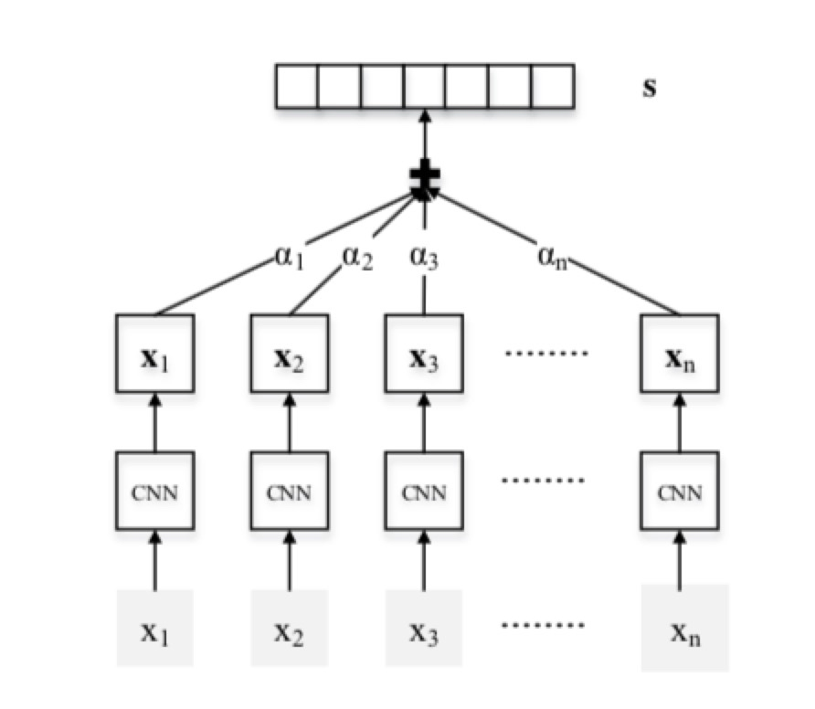
    2. 模型输入：一个句子的词序列；
    3. 模型输出：各类关系的softmax概率；
    4. 句子编码器sentence encoder：即PCNN模型(word embedding->position embedding->concat->convolution->piecewise max pooling)；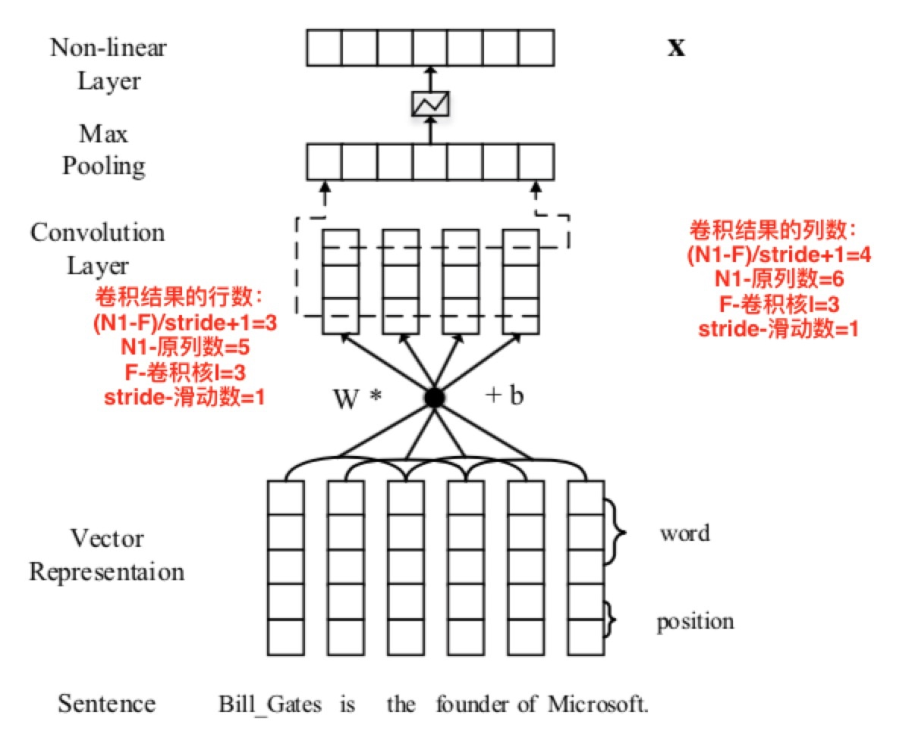

    5. 句子级别注意力selective attention over instances：
        1. 对于一个实体对的包(Set)$S = \{ x_1, x_2, ..., x_n \}$中的所有实例/句子表示$\vec{x}_1, \vec{x}_2, ..., \vec{x}_n$，我们计算包/集合表示向量$\vec{s} = \sum_i \alpha_i \vec{x}_i$，其中$\alpha_i$可以通过两种方式得到；
        2. **Average**：即$\alpha_i = 1/n$；
        3. **Selective Attention**：
            1. 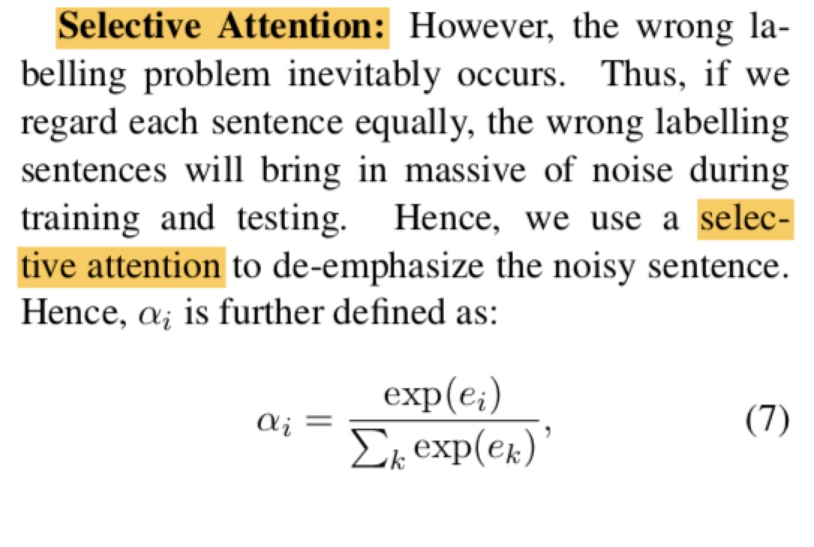
            2. 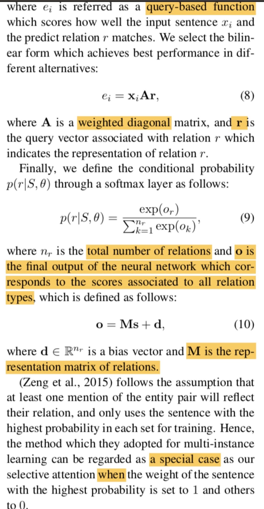
    6. 目标函数：
        1. 集合/包级别的交叉熵：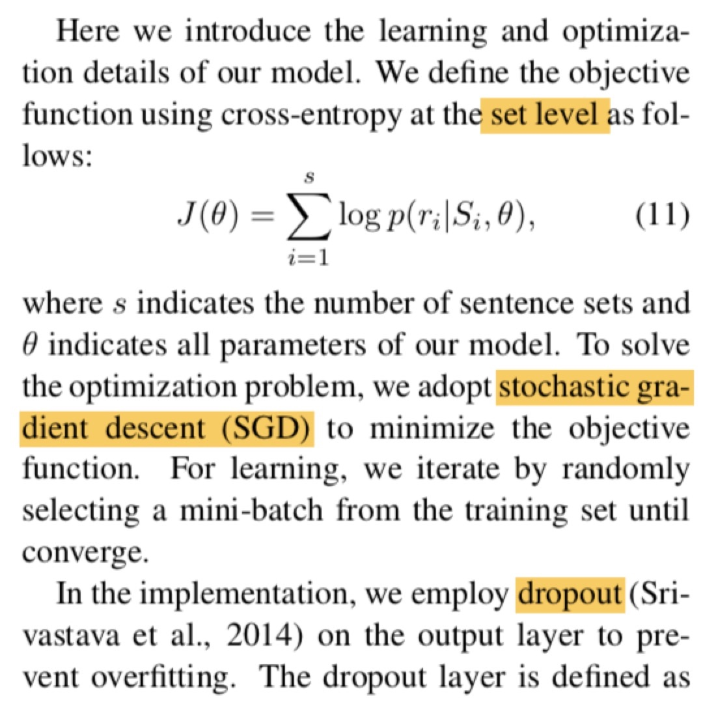
        2. dropout防止过拟合：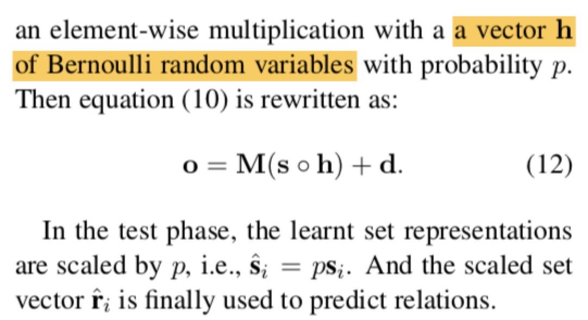


4. 实验（略）

<h2>2. 论文阅读 -- Distant Supervision for Relation Extraction via Piecewise Convolutional Neural Networks</h2>

1. introduction
    1. 远程监督关系抽取存在的问题：
        1. 远程监督存在误标注问题，导致数据集引入噪声，远程监督假说过于strong（远程监督假说DS assumption: 如果两个实体在知识库中存在关系r，则提及这两个实体的所有句子都表达了关系r）；
        2. 使用传统nlp方法、统计模型来进行关系抽取时，引入误差，性能不佳；
    2. 论文工作：
        1. 将远程监督关系抽取建模为多实例问题multi-instance problem；
            1. 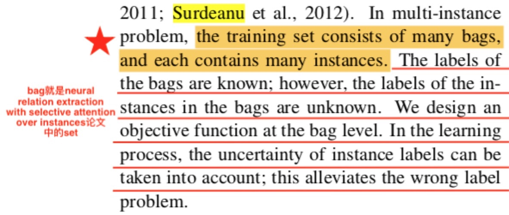
        2. 使用PCNN神经网络来代替传统nlp方法，PCNN神经网络自动学习特征，无需人工设计；
            1. piecewise max pooling替换单一max pooling，根据实体，将句子分成3段，并分段max pooling，获取实体外，实体之间的上下文特征；
2. 相关工作
    1. 关系抽取可视作分类问题：
        1. 给定知识库中的一个实体对(e1, e2)以及实体标注句子，模型预测实体e1与实体e2之间的关系r是预定义几类关系的哪一类；
    2. 关系抽取方法分为有监督关系抽取与远程监督关系抽取；
    3. 远程监督存在误标注问题，导致数据集引入噪声，远程监督假说过于strong，Riedel et al. (2010); Hoffmann et al. (2011); Surdeanu et al. (2012)等研究放宽了DS assumption；
        1. Riedel et al. (2010) --> expressed-at-least-once assumption: 如果两个实体在知识库中存在关系r，则**至少一句**提及这两个实体的句子表达了关系r --> 多实例单标签学习multi-instance single-label learning；
        2. Hoffmann et al. (2011) --> 关系可能会重叠：一对实体e1，e2可能会存在多种关系 --> 多实例多标签学习multi-instance multi-label learning；
    4. (Socher et al., 2012; Zeng et al., 2014)等人引入神经网络模型来完成关系抽取；
3. 模型介绍
    1. 整体架构：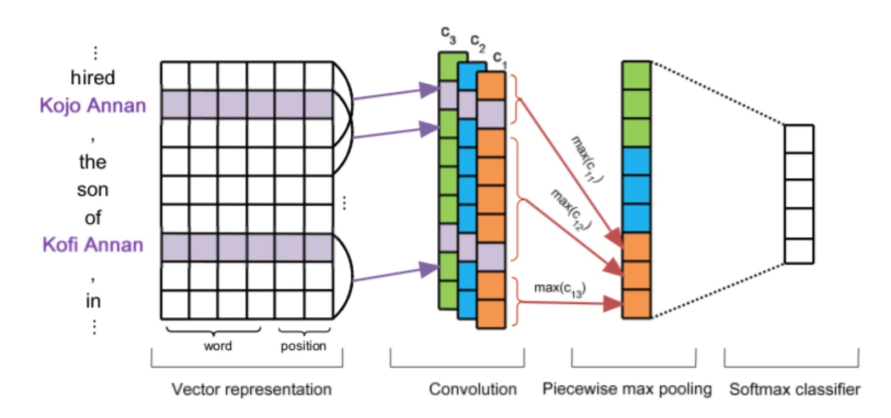
    2. 模型输入：一个句子的词序列；
    3. 模型输出：各类关系的softmax概率；
    4. 向量表示层：
        1. 词嵌入：
            1. 使用预训练词嵌入模型（实验使用word2vec），通过查预训练词嵌入矩阵得到词嵌入表示；
            2. 相比随机初始化，使用预训练词嵌入初始化模型能够达到更优的极小值点；
        2. 位置嵌入：
            1. 定义为当前词到两个实体词的相对距离；

            2. 位置嵌入是怎么训练得到的？
        3. 将词嵌入和位置嵌入拼接在一起，得到一个词的最终向量表示$q_i \in R^d$，则句子的向量表示矩阵$S = \{q_1, q_2, ..., q_s\} \in R^{s*d}$，其中$d = d_w + d_p * 2$，$d_w$为词嵌入维度，$d_p$为位置嵌入维度，最后将S输入给卷积层；
    5. 卷积层：每个卷积核即滤波器，从句子中自动抽取特征，卷积保持了输入句子的结构格式，能够更好地抽取其上下文特征；
        1. 单个卷积核($\vec{w} \in R^m (m=w*d)$，w为卷积窗口大小，d为词嵌入+位置嵌入维度)情形：
            1. 算法使用乘法实现卷积；
            2. $\vec{q}_{i:j}$表示向量$\vec{q}_i$到向量$\vec{q}_j$拼接得到的新的向量，其中$\vec{q}_{i:j} = [q_{i1}, ..., q_{id}, q_{(i+1)1}, ..., q_{(i+1)d}, ..., q_{j1}, ..., q_{jd}] \in R^{m}(m=w*d)$；
            3. 则卷积输出为$\vec{c} \in R^{s+w-1}$，其中每一个元素为$c_j = \vec{w} \vec{q}_{j-w+1:j} (1 \le j  \le s+w-1)$；
            4. 对于卷积起始阶段以及卷积结束阶段时，j<1或j>s+w-1的情况，使用padding技术补0（根据下标及实验知，为保持卷积输出与输入句子长度s相同，头尾各补一行0）；
        2. 多个卷积核($W = \{ \vec{w}_1, \vec{w}_2, ..., \vec{w}_n \} \in R^{n*m}, \vec{w}_i \in R^m(m=w*d)$)情形：
            1. 同上，n个卷积核的卷积输出为$C = \{ \vec{c}_1,\vec{c}_2, ..., \vec{c}_n \} \in R^{n*(s+w-1)}$，其中第i个卷积核输出的每一个元素为$c_{ij} = \vec{w_i} \vec{q}_{j-w+1:j} (1 \le j \le s+w-1)$；
        3. 最后讲卷积输出矩阵$C = \{ \vec{c}_1,\vec{c}_2, ..., \vec{c}_n \} \in R^{n*(s+w-1)}$输入给池化层；
    6. 分段最大池化层：卷积输出C是可变长度矩阵，长度取决输入句子长度；为了获得定长向量供后续层使用，我们使用分段池化层来采样feature map各段上的最显著特征(最大值)；
        1. 句子可以由头尾实体划分成3段，为分别获取3段中的特征，即实体之外、实体之间的上下文语义，我们使用分段最大池化层；
        2. 按实体位置，将每个卷积核的卷积输出分为3段$\vec{c_i} = \{ \vec{c}_{i1}, \vec{c}_{i2}, \vec{c}_{i3} \}$；
        3. 第i个卷积核的分段最大池化的输出的每一个元素为$p_{ij} = max(\vec{c}_{ij}),  1 \le i \le n, 1 \le j \le 3$
        4. 第i个卷积核的分段最大池化的输出为3维向量$\vec{p}_i = \{p_{i1}, p_{i2}, p_{i3} \}$；
        5. 将n个卷积核的分段最大池化结果串接得到$\vec{p}_{1:n}$，并经过非线性函数得到输出$\vec{g} = tanh(\vec{p}_{1:n}) \in R^{3n}$
    7. Softmax层：
        1. 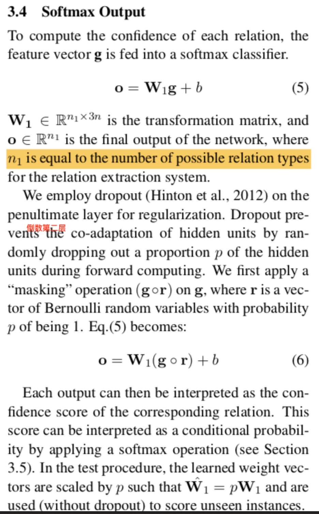
    8. 多实例学习Multi-instance learning
        1. 并非输入一个实例/句子就计算梯度、更新模型参数，而是输入包bag的一个minibatch的所有句子/实例， 选取输出关系r的softmax概率最大的实例m，使用实例m来计算梯度，更新参数；
        2. 具体见论文；
4. 实验（略）


    
    CNN用在NLP上的参考链接：[一文读懂CNN如何用于NLP](http://ju.outofmemory.cn/entry/341777)；
    CNN卷积使用矩阵乘法实现的算法的参考链接：[卷积神经网络（CNN）中卷积的实现](https://www.cnblogs.com/hejunlin1992/p/8686838.html)；

   
<h2>3. Protobuf介绍</h2>

Google protobuf(protocol buffer)是一个灵活的、高效的、语言中立的(支持多种编程语言使用)、用于序列化数据的协议。相比较XML和JSON格式，protobuf更小、更快、更便捷。

protobuf使用的3个步骤：

1. 创建`.proto`文件，并在其中定义protobuf消息类型protobuf message types(用于指定需要序列化的数据的结构/格式，以及指导数据序列化后的格式)；
2. 用protobuf编译器编译`.proto`文件，生成特定编程语言下数据访问类data access classes的源代码；
3. Java、C++、Python等开发者使用这些生成的数据访问类，即Protobuf API来开发读写消息的应用；

下面，我们详述每一个步骤涉及的技术细节；

<h3>使用protobuf语言编写.proto文件</h3>

**消息类型定义：**

一个`.proto`文件中可以定义多个消息类型，消息类型的定义格式如下：

```
message 消息名称 {

    1个或多个字段
    (eg, required/optional/repeated 字段类型 字段名称 = 字段数;)

}
```

SearchRequest消息类型例子，每个搜索请求都有一个查询字符串，感兴趣的特定结果页面以及每页的结果数：

```
message SearchRequest {
  required string query = 1;
  optional int32 page_number = 2;
  optional int32 result_per_page = 3;
}
```

可以在单个`.proto`文件中定义多种消息类型，例如：

```
message SearchRequest {
  required string query = 1;
  optional int32 page_number = 2;
  optional int32 result_per_page = 3;
}

message SearchResponse {
 ...
}
```

**字段定义：**

一个消息中可以包含一个或多个字段，字段的定义格式如下：

```
required/optional/repeated 字段类型 字段名称 = 字段数;
```

**字段类型field type**可以是内置提供的标量字段（如下图），也可以是枚举类型[enum](https://developers.google.com/protocol-buffers/docs/proto#enum)和其他**消息**类型；

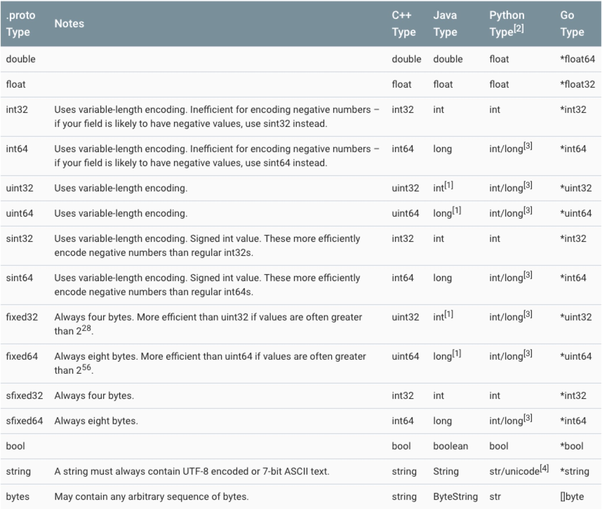

一个消息类型定义中的每一个字段都有**唯一**的**字段数field number**，这些字段数用于在protobuf序列化后的[消息二进制格式message binary format](https://developers.google.com/protocol-buffers/docs/encoding)中标识字段，并且在使用消息类型后字段数不应更改。请注意，字段数1～15占用一个字节进行编码，包括字段编号和字段类型。字段数16～2047占用两个字节。因此，应该为非常频繁出现的字段保留字段数1～15。请为将来可能添加的、频繁出现的字段预留一些字段数。

一个字段有如下规则类型：

+ `required`：消息中必须存在1个此字段；
+ `optional`：消息中存在0个或1个此字段；
+ `repeated`：消息中存在0个或1个或多个此字段；

**注释：**

使用`//`注释一行，使用`/* ... */`注释多行；

**保留字段：**

如果通过完全删除字段或将其注释掉来更新消息类型，则未来用户可以在对类型进行自己的更新时重用这些删除掉的字段数。如果此后加载相同`.proto`的旧版本，这可能会导致严重问题，包括数据损坏，bug等。确保不会发生这种情况的一种方法是指定保留已删除字段的字段数（和/或字段名称，这也可能导致JSON序列化问题）。如果将来的任何用户尝试使用这些字段标识符，协议缓冲编译器将会给予警告。

```
message Foo {
  reserved 2, 15, 9 to 11;
  reserved "foo", "bar";
}
```

请注意，您不能在同一保留语句中混用字段名称和字段数。

**optional字段及默认值**

当optional字段在数据中不存在时，protobuf将为该字段赋予自定义默认值或系统默认值；

自定义默认值格式：

```
optional int32 result_per_page = 3 [default = 10];  //方括号部分
```
系统内置默认值：对于字符串，默认值为空字符串。对于字节，默认值为空字节字符串。对于bools，默认值为false。对于数字类型，默认值为零。对于枚举，默认值是枚举类型定义中列出的第一个值。

**引用其他消息类型：**

消息类型的字段可以是其他消息类型，对于在同一个`.proto`文件中定义的消息类型，则可直接引用：

```
message SearchResponse {
  repeated Result result = 1;
}

message Result {
  required string url = 1;
  optional string title = 2;
  repeated string snippets = 3;
}
```

对于引用不同`.proto`文件中定义的消息类型，需要用到导入import：

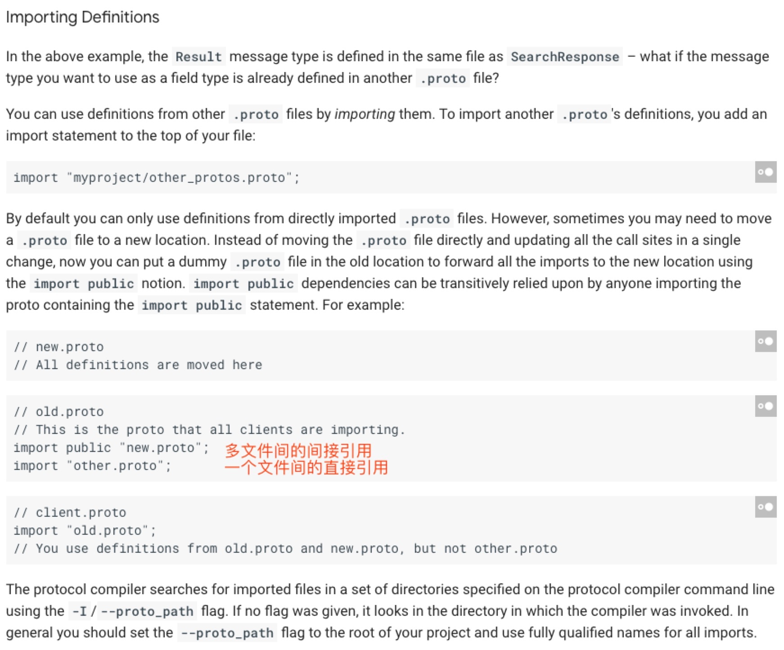


**内嵌消息类型：**

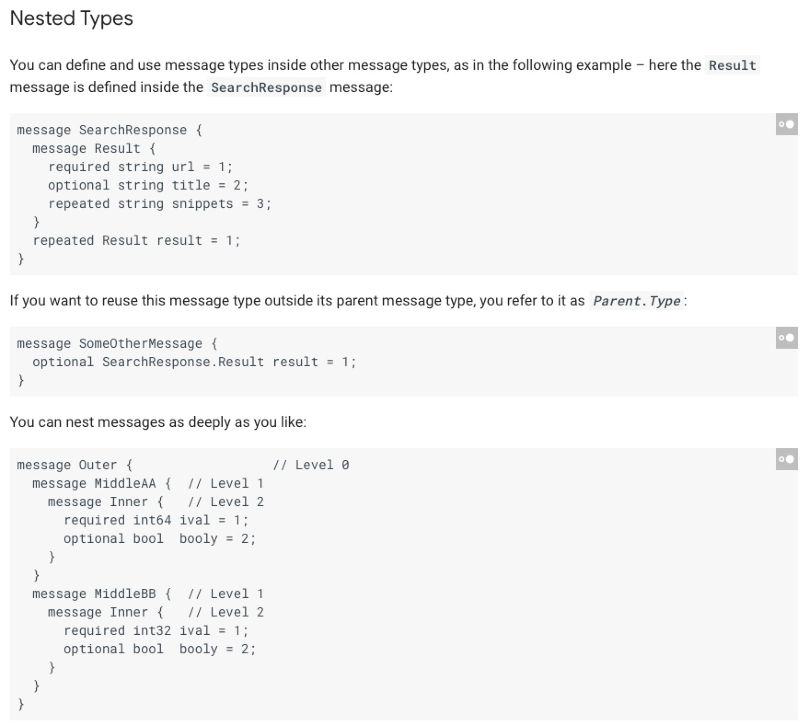


关于枚举类型定义、包package（用于命名冲突，指定命名空间）、updating message，请参考官方文档[Protobuf Language Guide](https://developers.google.com/protocol-buffers/docs/proto)；

<h3>使用protobuf编译器</h3>

根据上述介绍，我们能够定义一个`.proto`文件，下一件需要做的事是生成读、写消息message所需的类。为此，我们需要对`.proto`文件运行protobuf编译器protoc：

1. 若尚未安装编译器，请[安装包]()并遵循README中的指示；
2. 现在运行编译器，指定源目录（应用程序的源代码所在的位置 - 如果不提​​供值，则使用当前目录），目标目录（希望生成的代码放置的位置;通常与$SRC_DIR相同），以及`.proto`的路径。运行方式如下

```
protoc -I=$SRC_DIR --python_out=$DST_DIR $SRC_DIR/文件名称.proto
```

输出Python代码则使用`--python_out`选项，输出Java代码则使用`--java_out`，其他编程语言也类似；

Python下，生成代码的文件名为`文件名称_pb2.py`

关于其他编程语言protobuf编译器的使用，请参考以下链接：

1. [protobuf tutorial](https://developers.google.com/protocol-buffers/docs/tutorials)；

<h3>Protobuf Python API</h3>

根据上述介绍，我们已经获得了可以读写消息的、编译器生成的类。下面我们将介绍这些类提供的操作、属性和方法，即Protobuf Python API：

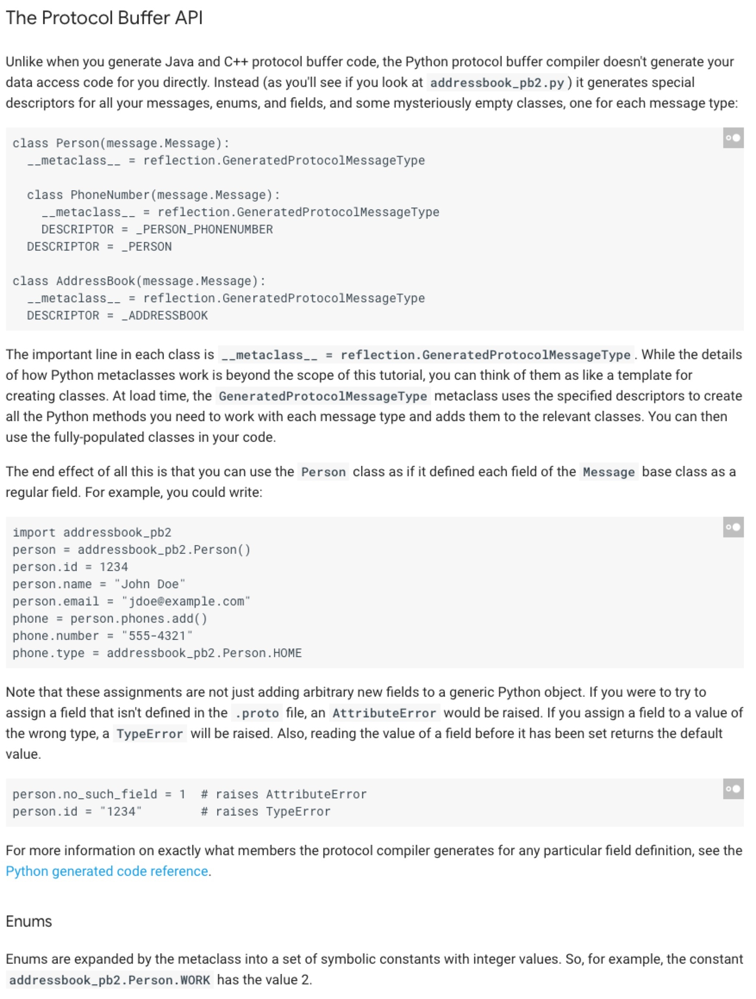

**标准消息方法Standard Message Methods：**每个消息类提供许多其他方法，可用于检查或操作整个消息，包括：

1. `IsInitialized()`：检查所有required字段是否都已经初始化；
2. `__str__()`：以人类可读的方式打印消息，对调试debug特别有用。（通常通过str(message)或print(message)调用。）
3. `CopyFrom(other_msg)`：用给定消息的值重写消息；
4. `Clear()`：将消息的所有字段置空，以便重新初始化；

**解析与序列化parsing and serializing：**

最后，每个protobuf生成的类都有使用协议缓冲区二进制protobuf binary format格式编写和读取所选类型的消息的方法：

1. `SerializeToString()`：序列化消息并将其作为字符串返回。请注意，字节是二进制的，而不是文本;我们只使用str类型作为方便的容器。
2. `ParseFromString(data)`：解析给定字符串中的消息。

官方给出的读写消息message的例子：

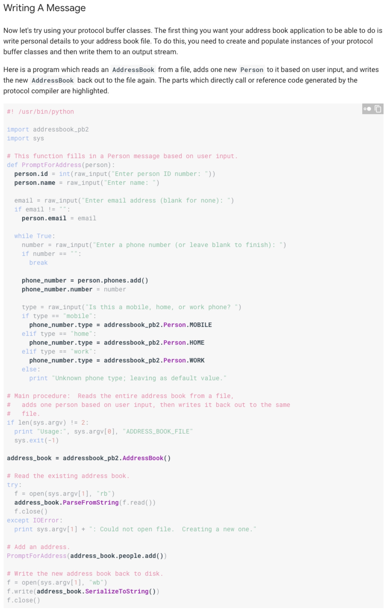

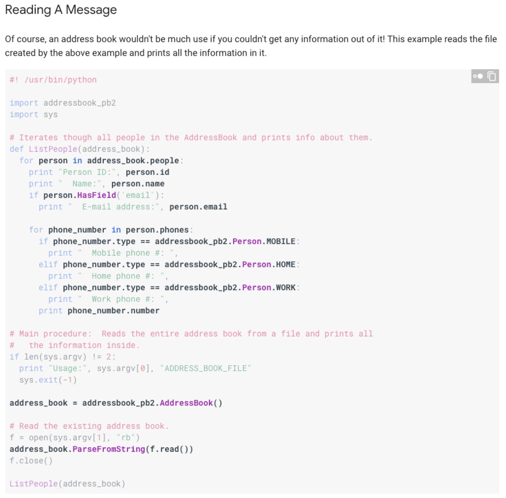


关于其他编程语言protobuf api的使用，请参考以下链接：

1. [protobuf api overview](https://developers.google.com/protocol-buffers/docs/reference/overview)；

<h3>protobuf encoding</h3>

本章节介绍protobuf是如何高效序列化数据。

一个message，序列化时protobuf首先计算这个message所有field序列化需要占用的字节长度，计算这个长度是非常简单的，因为protobuf中每种类型的field所占用的字节数是已知的(bytes、string除外)，只需要累加即可。这个长度就是serializedSize，是个32位integer，在protobuf的某些序列化方式中可能使用varint32（一个压缩的、根据数字区间，使用不同字节长度的int）；

此后是序列化field字段列表，每个field字段序列化后包含int32(tag，type)和value的字节数据，我们知道每个filed都有一个唯一的字段数tag（即field number）表示它的index位置，type为字段的类型（，官方文档中的wire type）；如果field为string、bytes类型，还会在value之前额外的补充添加一个varint32类型的数字，表示string、bytes的字节长度。

消息经过序列化后会成为一个二进制数据流，该流中的数据为一系列的 Key-Value 对，如下图

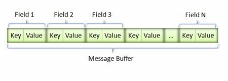

二进制格式的message使用字段数tag（即field number）作为key，Key 用来标识具体的field，在解包的时候，Protocol Buffer 根据 Key 就可以知道相应的 Value 应该对应于消息中的哪一个 field。

　　那么在反序列化的时候，首先读取一个32为的int表示serializedSize，然后读取serializedSize个字节保存在一个bytebuffer中，即读取一个完整的消息。然后从bytebuffer中读取一个int32数字，从这个数字中解析出tag和type，如果type为string、bytes，然后补充读取一个varint32就知道了string的字节长度了，此后根据type或者字节长度，读取后续的字节数组并转换成java type。上述操作就是解析一个字段的流程，重复上述操作，直到整个消息所有字段解析完毕。

采用这种 Key-Pair 结构无需使用分隔符来分割不同的 Field。对于可选的 Field，如果消息中不存在该 field，那么在最终的 Message Buffer 中就没有该 field，这些特性都有助于节约消息本身的大小。


更多protobuf encoding内容，请参考

1. [encoding](https://developers.google.com/protocol-buffers/docs/encoding)；
2. [google protobuf序列化原理](https://blog.csdn.net/yansmile1/article/details/58151026)；


参考链接：

1. [google protobuf安装与使用](https://www.cnblogs.com/luoxn28/p/5303517.html)；
2. [protobuf安装使用（python版）](https://blog.csdn.net/adamwu1988/article/details/56675221)；

<h2>3. OpenNRE源码研究</h2>

<h3>3.1. 数据预处理</h3>

由于原始NYT10数据集是以Google Protobuf序列化格式存储的，OpenNRE先对数据进行预处理，将protobuf格式数据转换成OpenNRE要求的json格式，得到`train.json`、`test.json`文件，OpenNRE要求具体格式如下：

数据集组织结构：
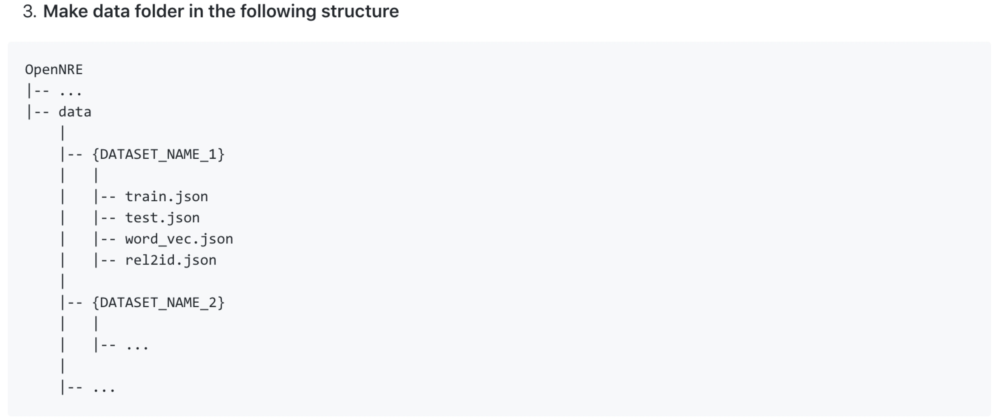

训练集、测试集格式：
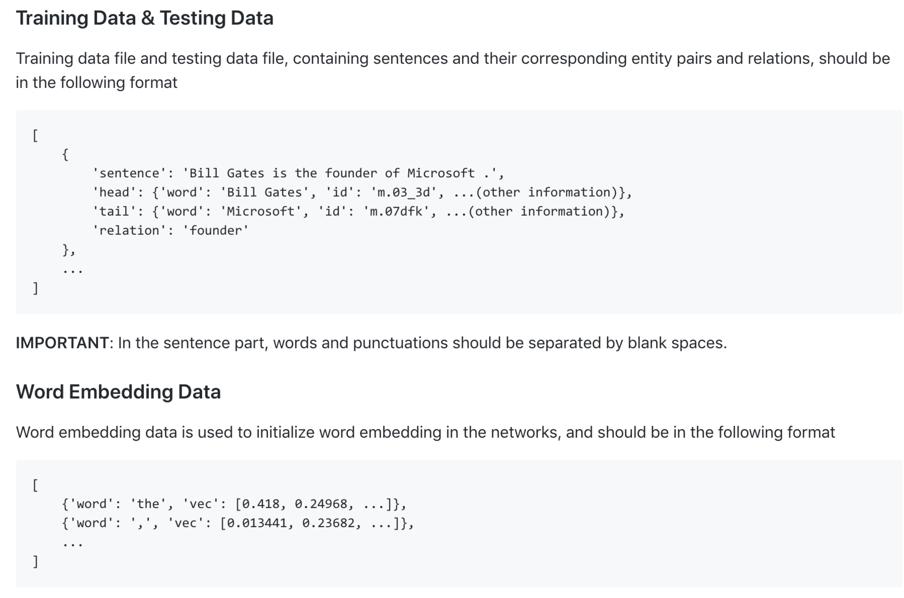

数据预处理涉及protobuf部分代码（思路见备注）：

```
def get_instances(json_data, file_name):
    print("Loading {}".format(file_name))
    # 以二进制格式打开protocol buffer二进制格式.pb文件
    f = open(file_name, 'rb')
    # 读取所有内容到缓冲区
    buf = f.read()
    # 初始化文件当前位置，实例计数器，关系计数器
    cur_pos = 0
    cnt_ins = 0
    cnt_relfact = 0
    # 文件当前位置未达到文件末尾时，循环
    while (cur_pos < len(buf)):
        # 在文件当前位置读取标识消息长度的varint32，
        # 并返回消息长度msg_len，以及消息起始位置new_pos
        msg_len, new_pos = _DecodeVarint32(buf, cur_pos)
        # 从文件当前位置，跳过varint32，到消息起始位置
        cur_pos = new_pos
        # 读取消息
        msg_buf = buf[cur_pos:cur_pos+msg_len]
        # 移动文件当前位置到下一条消息的长度varint32
        cur_pos += msg_len
        relfact = pb.Relation()
        # 关系计数+1
        cnt_relfact += 1
        relfact.ParseFromString(msg_buf)
        head = guid2entity[relfact.sourceGuid]
        tail = guid2entity[relfact.destGuid]
        relation = relfact.relType
        for ins in relfact.mention:
            # 实例计数+1
            cnt_ins += 1
            json_data.append({'sentence': ins.sentence, 'head': head, 'tail': tail, 'relation': relation})
    f.close()
    print("Finish loading, got {} instances and {} relfacts totally".format(cnt_ins, cnt_relfact))
```


数据预处理参考链接：

1. [Google Protocol Buffer 的使用和原理](https://www.ibm.com/developerworks/cn/linux/l-cn-gpb/index.html);
2. [proto buf 的写多条指令(默认不支持写多条proto_buf)](http://blog.leanote.com/post/zhaoxingniu/protobuf-%E5%AD%A6%E4%B9%A0%E4%B8%8E%E4%BD%BF%E7%94%A8);
3. [google.protobuf.internal.decoder._DecodeVarint32](https://programtalk.com/python-examples/google.protobuf.internal.decoder._DecodeVarint32/);

