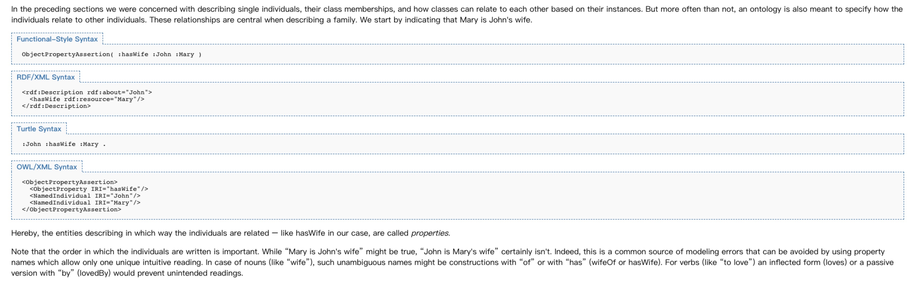
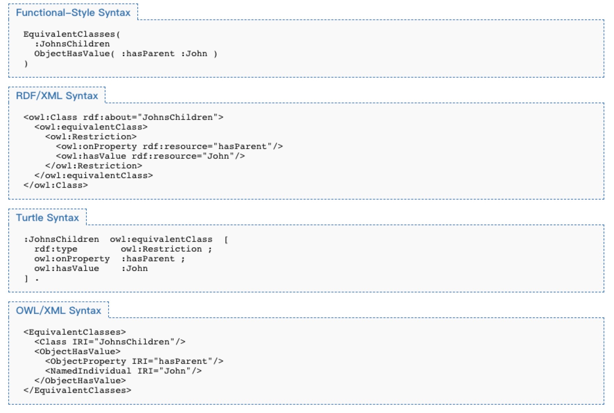

<h1>知识图谱理论篇（四）--语义网技术栈（Semantic Web Stack）</h1>

本文将主要讲解知识图谱存储、知识图谱的形式化表示、知识图谱本体构建。

<h2>1. 知识图谱的存储</h2>

在之前的[知识图谱理论篇(一)--知识图谱构建技术综述](https://github.com/charosen/ClassNotes/blob/master/knowledge_graph/Knowledge_Graph_Construction_Techniques.md)中，我们就介绍过知识图谱的定义和逻辑分层：

> **定义**：知识图谱是结构化的语义知识库，是以“实体-关系-实体”或“实体-属性-属性值”三元组为基本单位构成的网络；

> **逻辑分层**：
> 1. 模式层：存储经过提炼的知识，使用本体（本体支持公理、规则、约束条件）来规范实体、实体属性、实体关系等对象；
> 2. 数据层：知识以事实为单位存储在数据库中，事实的基本表示方式是三元组；

可见，知识图谱是以三元组为基本单位存储在数据库中。在实践中，主流的方法是将三元组存储在图数据库或普通数据库中。

对于图数据库中存储的知识图谱，常用的图数据库为Neo4j，并使用Cypher语句从知识图谱中查询知识；

对于普通数据库中存储的知识图谱，常用SPARQL语句从知识图谱中查询知识；

<h2>2. 知识图谱的形式化表示</h2>

在谈论知识图谱的时候，“三元组”这个名词经常会被提及，那三元组到底是什么呢？知识图谱的形式化表示又是什么呢？为了回答这些问题，这就需要介绍**语义网技术栈Semantic Web Stack，即，W3C制定的用于描述和关联万维网数据的一系列技术标准**。

<h3>2.1. RDF--资源描述框架Resource Description Framework</h3> 

在介绍RDF前，我想先抛出两张图片和一些背景知识。在阅读知识图谱论文时，我们经常会看到如下的知识图：

其实，上面的知识图并不代表知识图谱的实际组织形式，虽然它简单直接，但它会让我们对知识图谱产生一定的误解。

上面的知识图更**像**是知识图谱的前身：上个世纪五六十年代所提出的一种知识表示形式——语义网络(Semantic Network)。如下图，语义网络和知识图谱相似，但语义网络更侧重于描述概念与概念之间的关系，（有点像生物的层次分类体系——界门纲目科属种），而知识图谱则更偏重于描述实体之间的关联。

语义网络的优点：

1. 容易理解和展示。

2. 相关概念容易聚类。

语义网络的缺点：

1. 节点和边的值没有标准，完全是由用户自己定义。

2. 多源数据融合比较困难，因为没有标准。

3. 无法区分概念节点和对象节点。

4. 无法对节点和边的标签(label，我理解是schema层，后面会介绍)进行定义。

简言之，语义网络可以比较容易地让我们理解语义和语义关系。其表达形式简单直白。然而，由于缺少标准，其比较难应用于实践。而RDF标准解决了语义网络的缺点1和缺点2；RDFS和OWL标准则解决了缺点3和缺点4.

在学习完RDF后，我们会发现真实的知识图谱组织形式如下：

接着，进入正题。

<h4>2.1.1. 简介</h4>

1. RDF是用于描述资源的框架，资源可以是文档、人、物理对象（**实体**）和抽象概念（**概念**）；
2. RDF适用于应用需要处理互联网信息的场景，而不适用于仅仅将信息展示给人类的场景；
3. RDF提供了一个表示互联网信息的通用框架，使信息在应用间交换时不会丢失语义；

<h4>2.1.2. RDF数据模型</h4>

> The RDF Data Model is described in this section in the form of an "abstract syntax", i.e. a data model that is independent of a particular concrete syntax (the syntax used to represent triples stored in text files). Different concrete syntaxes may produce exactly the same graph from the perspective of the abstract syntax. The semantics of RDF graphs [RDF11-MT] are defined in terms of this abstract syntax.

1. 三元组Triples--RDF基本语句RDF Statement
    1. 三元组由subject、predicate、object组成：
    2. `subject`表示资源，类型可以是IRI或Blank node；
    3. `predicate`表示关系，关系是有向的，也称作属性property，类型只能是IRI；
    4. `object`表示资源，类型可以是IRI、Blank node或Literal；
2. RDF数据类型
    1. **互资源标识符International Resource Identifier--IRIs**：IRI唯一标识一个资源，IRI是URI的泛化（URI是一种形式的IRI），IRI字符串中允许使用non-ascii字符；
        1. IRI是全局标识符，任何IRI的重复出现都是指代同一事物；
        2. RDF is agnostic about what the IRI represents. However, IRIs may be given meaning by particular vocabularies or conventions.
    2. 字面量Literals：非IRI的值；
        1. 字面量有数据类型，RDF定义了一系列的字面量类型，包括XML Schema中定义的类型，例如string, boolean, integer, decimal and date；
    3. Blank nodes：不使用IRI标识符来描述资源，有点类似代数中的变量；
        1. 

3. Multiple Graphs：
    1. Named Graph：将多个图中的RDF语句打包成一个组，并赋予一个IRI，即构成一个Named Graph；
    2. RDF Dataset：多个named graphs和至多一个default graph构成一个RDF Dataset；

<h4>2.1.3. RDF词汇表RDF Vocabularies</h4>

1. RDF词汇表是**描述和建模RDF数据**的词汇表，用于对RDF进行类似的类定义及其属性的定义；RDF是**描述资源/互联网数据**的通用框架（注意区别）；
2. RDF词汇表RDFS为区分概念节点和实体节点提供了标准；
3. 最常用的RDF词汇表是RDF Schema，有RDFS衍生出来诸多词汇表，如Dublin Core, schema.org, SKOS... 
4. 后续将在介绍RDFS时进行详细介绍

<h4>2.1.4. writing RDF Graphs--RDF语言</h4>

上述RDF数据模型只提供了RDF的abstract syntax，而RDF的具体序列化格式--RDF language存在多种形式，例如：

1. Turtle family of RDF languages (N-Triples, Turtle, TriG and N-Quads);
2. JSON-LD (JSON-based RDF syntax);
3. RDFa (for HTML and XML embedding);
4. RDF/XML (XML syntax for RDF);

RDF文档（RDF Document）是使用某种RDF语言（RDF concrete syntax），例如Turtle, RDFa, JSON-LD等，来编码并存储RDF Graph或RDF Dataset的文档；

更多RDF languages内容，请参阅RDF文档；

参考链接：

1. [RDF 1.1 Primer](https://www.w3.org/TR/rdf11-primer/#fig2)；
2. [W3C: RDF 1.1 Concepts and Abstract Syntax](http://link.zhihu.com/?target=https%3A//www.w3.org/TR/rdf11-concepts/)；
3. 论文：Exploiting Linked Data and Knowledge Graphs in Large Organizations；
4. [Google: Introducing the Knowledge Graph: things, not strings](http://link.zhihu.com/?target=https%3A//googleblog.blogspot.co.uk/2012/05/introducing-knowledge-graph-things-not.html)；
5. [Blog:Problems of the RDF model: Blank Nodes](http://link.zhihu.com/?target=http%3A//milicicvuk.com/blog/2011/07/14/problems-of-the-rdf-model-blank-nodes/)；
6. [Blog:Compound Value Types in RDF](http://link.zhihu.com/?target=http%3A//blog.databaseanimals.com/compound-value-types-in-rdf)；
7. [Chen, L., Zhang, H., Chen, Y., & Guo, W. (2012). Blank nodes in rdf. Journal of Software, 7(9).](http://link.zhihu.com/?target=https%3A//www.researchgate.net/publication/276240316_Blank_nodes_in_RDF)；

<h3>2.2. RDF Schema</h3>

<h4>why RDF Schema? -- RDF表达能力有限</h4>

**RDF的表达能力有限，无法区分类和对象，也无法定义和描述类的关系/属性。我的理解是，RDF是对具体事物的描述，缺乏抽象能力，无法对同一个类别的事物进行定义和描述。RDFS本质是RDF词汇的一个拓展。**就以罗纳尔多这个知识图为例，RDF能够表达罗纳尔多和里约热内卢这两个实体具有哪些属性，以及它们之间的关系。但如果我们想定义罗纳尔多是人，里约热内卢是地点，并且人具有哪些属性，地点具有哪些属性，人和地点之间存在哪些关系，这个时候RDF就表示无能为力了。对于知识图谱等应用，这种泛化抽象能力都是相当重要的。RDFS和OWL这两种技术或者说模式语言/本体语言（schema/ontology language）解决了RDF表达能力有限的困境。

> Notice: RDFS/OWL序列化格式和RDF没什么不同，其实在表现形式上，它们就是RDF。其常用的方式主要是RDF/XML，Turtle。另外，通常我们用小写开头的单词或词组来表示属性，大写开头的表示类。数据属性（data property，实体和literal字面量的关系）通常由名词组成，而对象数据（object property，实体和实体之间的关系）通常由动词（has，is之类的）加名词组成。剩下的部分符合驼峰命名法。为了将它们表示得更清楚，避免读者混淆，之后我们都会默认这种命名方式。读者实践过程中命名方式没有强制要求，但最好保持一致。

<h4>2.2.1. 简介</h4>

1. RDF词汇表是**描述和建模RDF数据**的词汇表，用于对RDF进行类似的类定义及其属性的定义；RDF是**描述资源/互联网数据**的通用框架；（注意区别）；
2. RDF词汇表RDFS为区分概念节点和实体节点提供了标准；
3. RDF schema是最常用的RDF词汇表，其他常用RDF词汇表有Dublin core, schema.org, SKOS...
4. RDF schema<http://www.w3.org/2000/01/rdf-schema#>是RDF基本词汇(rdf:type, rdf:subject...)<https://www.w3.org/1999/02/22-rdf-syntax-ns#>的一个拓展词汇表；
5. RDF schema的类class和属性property系统与面向对象编程的类系统很相似，但是它们的区别在于：
    1. 面向对象编程根据实例instance拥有的属性来定义类（class-centric approach）；
    2. RDF schema根据属性/关系相关联的类来定义属性(property-centric approach)；

>The RDF Schema class and property system is similar to the type systems of object-oriented programming languages such as Java. RDF Schema differs from many such systems in that instead of defining a class in terms of the properties its instances may have, RDF Schema describes properties in terms of the classes of resource to which they apply. This is the role of the domain and range mechanisms described in this specification. For example, we could define the eg:author property to have a domain of eg:Document and a range of eg:Person, whereas a classical object oriented system might typically define a class eg:Book with an attribute called eg:author of type eg:Person. Using the RDF approach, it is easy for others to subsequently define additional properties with a domain of eg:Document or a range of eg:Person. This can be done without the need to re-define the original description of these classes. One benefit of the RDF property-centric approach is that it allows anyone to extend the description of existing resources, one of the architectural principles of the Web [BERNERS-LEE98].

<h4>2.2.2. RDFS类词汇</h4>

1. 资源可以分成许多类，类的成员即类的实例，类本身也是资源；
2. 不同的类可以存在相同的实例集，但每个类都有其独有的属性，以与其他类区分开；
3. 类可以是其自身的实例；

<h4>2.2.3. RDFS属性词汇</h4>

<h4>2.2.4. 使用rdfs:domain和rdfs:range来描述属性</h4>

使用rdfs:domain和rdfs:range来约束属性的rdf:subject和rdf:object

<h4>2.2.5. 其他词汇</h4>

本节介绍RDF中的一些基本词汇container、collection、reification、utility properties等等

相关内容直接查阅文档RDF Schema 1.1，就不再赘述了；

参考资料：
1. [知识图谱基础之RDF，RDFS与OWL（必看，给的RDFS与OWL的例子很好）](https://zhuanlan.zhihu.com/p/32122644)；
2. [RDF Schema 1.1](https://www.w3.org/TR/2014/REC-rdf-schema-20140225/)；

<h3>2.3. OWL </h3>
 
<h4>why OWL?--RDFS表达能力有限</h4>

RDFS的表达能力还是相当有限的，因此提出了OWL。**OWL可当做是RDFS的一个扩展，其添加了额外的预定义词汇。同时，OWL还提供很强的推理能力。**

<h4>2.3.4. 类、属性、个体--使用它们简单建模本体</h4>

1. 类和实例：
    1. 使用`rdf:type`来表示类的实例；
2. 类的层级结构：
    1. 使用`rdfs:subClassOf`表示子类，若"every A is B"，则A是B的子类；
    2. `rdfs:subClassOf`是可传递的transitive、自反的reflexive（every class is its own subclass）；
    3. 使用`owl:equivalentClass`表示两个类是等价的；
3. 类不相交：
    1. 使用`owl:AllDisjointClasses`表示类间不相交；
    2. In practice, disjointness statements are often forgotten or neglected. The arguable reason for this could be that intuitively, classes are considered disjoint unless there is other evidence. By omitting disjointness statements, many potentially useful consequences can get lost. Note that in our example, the disjointness axiom is needed to deduce that Mary is not a man. Moreover, given the above axioms, a reasoner can infer the disjointness of the classes Mother and Man.
4. 对象属性：
    1. 
    2. 使用`owl:NegativePropertyAssertion`表示属性不存在；
    3. Negative property assertion是owl中唯一表述something is not true的方法；（owl依据开放世界假说，即owl中missing的知识，可能是真的，所以必须显示声明not true的知识）；
    4. 

5. 属性的层级结构：
    1. 使用`rdfs:subPropertyOf`表示子属性；
    2. 使用`owl:equivalentPropety`表示两个属性是等价的；
6. 使用`rdfs:domain`和`rdfs:range`来约束属性；
7. 实体等价与实体不等价：
    1. 使用`owl:sameAs`表示两个实体是相同实体；
    2. 使用`owl:differentFrom`表示两个实体是不同实体；
8. 数据属性：
    1. 详见文档；
    2. We would like to point out at this stage a common mistake which easily occurs when using property domains and ranges. In the example just given, which states that the hasAge property is only used to relate persons with non-negative integers, assume that we also specify the information that Felix is in the class Cat and that Felix hasAge 9. From the combined information, it would then be possible to deduce that Felix is also in the class Person, which is probably not intended. This is a commonly modeling error: note that a domain (or range) statement is not a constraint on the knowledge, but allows a reasoner to infer further knowledge. If we state – as in our example – that an age is only given for persons, then everything we give an age for automatically becomes a person.

<h4>2.3.5. Advanced Class Relationships</h4>

1. 复杂类：
    1. OWL支持类的逻辑运算（and、or、not）与集合运算（交`owl:intersactionOf`、并`owl:unionOf`、补`owl:complementOf`），These constructors combine atomic classes – i.e. classes with names – to complex classes；
    2. But, of course, it is also possible to use class constructors together with a subclass statement in order to indicate necessary, but not sufficient, conditions for a class. The following statement indicates that every Grandfather is both a man and a parent (whereas the converse is not necessarily true);
2. 属性限制：
    1. existential quantification: 
    2. universal quantification: 
    3. Property restrictions can also be used to describe classes of individuals that are related to one particular individual. For instance we could define the class of John's children: 
    4. As a special case of individuals being interlinked by properties, an individual might be linked to itself. 
3. 属性数量限制Property Cardinality Restriction：
    1. Using universal quantification, we can say something about all of somebody's children, whereas existential quantification allows us to refer to (at least) one of them. However, we might want to specify the number of individuals involved in the restriction. Indeed, we can construct classes depending on the number of children. The following example states that John has at most four children who are themselves parents；
    2. 使用`owl:maxQualifiedCardinality`表示至多有几个属性；
    3. 使用`owl:minQualifiedCardinality`表示至多有几个属性；
    4. 使用`owl:qualifiedCardinality`表示精确匹配几个属性；
    5. In a cardinality restriction, providing the class is optional; if we just want to talk about the number of all of John's children we can write the following: 
4. 枚举所有实例：
    1. 构建类最简单直接的方法：枚举其所有实例；
    2. 

<h4>2.3.6. Advanced Use of Properties</h4>

1. 属性特性：
    1. 逆属性`owl:inverseOf`;
    2. 对陈属性`owl:SymmetricProperty`：双向、the property relates A with B exactly if it relates B with A;
    3. 非对称属性`owl:AsymmetricProperty`;
        1. Note that being asymmetric is a much stronger notion than being non-symmetric. Likewise, being symmetric is a much stronger notion than being non-asymmetric.
    4. 属性不相交`owl:propertyDisjointWith`：two properties are disjoint if there are no two individuals that are interlinked by both properties;
    5. 自反属性`owl:ReflexiveProperty`：Properties can also be reflexive: such a property relates everything to itself;
        1. Note that this does not necessarily mean that every two individuals which are related by a reflexive property are identical;
    6. 非自反属性`owl:IrreflexiveProperty`： no individual can be related to itself by such a role;
    7. Functional属性`owl:FunctionalProperty`： it just states that there can be no more than one;
    8. 传递性属性`owl:TransitiveProperty`;
2. 属性链Property Chains：
    1. 
3. Keys：
    1. 

<h4>2.3.7. Advanced Use of Datatyped</h4>

更多内容，详见owl 2文档；还有8、9、10章；

参考资料：
1. [知识图谱基础之RDF，RDFS与OWL（必看，给的RDFS与OWL的例子很好）](https://zhuanlan.zhihu.com/p/32122644)；
2. [OWL 2 Web Ontology Language Primer (Second Edition)](https://www.w3.org/TR/owl2-primer/)；
3. [OWL 2 Web Ontology Language Document Overview (Second Edition)](https://www.w3.org/TR/owl2-overview/)；
4. [Learn RDF - Cambridge Semantics](http://link.zhihu.com/?target=https%3A//www.cambridgesemantics.com/blog/semantic-university/learn-rdf/)；
5. [Learn OWL and RDFS - Cambridge Semantics](http://link.zhihu.com/?target=https%3A//www.cambridgesemantics.com/blog/semantic-university/learn-owl-rdfs/)；

<h3>2.4. SPARQL 1.1</h3>

<h4>2.4.1. 简介</h4>

1. SPARQL 1.1是为在Web或RDF存储中查询和操作RDF图内容提供语言和协议的一组规范。
2. SPARQL 1.1由一系列规范组成：
    1. [SPARQL 1.1 Query Language](http://www.w3.org/TR/sparql11-query/): RDF的查询语句；
    2. [SPARQL 1.1 Query Results JSON Format](http://www.w3.org/TR/sparql11-results-json/)和[SPARQL 1.1 Query Results CSV and TSV Formats](http://www.w3.org/TR/sparql11-results-csv-tsv/): SPARQL标准的查询结果是XML格式[SPARQL-XML-Result](https://www.w3.org/TR/sparql11-overview/#SPARQL-XML-Result)，前述两个规范为SPARQL查询返回JSON, CSV, TSV格式结果提供支持。
    3. [SPARQL 1.1 Federated Query](http://www.w3.org/TR/sparql11-federated-query/): 该规范定义了一个在不同SPARQL endpoints上分布式执行查询语句的SPARQL 1.1 Query Language的拓展版本；
    4. [SPARQL 1.1 Entailment Regimes](http://www.w3.org/TR/sparql11-entailment/): 该规范定义不同蕴含制度entailment regimes下（例如RDFS, OWL, RIF）SPARQL查询的语义；
    5. [SPARQL 1.1 Update Language](http://www.w3.org/TR/sparql11-update/): RDF图的更新语言；
    6. [SPARQL 1.1 Protocol for RDF](http://www.w3.org/TR/sparql11-protocol/): 该协议定义了向SPARQL service传送SPARQL查询和更新请求的方法；
    7. [SPARQL 1.1 Service Description](http://www.w3.org/TR/sparql11-service-description/): 该规范定义了发现SPARQL service的方法和描述SPARQL service的词汇表；
    8. [SPARQL 1.1 Graph Store HTTP Protocol](http://www.w3.org/TR/sparql11-http-rdf-update/): As opposed to the full SPARQL protocol (Protocol for RDF), this specification defines minimal means for managing RDF graph content directly via common HTTP operations；（直接使用HTTP协议POST, DELETE, PUT, GET来对SPARQL service上的RDF图内容执行增、删、改、查操作；而无需编写SPARQL语言并传送给SPARQL service来执行操作）；
    9. [SPARQL 1.1 Test Cases](http://www.w3.org/2009/sparql/docs/tests/):  A suite of tests, helpful for understanding corner cases in the specification and assessing whether a system is SPARQL 1.1 conformant；

<h4>2.4.2. SPARQL 1.1 查询语句</h4>

1. 简单查询Making Simple Queries：
    1. SPARQL查询通常包含一个基本图模式`basic graph pattern`；
    2. 基本图模式`basic graph pattern`即一组三元组模式`triple pattern`；
    3. 三元组模式`triple pattern`类似于RDF三元组，其不同之处在于每一个subject、predicate、object都可以是变量；
    4. A basic graph pattern matches a subgraph of the RDF data when RDF terms from that subgraph may be substituted for the variables and the result is RDF graph equivalent to the subgraph；
    5. Writting a simple query：SELECT从句指定查询结果应显示的变量，WHERE从句提供基础图模式basic graph pattern来匹配数据图；
        1. 
    6. Multiple matches：查询结果是一个solution sequence，每一个solution对应于查询图模式匹配数据；There may be zero, one or multiple solutions to a query；
        1. 
    7. 匹配RDF字面量及特定数据类型：
        1. 匹配language tag：
        2. 匹配数值类型：
        3. 匹配任意数据类型：
    8. 匹配blank node：
    9. 使用表达式来创建值：下面的查询语句展示了如何使用CONCAT函数连接first names和last names来构建name：
    10. 构建RDF图：不像SELECT查询返回variable binding（变量-RDF数据对），CONSTRUCT查询返回RDF图；The graph is built based on a template which is used to generate RDF triples based on the results of matching the graph pattern of the query.
2. RDF Term约束：
    1. 图形模式匹配产生solution sequence，其中每个solution都有一组（变量-rdf术语）对；SPARQL FILTER将solution限制为过滤器表达式计算结果为TRUE的solution；
    2. 约束字符串的值：
    3. 约束数值：
3. SPARQL语法：
    1. RDF Term语法：
        1. IRI语法：
        2. 字面量语法：字符串+^^+特定数据类型iri
            1. 字符串：双引号、单引号扩起来；
            2. 语言字符串：字符串+@+langugage tag
            3. 整数：无引号的数；
            4. Decimal：无引号，无指数e的，加小数点的数；
            5. 指数：无引号，加指数e的数；
            6. 布尔类型：true or false；
            7. 
        3. 查询变量语法：$+变量名，或，?+变量名；
        4. blank node语法：
            1. []：表示在查询语句中只使用一次的blank node；
            2. _:abc：为blank node赋予blank node标签abc，可表示在查询语句中使用多次的blank node；
            3. 
    2. 三元组模式triple pattern语法：
        1. predicate-object列表：使用分号`;`分隔一个subject对应的多个predicate-object；
        2. object列表：使用`,`分隔一个subject-predicate对应的多个object；
        3. RDF Collections：
        4. rdf:type：
4. 图模式graph patterns：
    1. SPARQL基于图形模式匹配。通过以各种方式组合较小的模式，可以形成更复杂的图形模式：
    2. 基本图模式basic graph pattern：
        1. blank node标签：一个blank node标签只能用于任意查询的仅一个基本图模式；
        2. 
    3. 组图模式group graph pattern：
        1. 使用`{}`分隔不同图模式；
        2. empty group pattern：
        3. 约束的作用域：FILTER作用域其所在的`{}`之内的所有triple patterns；
        4. group graph pattern examples：
5. Optional Graph Pattern:
    1. Optional Pattern Matching:
        1. OPTIONAL关键字是作用在其左侧的pattern上的；
        2. 
    2. Constraints in Optional Pattern Matching:
    3. Multiple Optional Graph Patterns:
6. Alternative Graph Pattern：
7. 否定命题Negation：

更多内容，请查看官方文档[SPARQL 1.1 Query Language](https://www.w3.org/TR/sparql11-query/#rPrefixedName)；

参考资料：

1. [SPARQL 1.1 Overview](https://www.w3.org/TR/sparql11-overview/);
2. [SPARQL 1.1 Query Language](https://www.w3.org/TR/sparql11-query/#rPrefixedName);

<h2>附录. 知识图谱到底是什么？</h2>

在之前的[知识图谱理论篇(一)--知识图谱构建技术综述](https://github.com/charosen/ClassNotes/blob/master/knowledge_graph/Knowledge_Graph_Construction_Techniques.md)中，我们就给大家介绍过知识图谱的定义：

> 知识图谱是结构化的语义知识库，是以“实体-关系-实体”或“实体-属性-属性值”三元组为基本单位构成的网络；

从定义中，我们知道知识图谱无非是使用网络结构组织知识。那为什么2012年谷歌需要提出知识图谱这个概念呢？使用网络结构来组织知识又有什么好处呢？

如果你了解过搜索引擎和语义网Semantic Web，就能明白知识图谱提出的必要性。

长期以来，搜索引擎是根据用户搜索的关键字计算相似度，排序网页并返回包含“关键字”的网页结果。如此一来，搜索引擎无法洞察用户查询背后的语义信息，会返回大量包含“关键字”的、但与查询语义不相关的噪声网页，用户不得不在众多返回结果中逐一查找自己感兴趣的内容。例如，用户在搜索引擎中搜索“罗纳尔多”，搜索引擎大多会返回“肥罗”的相关内容，但用户可能关心的是“c罗”的相关内容。这也是计算机一直面临的困境--无法获取网络文本的语义信息。

因此，为了提升搜索引擎返回的答案质量、为了让机器能够理解文本背后的含义，我们需要对可描述的事物(实体)进行建模，填充它的属性，拓展它和其他事物的联系，构建实体之间的网络，即，构建机器的先验知识。

> 需要说明的是，上面的知识图并不代表知识图谱的实际组织形式，相反，它还会让读者对知识图谱产生一定的误解。在下一个部分，我会给出这张图所包含内容在知识图谱中更形式化的表示。实际上，我看到许多介绍知识图谱的文章都喜欢给出此种类型的图，却又不给出相应的说明，这可能会让读者一开始就进入理解的误区。

参考资料: [为什么需要知识图谱？什么是知识图谱？——KG的前世今生](https://zhuanlan.zhihu.com/p/31726910)

