<h1>旅游知识图谱实践篇（一）--携程半结构化知识抽取</h1>

该实践篇系列从零开始构建海南旅游知识图谱，本篇主要介绍从携程海南旅游页面上获取半结构化数据及旅游知识图谱本体建模。

<h2>1. 简介</h2>

本文主要围绕半结构化数据获取，介绍基于scrapy实现的携程海南旅游爬虫，通过该爬虫获取携程旅游上的半结构化数据。

目前携程旅游爬虫，能够爬取海南景点、购物、酒店、餐厅、游记共5类数据，包含景点1928处，购物中心6837处，餐厅10538家，酒店5266家，城市19座，商圈35处，景点门票362条；

<h2>2. 数据库选型</h2>

考虑到从携程上爬取的数据的字段各异，比如有的存在距离字段，有的则没有，因此，本项目选择比较流行的非关系数据库MongoDB来存储数据。

库内包含city、hotel、restaurant、shopping、sight、ticket、zone，共7张collection：

1. city数据格式：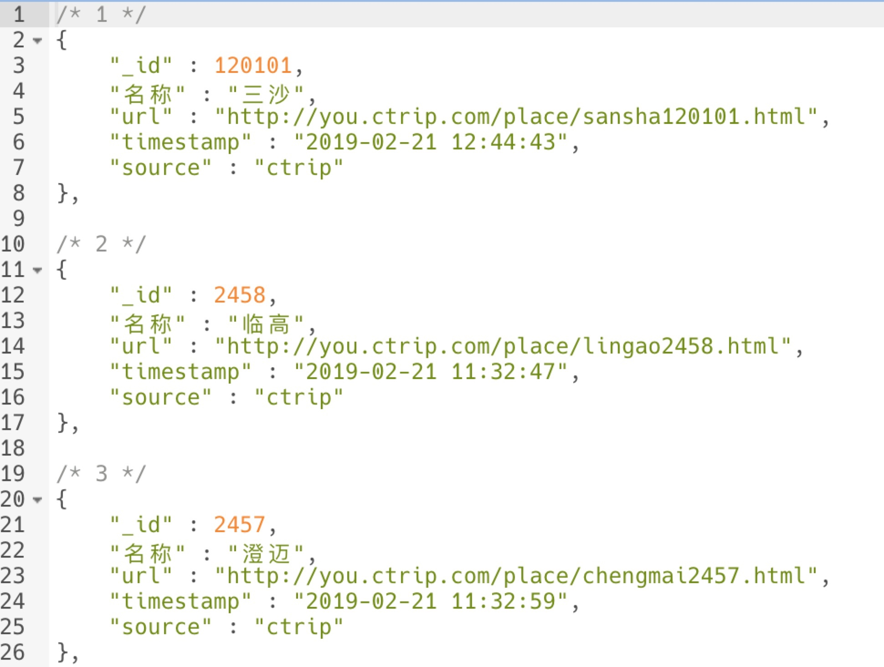
2. hotel数据格式：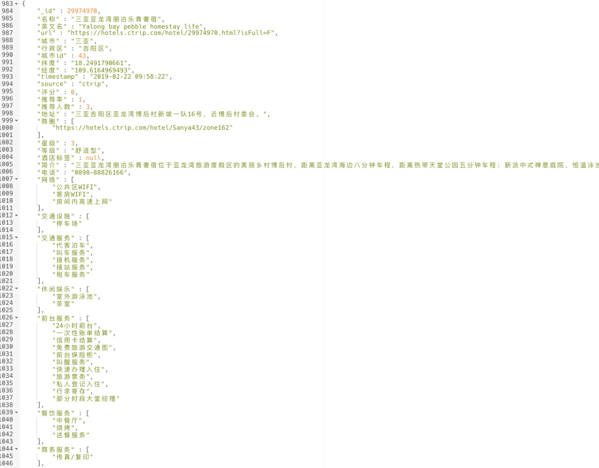
3. restaurant数据格式：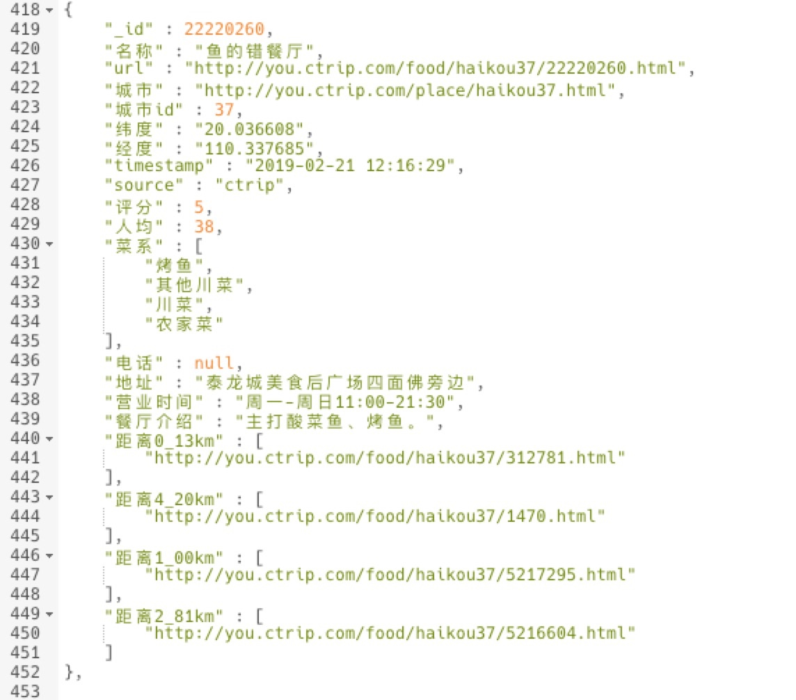
4. shopping数据格式：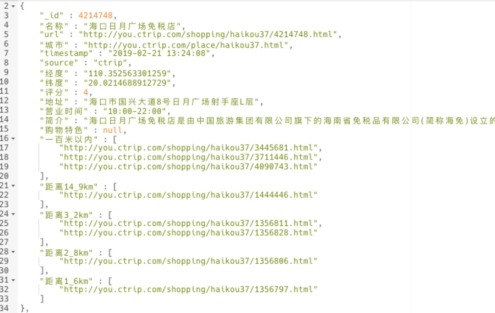
5. sight数据格式：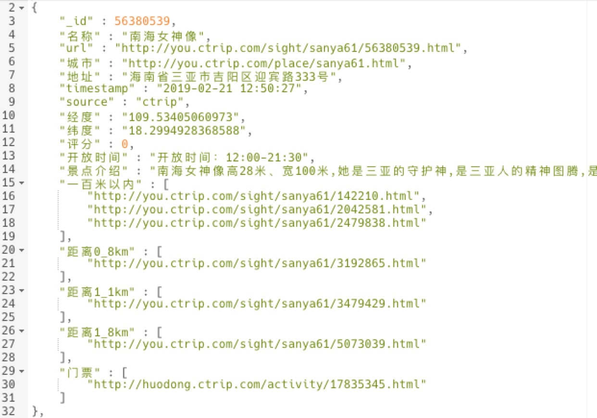
6. ticket数据格式：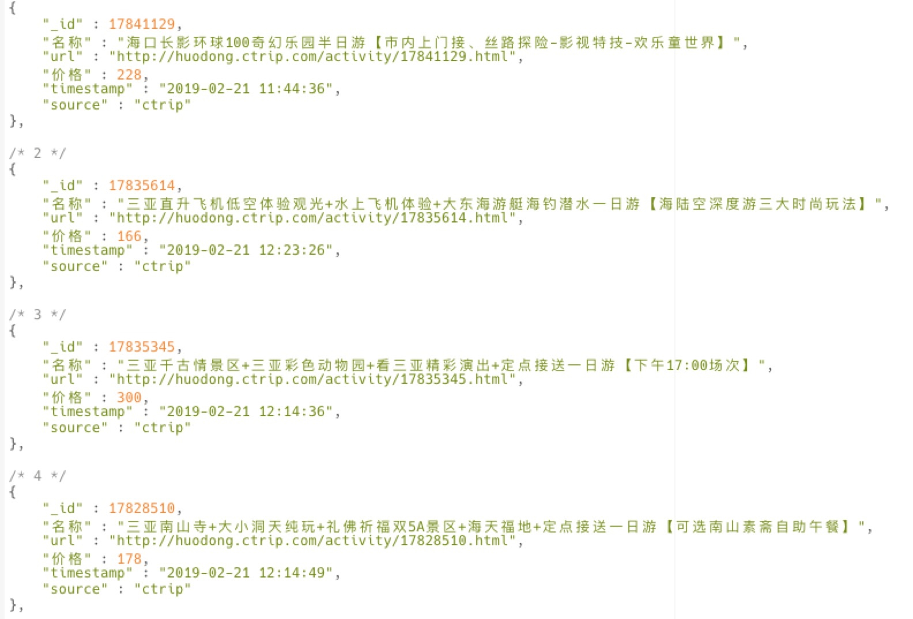
7. zone数据格式：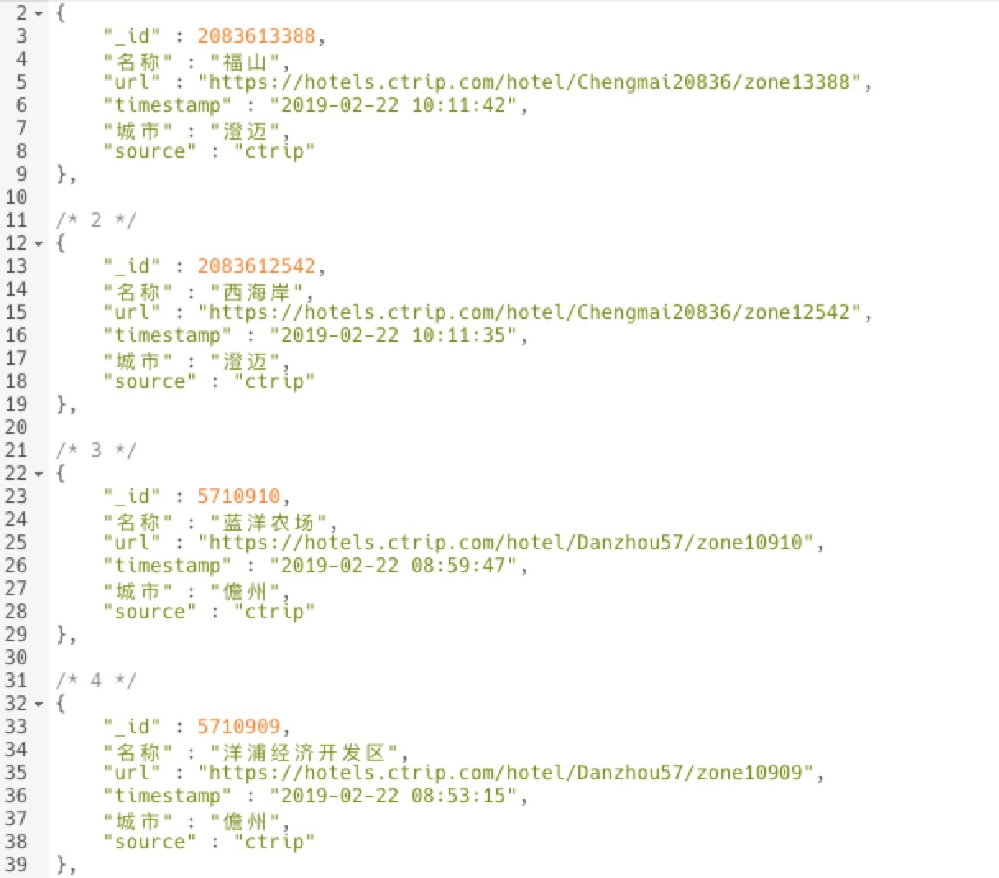

上面展示了存储在MongoDB中旅游数据的概况，下面介绍MongoDB数据库建库的一些细节：

1. 修改`items.py`：
    1. 每类数据的Item类均提供collection与table字段，该字段是该类数据的数据库表名；
    
    ```
    import scrapy

    class CityItem(scrapy.Item):
        collection = table = "city"
    
        raw = scrapy.Field()
    
    
    class ZoneItem(scrapy.Item):
        collection = table = "zone"
    
        raw = scrapy.Field()
    
    class TicketItem(scrapy.Item):
        collection = table = "ticket"
    
        raw = scrapy.Field()
    
    
    class GoodsItem(scrapy.Item):
        collection = table = "goods"
    
        raw = scrapy.Field()
    
    
    class RestaurantItem(scrapy.Item):
    
        collection = table = "restaurant"
    
        # define the fields for your item here like:
        # name = scrapy.Field()
        raw = scrapy.Field()
    
    
    class SightItem(scrapy.Item):
    
        collection = table = "sight"
    
        raw = scrapy.Field()
    
    
    class HotelItem(scrapy.Item):
    
        collection = table = "hotel"
    
        raw = scrapy.Field()
    
    
    class ShoppingItem(scrapy.Item):
    
        collection = table = "shopping"
    
        raw = scrapy.Field()
    
    
    class TravelItem(scrapy.Item):
    
        collection = table = "travel"
    
        raw = scrapy.Field()
    
    
    ```

2. 修改`pipelines.py`：
    1. 编写MongoPipeline，用于对爬取后的数据进行MongoDB存储操作。由于MongoDB要求"_id"字段必须唯一，因此，本项目利用"_id"字段对数据去重，同时，要求数据名称不得为空，进一步去除错误数据；
    
    ```
    class MongoPipeline(object):
    def __init__(self, mongo_conf):
        self.conf = mongo_conf
        if not self.conf:
            raise ValueError('Mongo settings missing!')

    @classmethod
    def from_crawler(cls, crawler):
        return cls(crawler.settings.get('MONGO_CONF'))

    def open_spider(self, spider):
        self.client = pymongo.MongoClient(**self.conf)
        self.db = self.client[self.conf.get('authSource')]

    def process_item(self, item, spider):
        name = item.collection
        data = item["raw"]
        # ids = set(x["_id"] for x in self.db[name].find({}, {'_id': 1, }))
        # if data["名称"] and data["_id"] and data["_id"] not in ids:
        if data["名称"] and data["_id"]:
            try:
                self.db[name].insert_one({k.replace('.', '_'):v for k, v in data.items()})
            except DuplicateKeyError:
                print('data already exists:', data["名称"], data["_id"])
        return item

    def close_spider(self, spider):
        self.client.close()

    ```

<h2>3. 携程海南旅游爬虫</h2>

1. 修改`setting.py`：
    1. 提供海南省各个城市名称以及城市id，用以初始化爬虫start_urls;
    2. 提供MongoDB数据库连接配置信息；
    3. 设置AUTOTHROTTLE，使爬虫自动调节爬取速率；
2. 修改`middlewares.py`：
    1. 结合fake_useragent库以及自己编写的IP代理池，本项目自定义了随机User-Agent中间件与IP代理中间件，用于规避反爬措施；
    2. 在爬虫使用过程中，爬虫经常会出现302重定向的情况，导致爬虫获取不到对应页面的数据；为使爬虫不丢失302网页的数据，本项目自定义重定向中间件，对302网页更换新的useragent、ip代理并重新爬取；
        1. 重定向方案一：使用scrapy内置提供的retrymiddleware，对scrapy setting文件的retry_http_codes添加302状态码。但是内置retrymiddleware在重试爬取网页时，不会更新request的user-agent和代理ip，而网页被重定向往往是因为ip代理被禁，因此，使用retrymiddleware重试仍会被重定向，该方案并不能解决网页302重定向问题；
        2. 重定向方案二（本项目使用的方法）：自定义如下的RedirectRetryMiddleware，重试时为request更换新的user-agent和ip代理，成功解决了重试仍被重定向的问题；
    
    ```
    class RedirectRetryMiddleware(RetryMiddleware):

    def __init__(self, settings):
        super(RedirectRetryMiddleware, self).__init__(settings)
        self.ua = UserAgent(verify_ssl=False)
        self.ua_type = settings.get('RANDOM_UA_TYPE', 'random')

    @classmethod
    def from_crawler(cls, crawler):
        return cls(crawler.settings)

    def process_response(self, request, response, spider):
        if request.meta.get('dont_retry', False):
            return response
        if response.status == 302:
            reason = response_status_message(response.status)
            retryreq = self._retry(request, reason, spider)
            if retryreq:
                if 'hotel' in request.url:
                    new_proxy = requests.get('http://127.0.0.1:5555/hotelproxy/random').text
                else:
                    new_proxy = requests.get('http://127.0.0.1:5556/otherproxy/random').text
                retryreq.meta['proxy'] = ''.join(['http://', new_proxy])
                retryreq.headers['User-Agent'] = getattr(self.ua, self.ua_type)
                # print('retry new proxy', retryreq.meta['proxy'])
                # print('retry new ua', retryreq.headers['User-Agent'])
            return retryreq or response
        return response

    ```
    
1. 编写spiders：
    1. 编写`ct_hotel.py`, `ct_restaurant.py`, `ct_shopping.py`, `ct_sight.py`, `ct_travel.py`爬虫脚本，分别爬取`https://hotels.ctrip.com/hotel/{cityNameId}/p{num}`, `http://you.ctrip.com/restaurantlist/{cityNameId}.html`, `http://you.ctrip.com/shoppinglist/{cityNameId}.html`, `http://you.ctrip.com/sightlist/{cityNameId}.html`, `http://you.ctrip.com/travels/{cityNameId}.html`，其中酒店网页爬虫通过请求javascript后台接口来获取页面内容。
    2. ps：在请求携程酒店javascript接口时，返回的数据是字符串格式的json数据，但是数据并非遵循严谨的json格式，存在一些不合法的转义字符，导致使用json.loads来将字符串格式转换为json格式时会报如下错误：`Error Message is: Invalid \escape: line 1 column 5863 (char 5863)`，在stackoverflow上，我们查询到解决方法<https://stackoverflow.com/questions/9312196/how-to-convert-this-string-into-json-format-using-json-loads>；
    
    
    ```
        # In your sample string, the backslash occurs in three "valid" situations:
        # 1. before a /
        # 2. as the start of a Unicode escape sequence
        # 3. before a " (to escape an embedded quote).
        # You can convert all other backslashes to double backslashes like this:
        regex = re.compile(r'\\(?![/u"])')
        fixed = regex.sub(r"\\\\", response.body_as_unicode())
        # 转换过的content在转换成json时不会报错
        content = json.loads(fixed, strict=False)
    ```


<h2>4. 本体建模</h2>

关于本体建模的介绍，在[实践篇（一）：数据准备和本体建模](https://zhuanlan.zhihu.com/p/32389370)中已经进行了全面的阐述，在此，本文就不再赘述。

本体的构建大体有两种方式：自顶向下和自底向上。

1. 开放域知识图谱的本体构建通常用自底向上的方法，自动地从知识图谱中抽取概念、概念层次和概念之间的关系。这也很好理解，开放的世界太过复杂，用自顶向下的方法无法考虑周全，且随着世界变化，对应的概念还在增长。

2. 领域知识图谱多采用自顶向下的方法来构建本体。一方面，相对于开放域知识图谱，领域知识图谱涉及的概念和范围都是固定或者可控的；另一方面，对于领域知识图谱，我们要求其满足较高的精度。现在大家接触到的一些语音助手背后对接的知识图谱大多都是领域知识图谱，比如音乐知识图谱、体育知识图谱、烹饪知识图谱等等。正因为是这些领域知识图谱来满足用户的大多数需求，更需要保证其精度。


本实例是一个旅游领域的知识图谱，我们采用自顶向下的方法来构建本体结构。首先介绍下我们使用的工具protégé（点击进入官网下载）:

**Protégé，又常常简单地拼写为“Protege”，是一个斯坦福大学开发的本体编辑和知识获取软件。开发语言采用Java**，属于开放源码软件。由于其优秀的设计和众多的插件，Protégé已成为目前使用最广泛的本体论编辑器之一（来自维基百科）。

下面简述海南旅游本体的构建细节：

1. 打开protege，新建一个本体项目，并为该本体赋值一个Ontology IRI：`http://smarttrip.bupt.edu.cn`(Ontology IRI用于唯一标识一个本体)；
2. 点击“Entities”tab标签，选择“Classes”标签。在这个界面，本项目创建旅游知识图谱的类/概念，共定义10个类，其中所有的类都是Thing的子类，zone、area、city是place类的子类，子类关系通过"Subclass Of"来定义：
    1. 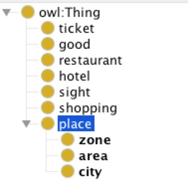
3. 点击“Entities”tab标签，选择“Object properties”标签。在这个界面，本项目创建类之间的关系，即，对象属性。本项目共创建了6种对象属性，包括位于、地处、处在、购物特色、门票、附近。利用OWL提供的"Domains"、"Ranges"特性，本项目约束对象属性的定义域、取值范围；利用OWL提供的"SubpropertyOf"特性，本项目可以定义属性间的继承关系：
    1. 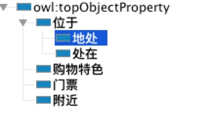
    2. 如下图所示，“地处”对象属性的定义域限制为"shopping"、"restaurant"、"sight"、"hotel"，取值范围限制为"area"、"zone"、"city"，且“地处”是“位于”的子属性；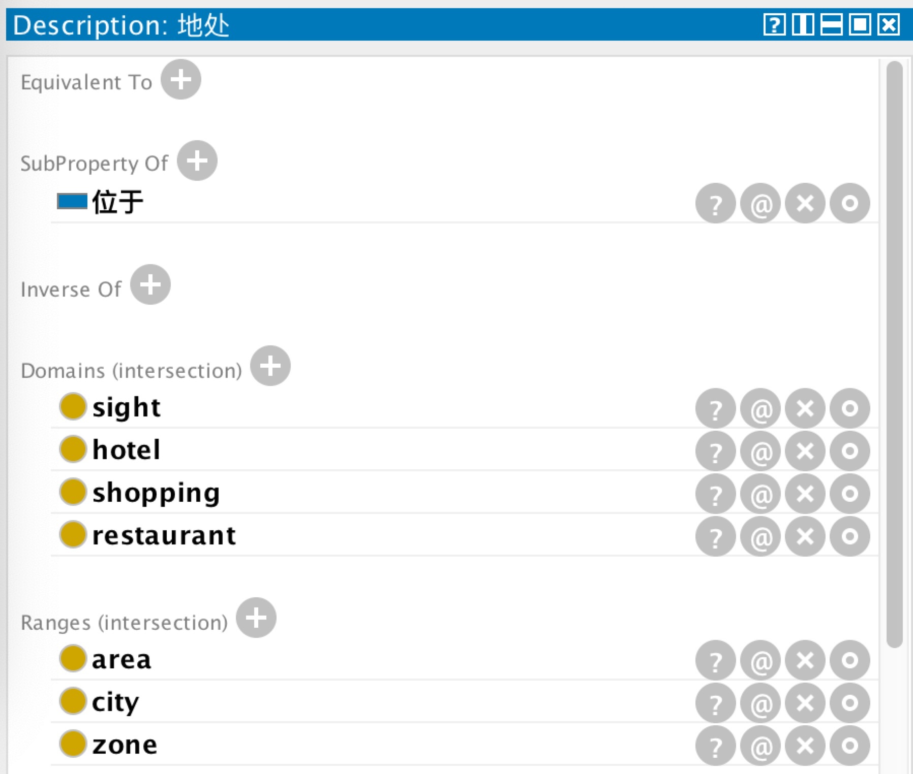
    3. 同理，如下图，“处在”对象属性的定义域限制为"zone"、"area"，取值范围限制为"city"，且“处在”是“位于”的子属性；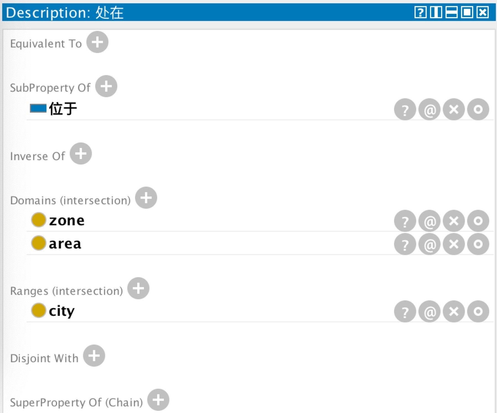
    4. 对于“购物特色”对象属性，本项目约束其定义域为"shopping"，取值范围为"good"；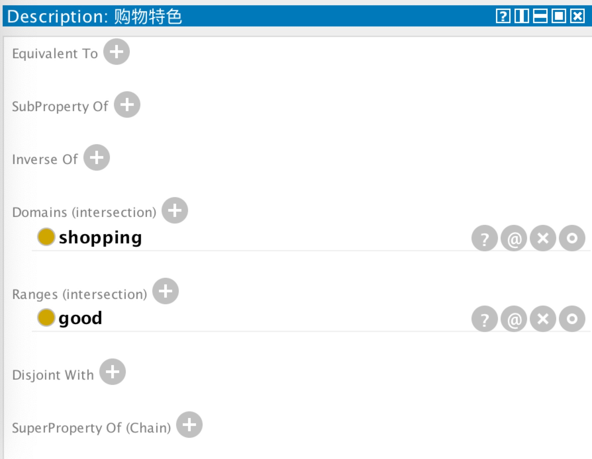
    5. 对于“门票”对象属性，本项目约束其定义域为"sight"，取值范围为"ticket"；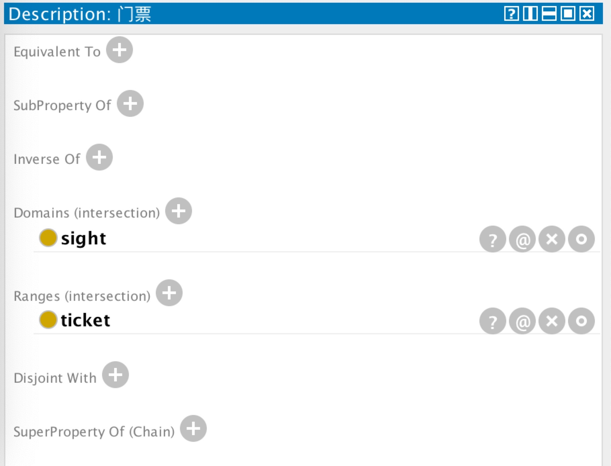
    6. 对于“附近”对象属性，本项目约束其定义域为"sight"、"restaurant"、"shopping"，取值范围为"sight"、"restaurant"、"shopping"；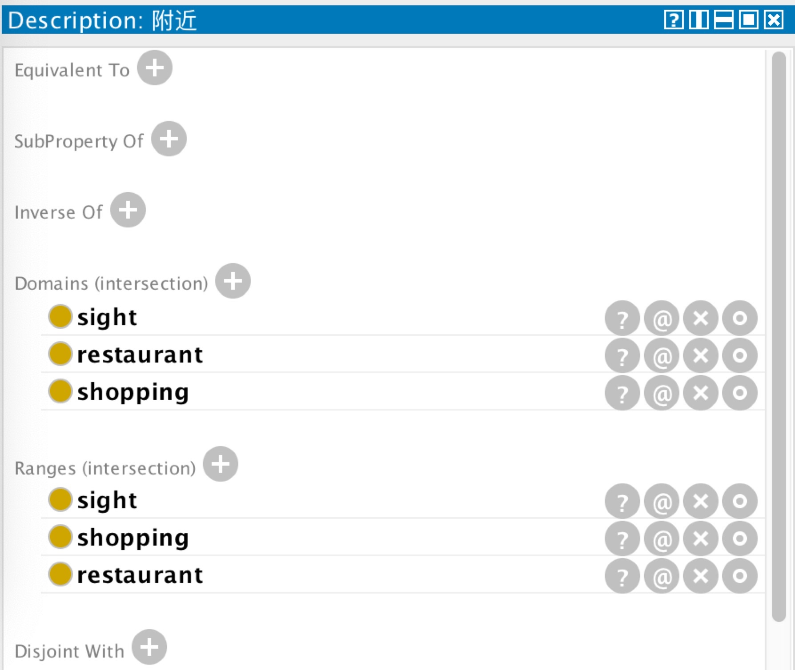

4. 点击“Entities”tab标签，选择“Data properties”标签。在此界面，本项目定义大量的数据属性，用于描述类的特性；OWL提供两种类型的属性，即对象属性与数据属性。对象属性用于刻画类之间的“关系”，不同于对象属性，数据属性用于描述某一特定类的特性。数据属性相当于树的叶子节点，只有入度，而没有出度。其实区分数据属性和对象属性还有一个很直观的方法，我们观察其"range"，取值范围即可。对象属性的取值范围是类，而数据属性的取值范围则是字面量。
    1. 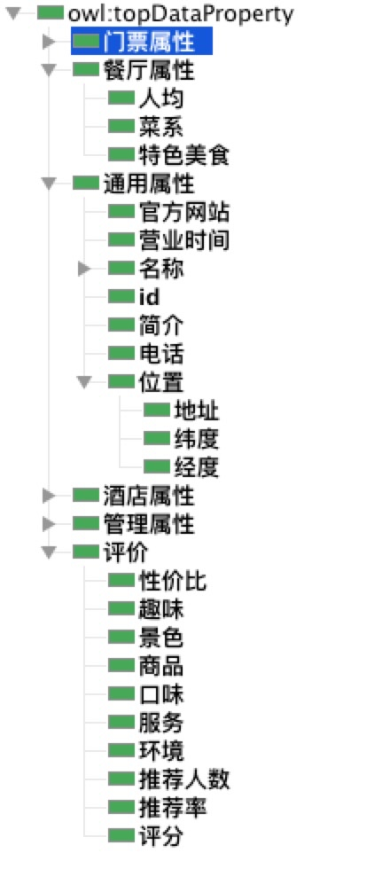
5. protege也支持以可视化的方式来展示本体结构。我们点击"Window"选项，在"Tabs"中选择"OntoGraf"，然后"Entities"旁边就多了一个标签页。在右侧窗口中移动元素，可以很直观地观察本体之间的关系。
    1. 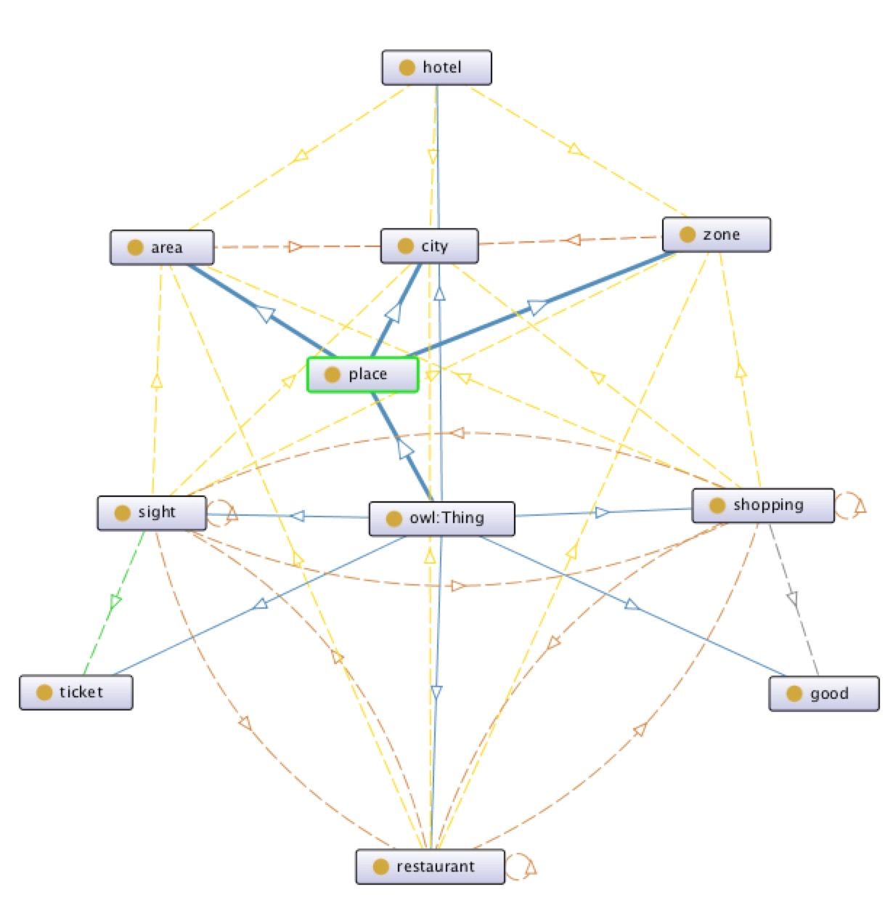

protege本体编辑器参考链接：
1. [protege维基10分钟上手教程](https://protegewiki.stanford.edu/wiki/Protege4Pizzas10Minutes#Create_the_object_properties);
2. [protege软件使用说明](https://wenku.baidu.com/view/d1679c1cbe1e650e52ea99c7.html);

<h2>5. 总结</h2>

本文介绍了海南旅游知识图谱构建过程中的知识抽取步骤与本体建模步骤。通过数据爬取，本文以携程旅游页面上的半结构数据作为输入，并输出得到海南旅游结构化数据，为后续知识图谱构建提供结构化数据；通过使用protege，本文自顶向下定义了海南旅游知识图谱的本体结构。

下一篇中，我们将介绍将结构化数据转换成RDF的几种方法，引导读者实践完成MongoDB中数据转换为RDF格式的数据；

参考链接：
1. [实践篇（一）：数据准备和本体建模](https://zhuanlan.zhihu.com/p/32389370);
2. [从零开始构建知识图谱（一）半结构化数据的获取](http://pelhans.com/2018/08/31/kg_from_0_note1/);


