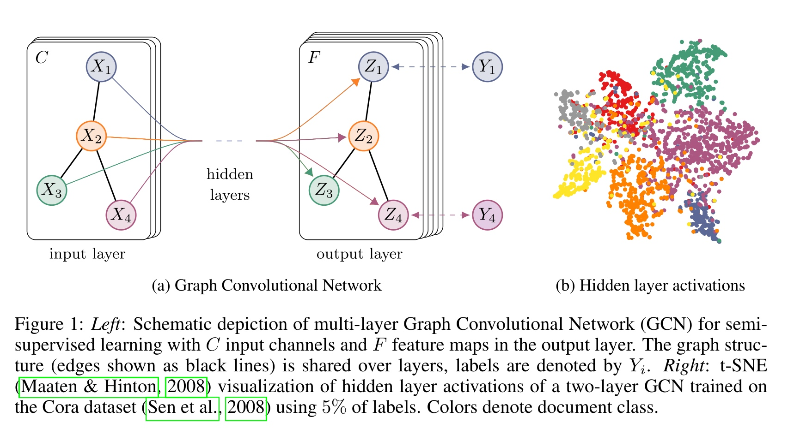
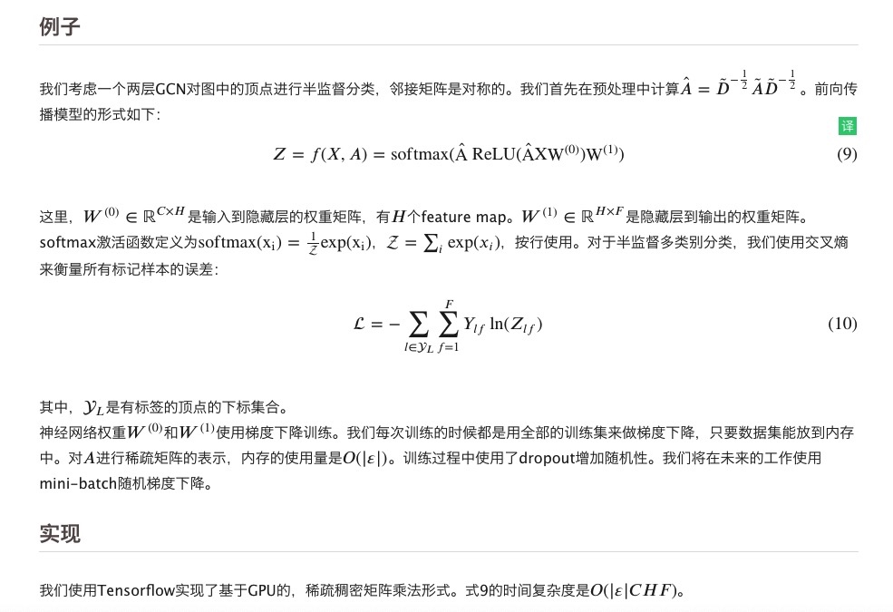

<h1>知识图谱理论篇(十二) --论文阅读SEMI-SUPERVISED CLASSIFICATION WITH GRAPH CONVOLUTIONAL NETWORKS  
</h1>

ICLR 2017。使用谱图理论的图卷积中很重要的一篇论文，提升了图卷积的性能，使用切比雪夫多项式的1阶近似完成了高效的图卷积架构。

<h2>1. 论文阅读---“SEMI-SUPERVISED CLASSIFICATION WITH GRAPH CONVOLUTIONAL NETWORKS
”(ICLR 2017)</h2>

<h3>1. abstract</h3>

1. 提出了一种直接在图结构数据上进行半监督学习的可拓展方法，该方法通过新的GCN模型实现
2. 新的GCN使用切比雪夫一阶多项式近似来实现谱图卷积
3. 模型复杂度与图的边数呈线性关系且训练得到的表示既编码了图结构，又编码了图形特征

<h3>2. introduction</h3>

考虑一个对图顶点分类的问题，图中只有小部分的顶点有标签。该问题可建模成基于图的半监督学习任务，先前方法通常引入图正则化项(Zhu et al., 2003; Zhou et al., 2004; Belkin et al., 2006; Weston et al., 2012)以在整个图上平滑标签信息，例如，通过在loss function使用一个图拉普拉斯正则项（即所有边的2-范数/拉普拉斯范数之和）：

$$\tag{1} \mathcal{L} = \mathcal{L_0} + \lambda \mathcal{L_{reg}}, \rm with \ \mathcal{L_{reg}} = \sum_{i.j}A_{ij} \Vert f(X_i) - f(X_j) \Vert^2 = f(X)^T \Delta f(X)$$

其中，
+ $\mathcal{L_0}$表示图的有标签部分的监督损失
+ $f(\cdot)$表示一个神经网络可微分函数
+ $\lambda$是权重因子
+ $X$是图上所有节点特征向量$X_i$组成的特征矩阵。
+ 考虑𝑁个顶点$v_i \in \mathcal{V}$，边$(v_i, v_j) \in \varepsilon$的无向图，其邻接矩阵$A \in \mathbb{R}^{N \times N}$（二值的或者带权重的），度矩阵$D_{ii} = \sum_jA_{ij}$。

图拉普拉斯正则化项假设相连节点更可能有相同标签，这个假设显然是不恰当的，因为图的边并不一定编码/意味着节点标签相似，然而可能包含着额外信息。

论文贡献：
1. 直接使用神经网络模型$f(X,A)$对所有带标签节点进行有监督的训练，损失函数为$L_0$，无需正则化项。将f()应用于图的邻接矩阵可使模型分发来自有监督损失函数的梯度信息，使其能够同时学习有标签/无标签节点的表示
2. 使用谱图卷积的切比雪夫一阶近似实现新的GCN
3. 论文的GCN模型可用于快速的可拓展的图节点半监督分类

<h3>3. 快速的、近似的图卷积</h3>

论文提出的多层图形卷积网络（GCN）：

$$\tag{2} H^{(l+1)} = \sigma(\tilde{D}^{-\frac{1}{2}} \tilde{A} \tilde{D}^{-\frac{1}{2}} H^{(l)} W^{(l)})$$

其中，
+ $\tilde{A} = A + I_N$是无向图$\mathcal{G}$带自环/自连接的邻接矩阵
+ $I_N$是单位阵
+ $\tilde{D}$是带自环无向图的度矩阵，其中$\tilde{D}_{i,i} = \sum_j \tilde{A}_{i,j}$
+ $W^{(l)} \in \mathbb{R}^{D \times F}$是层训练的权重矩阵，F个卷积核
+ $\sigma(\cdot)$是非线性激活函数
+ $H^{(l)} \in \mathbb{R}^{N \times D}$是第𝑙层的激活矩阵，$H^{(0)} = X$

上述公式为矩阵形式的公式，下面介绍每一个节点的传播公式

$$\tag{3} H^{(l+1)}_{i} = \sigma ( \sum_{j \in N(i)} \frac{ \tilde{A}_{i,j}}{ \tilde{D}^{- \frac{1}{2}}_{i,i}  \tilde{D}^{- \frac{1}{2}}_{j,j}} H^{(l)}_j W^{(l)})$$

+ $\tilde{A}_{i, j}$是无向图$\mathcal{G}$带自环/自连接的邻接矩阵$\tilde{A} = A + I_N$的元素，无权图则为0或者1；
+ $I_N$是单位阵
+ $\tilde{D}$是带自环无向图的度矩阵，其中$\tilde{D}_{i,i} = \sum_j \tilde{A}_{i,j}$
+ $W^{(l)} \in \mathbb{R}^{D \times F}$是层训练的权重矩阵，F个卷积核
+ $H^{(l)}_j \in \mathbb{R}^{D}$是第l层的第j个节点的激活向量/特征向量
+ $H^{(l+1)}_i \in \mathbb{R}^{D}$是第l+1层的第i个节点的激活向量/特征向量

接下来介绍基于谱图理论的GCN的相关工作和论文提出的GCN的理论推导：

1. 相关工作--谱卷积基础、第一代GCN、第二代GCN，参考链接如下
    1. [Convolutional Neural Networks on Graphs with Fast Localized Spectral Filtering](https://github.com/charosen/ClassNotes/blob/master/knowledge_graph/cnn_on_graph_fast_localized_spectral_filtering.md)
    2. [论文笔记：SEMI-SUPERVISED CLASSIFICATION WITH GRAPH CONVOLUTIONAL NETWORKS](https://blog.csdn.net/qq_41727666/article/details/84640549)
2. layer-wise linear model
    1. 第二代GCN定义的卷积公式如下$\tag{4} g_{\theta}^{'} \approx \sum^K_{k=0} {\theta}_k^{'} T_k(\tilde{\Lambda})$，其中$\tilde{\Lambda} = \frac{2}{\lambda_{max}} \Lambda - I_N$，$\lambda_{max}$表示L的最大特征值，而第二代GCN就是通过堆叠上述卷积层实现神经网络的；
    2. 现在**假设K=1**，则图卷积关于拉普拉斯矩阵L是线性的，因此在是图拉普拉斯谱上的线性函数。
    3. **假设$\lambda_{max}$近似等于2**，我们预测神经网络参数可以在训练中适应这个变化。**（why）**，综上近似简化图卷积公式：$\tag{6} g_\theta’ \ast x \approx \theta’_0x + \theta’_1 (L - I_N)x = \theta’_0x - \theta’_1 D^{-\frac{1}{2}} A D^{-\frac{1}{2}} x$
    4. **进一步假设$\theta_0 = - \theta_1 = \theta$**，减少参数数量，防止过拟合；
    5. 综上，一阶近似图卷积公式$\tag{7} g_\theta \ast x \approx \theta(I_N + D^{-\frac{1}{2}} A D^{-\frac{1}{2}}) x$
        1. 注意$I_N + D^{-\frac{1}{2}} A D^{-\frac{1}{2}}$的特征值范围在[0, 2]之间，在深层模型中重复应用这个操作会导致数值不稳定和梯度爆炸、消失的现象。为了减轻这个问题，我们引入了如下的重新正则化技巧：$I_N + D^{-\frac{1}{2}} A D^{-\frac{1}{2}} \to \tilde{D}^{-\frac{1}{2}} \tilde{A} \tilde{D}^{-\frac{1}{2}}$，$\tilde{A} = A + I_N$，$\tilde{D}_{i,i} = \sum_j \tilde{A}_{i,j}$
    6. 将一阶近似图卷积公式推广到C个输入通道的信号$X \in \mathbb{R}^{N \times C}$，和F个滤波器：$\tag{8} Z = \tilde{D}^{-\frac{1}{2}} \tilde{A} \tilde{D}^{-\frac{1}{2}} X \Theta$
        1. $\Theta \in \mathbb{R}^{C \times F}$是滤波器参数矩阵
        2. $Z \in \mathbb{R}^{N \times F}$是卷积后的信号矩阵
        3. 卷积操作的时间复杂度是$O(\vert \varepsilon \vert F C)$，因为$\tilde{A} X$可以被实现成一个稀疏矩阵和一个稠密矩阵的乘积。

<h3>4. 半监督节点分类</h3>

我们已经有了模型f(X,A)，可以在图上有效的传播信息，现在回到半监督节点分类问题上。

我们可以通过调整我们的模型f(X,A)，来放松通常在半监督学习中所做的假设。希望模型可以在【邻接矩阵A中包含着（数据X没有表达出来的）信息】这种情况下更有用。]

整个模型是一个多层的GCN，如图1所示。

<h3>5. 实验</h3>

请参考[论文笔记：SEMI-SUPERVISED CLASSIFICATION WITH GRAPH CONVOLUTIONAL NETWORKS](https://blog.csdn.net/qq_41727666/article/details/84640549)

参考链接：
1. [论文笔记：SEMI-SUPERVISED CLASSIFICATION WITH GRAPH CONVOLUTIONAL NETWORKS](https://blog.csdn.net/qq_41727666/article/details/84640549)
2. [Semi-Supervised Classification With Graph Convolutional Networks](https://davidham3.github.io/blog/2018/07/02/semi-supervised-classification-with-graph-convolutional-networks/)

