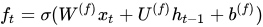

<h1>知识图谱理论篇(九) --堆叠Seq-BiLSTM和Tree-BiLSTM模型有监督关系抽取</h1>

<h2>1. 论文阅读 -- End-to-End Relation Extraction using LSTMs on Sequences and Tree Structures（2016 ACL）</h2>

1. introduction
    1. 传统模型将命名实体识别与关系抽取当成两个独立的任务，实验发现，联合建模实体和关系可提升模型性能；
    2. CNN模型与RNN模型都可用于学习关系表示，RNN可直接学习许多语言结构，例如，词序列、依赖树，但CNN关系抽取性能优于RNN；
    3. RNN性能不佳原因--先前LSTM模型只利用了有限的语言结构和神经网络，且未联合建模实体与关系；
    4. 使用更丰富的、分别作用于互补语言结构（词序列、依赖树）的LSTM结构，同时建模实体和关系，论文模型达到最先进性能；
    5. 论文贡献：
        1. 论文模型使用sequential-LSTM和tree-LSTM同时建模词序列和依赖树子结构信息，并将两个LSTM堆叠起来，可在单一模型中共享参数以联合表示实体与关系；
        2. 在训练过程中使用了entity-pretrain和scheduled sampling等方法进一步提升关系抽取性能；
        3. 基于以上模型，论文比最新基于特征的方法在ACE2005和ACE2004数据集上取得了F1-score12.1%和5.7%的相对错误率下降。针对名词性关系分类任务，在semEval-2010 Task8上取得了和最新的基于CNN方法相当的效果（F1-score）。实验过程中，作者对各模型组件做了大量的ablation analysis；
2. 相关工作
    1. NER:
        1. LSTM-RNN广泛应用于序列标注问题，命名实体识别可视作序列标注问题；
        2. CRF+Bi-LSTM在词性标记、chunking、ner上性能最好；
    2. 关系分类
        1. 传统方法--要是基于feature/kernel的方法（Zelenko 2013，Bunescu & Mooney 2005）
        2. 神经网络方法--基于embeding方法 （Hashinmoto 2015）、基于CNN的方法 （dos Santos 2015）、基于RNN的方法 （Socher 2012）
        3. 传统方法使用的实体间最短依赖路径在神经关系抽取模型中也有用；
        4. 先前的tree-structure的LSTM-RNN限制信息必须自底向上传播，且要求树的子节点必须固定；
3. 模型介绍
    1. 模型架构：
        1. 模型包括三个表示层：第一类是嵌入层，用于表示word、part-of-speech tag、dependency type和entity label；第二类是序列层，用于表示word sequence，这一层是一个双向LSTM-RNN；第三类是依存层，在依存树上表示两个目标词（实体）之间的关系。
    2. 模型细节
        1. 嵌入层--包括多个：词和pos的嵌入作为RNN的输入，entity的嵌入是sequence层的输出，dependency type作为dependency 层的输入；
        2. sequence层--主要描述句子的上下文信息和实体，通过一个双向LSTM-RNN表示句子序列信息，双向LSTM-RNN的单元包括以下信息：
            1. 
            2. 
            3. 
            4. 
            5. 
            6. 
        3. 实体发现层--实体检测任务是一个序列标注任务，文中实体的tag采用BILOU（Begin，Inside，Last，Outside和Unit）编码模式，每个tag表示entity的类型和一个词在entity中的位置。实体发现任务通过两个神经网络层实现：隐藏层$h_{t}^{(e)}$和softmax输出层。
            1. 
            2. 
            3. 在解码过程中，会利用一个已经预测的词标签去预测下一个词的标签。其输入是sequence层的输出和上一个label的embeding结果的连接。
        4. Dependency层--用于描述依存树中一对目标词的关系，这一层主要关注这对目标词在依存树上的最短路径。文中采用了双向树结构的LSTM-RNN来抓住目标词对周围的依存结构，信息可以从根节点传到叶节点，也可从叶节点传到跟节点。对于需要利用页节点附近的argument节点的关系分类任务来说，双向信息传递可以取得更好的效果。Tai 2015也采用了tree-structural的LSTM-RNN，但他们的方法限定类型子节点的数目必须固定。作者提出了tree-structural LSTM-RNN的变种，对于类型相同的子节点共享相同的权重Us，并且允许子节点的数目是可变的。对于有C(t)子节点的LSTM单元，其定义如下：
            1. 
        5. 在sequence层上添加Dependency层
            1. dependency层的第t个LSTM单元的输入$x_{t} = [s_{t};v_{t}^{(d)};v_{t}^{(e)}]$,其中$s_{t}$是sequence层的hidden state向量，$v_{t}^{(d)}4$是dependency标签的embeding，$v_{t}^{(e)}$对应实体预测得到的标签。
        6. 关系分类
            1. 对于两个带有L或U标签（BILOU schema）的词，可以构建一个候选的关系
            2. NN为每一个候选关系预测一个关系标签，并带有方向（除了负关系外，negative relation）候选关系是多个向量的连接$d_{p} = [\uparrow h_{pA};\downarrow h_{p1};\downarrow h_{p2}]$, 其中$d_{p}$是在bottom-up LSTM-RNN中两个目标词对的最近公共祖先（选择top unit）的隐藏状态向量，$\downarrow h_{p1}$和$\downarrow h_{p2}$在top-down LSTM-RNN中两个目标词的隐藏状态向量。
            3. 
        7. 模型训练
            1. 采用了以下优化方法：
            2. BPTT
            3. Adam（Kingma & Ba，2015）with gradient clipping
            4. parameter averaging
            5. L2 regularization
            6. embeding层和final hidden层之前都有dropout
            7. scheduled sampling（Bengio 2015）
            8. entity pretrain
4. 实验结果
    1. 数据
        1. 实验采用了ACE04和ACE05两个数据集用于end-to-end关系抽取，每个数据集包含7个实体类型和6~7个关系类型。
        2. 采用SemEval-2010 Task 8数据集做关系分类，该数据集包含9类名词之间的关系，8000个句子用作训练，2717个句子用作测试。
    2. 结果： 略

参考链接：
1. [论文阅读笔记--End-to-End Relation Extraction using LSTMs on Sequences and Tree Structures](https://zhuanlan.zhihu.com/p/26381714)

