<h1>知识图谱理论篇(六) --权重初始化方法</h1>

在阅读ATT+PCNN远程监督关系抽取模型源码的过程中，我发现模型的位置嵌入使用了xavier初始化方法。基于刘知远老师分享的[Weight Initialization in Neural Networks: A Journey From the Basics to Kaiming](https://towardsdatascience.com/weight-initialization-in-neural-networks-a-journey-from-the-basics-to-kaiming-954fb9b47c79)，本篇将介绍当前使用的所有权重初始化方法。

<h2>1. 权重初始化的重要性</h2>

1. 避免前向传播时层激活输出爆炸或消失，上述任一情况的出现都可能导致反传时[梯度爆炸与梯度消失](https://blog.csdn.net/guoyunfei20/article/details/78283043)(根据BP算法，第i层反传梯度取决于与当前神经元连接的第i+1层梯度、**第i+1层权重、激活函数导数、与当前神经元连接的第i-1层激活输出**)；
2. 模型的目标函数通常是非凸的，好的权重初始化方法能使模型收敛到更好的极小值点，且模型收敛速度更快；

<h2>2. 随机初始化</h2>

最常用的初始化方法是随机初始化方法，但是随机初始化是有弊端的，**假设输入数据服从标准正态分布$x_i \sim N(0, 1)$：**

**使用标准正态分布$w_i \sim N(0, 1)$随机初始化权重（激活输出爆炸）**

考虑100层，每层512个神经元的线性模型（无非线性激活函数），忽略偏置，进行如下实验（图中a矩阵即w权重矩阵）：

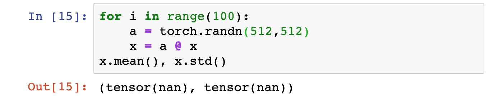

此时，**模型激活输出爆炸**，我们发现模型激活输出爆炸到计算机甚至不能表示其均值和标准差，进一步实验，我们发现模型在第29层时激活输出的方差就已经是nan了：

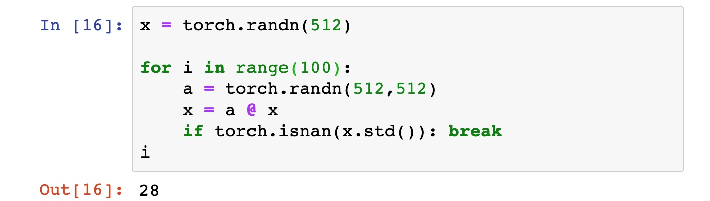

进一步，考虑加入tanh非线性激活函数，参考[聊一聊深度学习的weight initialization](https://zhuanlan.zhihu.com/p/25110150)，10层的神经网络，非线性变换为tanh，每一层的参数都是随机正态分布，均值为0，标准差为1。则每一层输出值分布的直方图：


几乎所有的值集中在-1或1附近，神经元饱和saturated了！注意到tanh在-1和1附近的gradient都接近0，这同样导致了gradient太小，参数难以被更新。

**使用正态分布$w_i \sim N(0, 0.01^2)$随机初始化权重（激活输出消失）**

同样考虑100层，每层512个神经元的线性模型（无非线性激活函数），忽略偏置，进行如下实验（图中a矩阵即w权重矩阵）：

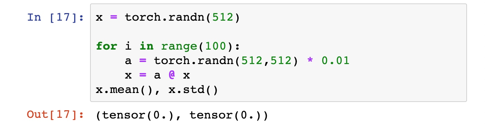

此时，**模型激活输出消失（均值和标准差为0）**，进而导致反传梯度消失，参数无法被更新，无法训练模型；

进一步，考虑加入tanh非线性激活函数，参考[聊一聊深度学习的weight initialization](https://zhuanlan.zhihu.com/p/25110150)，10层的神经网络，非线性变换为tanh，每一层的参数都是随机正态分布，均值为0，标准差为0.01。则每一层输出值分布的直方图：


**缓解随机初始化时激活爆炸/消失的启发式方法--好像是高斯分布下的xavier初始化**

考虑线性模型，经过随机初始化，权值、输入均独立同分布，经过数学推导得知，第i+1层的激活方差可以表示为：

$$Var(x^{i+1}_l) = Var(\sum_{k=1}^{n_i} x^i_k * w^i_{kl}) = \sum_{k=1}^{n_i} Var(w^i_{kl})Var(x^i_k) = n_i Var(w^i)Var(x^i_k)$$

可知，上述梯度爆炸的实验中，第i+1层激活输出方差是第i层激活输出方差的$n_i$=512倍；

启发地，为了能够正常地前向传播，我们应使各层激活输出的方差均相同，即$Var(x^{i+1}) = Var(x^i)$，所以第i层权重的方差应初始化为$Var(w^i) = \frac{1}{n_i}$，实验得：

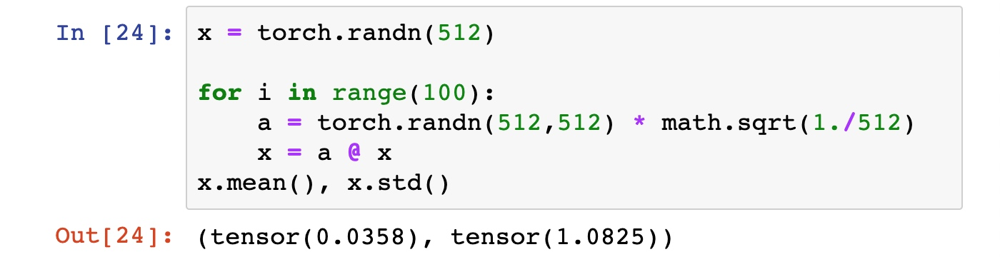

```
W = tf.Variable(np.random.randn(node_in, node_out)) / np.sqrt(node_in)
```

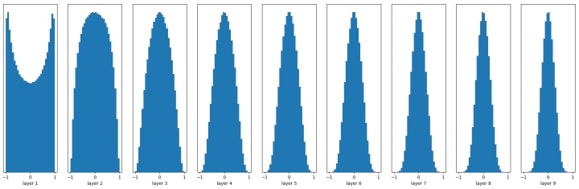

激活既没有爆炸也没有消失，但这是从线性模型上推导的；进一步，加入非线性函数tanh，我们发现这种启发式方法还是会出现激活消失：

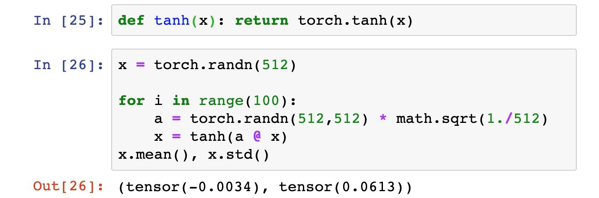

<h2>3. Xavier初始化</h2>

在非线性激活函数的存在时，上述启发式方法效果并不好。为了解决权重初始化问题，Xavier Glorot与Yoshua Bengio发布的论文[Understanding the difficulty of training deep feedforward neural networks](http://proceedings.mlr.press/v9/glorot10a/glorot10a.pdf)提出了一种新的初始化方法--xavier初始化，并与当时常用的启发式方法做比较--使用均匀分布初始化权值$w_i \sim U(\frac{1}{\sqrt{n}}, \frac{1}{\sqrt{n}})$。

常用的启发式方法效果并不好：

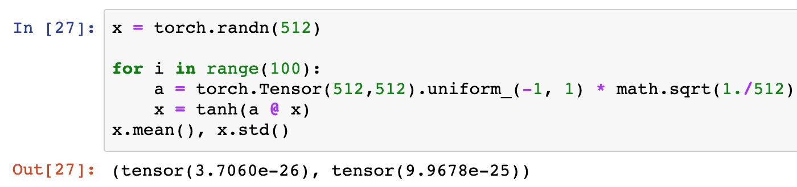

**均匀分布下的xavier（xavier是在线性模型条件（无非线性激活函数）下推导的）**

考虑如下线性模型(激活函数为$f(s^i) = s^i$)，激活函数输入为$\vec s^i = \vec z^iW^i + b^i$，激活输出为$\vec z^{i+1} = f(\vec s^i)$，根据BP算法有：

$$\frac{\partial Cost}{\partial s^i_k} = \frac{\partial Cost}{\partial z^{i+1}_k} \frac{\partial z^{i+1}_k}{\partial s^{i}_k} = W^{i+1}_{k, *} \frac{\partial Cost}{\partial \vec s^{i+1}} f'(s^i_k)$$

$$\frac{\partial Cost}{\partial w^i_{l,k}} = z^i \frac{\partial Cost}{\partial s^i_k}$$

正向传播时，第i层第l个神经元激活方差为（忽略偏置）：

$$\begin{align}
Var(z_l^i) =& Var(f(s_l^{i-1})) \\
= &Var(s_l^{i-1})\\
=& Var(\sum_{k=1}^{n_{i-1}}z_{k}^{i-1}W_{kl}^{i-1})\\
=& \sum_{k=1}^{n_{i-1}}Var(z_{k}^{i-1}W_{kl}^{i-1}) \\
= &{n_{i-1}}Var(W_{kl}^{i-1})Var(z_{k}^{i-1}) \\
= &{n_{i-1}}Var(W^{i-1})Var(z^{i-1})\\
= &Var(x)\prod _{i\prime=0}^{i-1}n_{i\prime}Var(W^{i\prime})
\end{align}$$

反向传播时，梯度的方差为：

$$\begin{align}
Var[\frac{\partial Cost}{\partial s^i_k}] = &Var[ W^{i+1}_{k, *} \frac{\partial Cost} {\partial \vec s^{i+1}} f'(s^i_k)] \\
= &Var[ W^{i+1}_{k, *} \frac{\partial Cost}{\partial \vec s^{i+1}}] \\
= &Var[\sum_{q=1}^{n_i+2} w^{i+1}_{kq} \frac{\partial Cost}{\partial s^{i+1}_q}] \\
= &\sum_{q=1}^{n_i+2} Var[w^{i+1}_{kq} \frac{\partial Cost}{\partial s^{i+1}_q}] \\
=  &\sum_{q=1}^{n_i+2} Var[w^{i+1}_{kq}]Var[ \frac{\partial Cost}{\partial s^{i+1}_q}] \\
= &n_{i+2} Var[w^{i+1}]Var[ \frac{\partial Cost}{\partial s^{i+1}_q}] \\
= &Var[ \frac{\partial Cost}{\partial s^{d}}] \prod _{i\prime=i+1}^{d-1}n_{i\prime+1}Var(W^{i\prime})
\end{align}$$

$$\begin{align}
Var[\frac{\partial Cost}{\partial w^i_{l,k}}] = &Var[z^i]Var[\frac{\partial Cost}{\partial s^i_k}] \\
= &\{Var(x)\prod _{i\prime=0}^{i-1}n_{i\prime} Var(W^{i\prime})\} * \{Var[ \frac{\partial Cost}{\partial s^{d}}] \prod _{i\prime=i+1}^{d-1}n_{i\prime+1}Var(W^{i\prime})\}
\end{align}$$

xavier的核心思想/条件(gorot条件)：

1. 正向传播时，各层激活方差相等（避免激活爆炸/消失）：
    1. 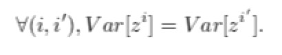

2. 反向传播时，各层梯度方差相等（避免梯度爆炸/消失）：
    1. 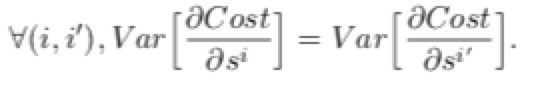

上述条件（gorot条件）可转换为

1. $Var(w_i) = 1 / n_i$
2. $Var(w_i) = 1 / n_{i+1}$

因此，综合正向和反向传播考虑，最终取

$$Var(w_i) = 2 / (n_i + n_{i+1}) $$

对于均匀分布$X \sim U(a, b)$，有
$$E = (a+b) / 2  \\
Var = (b-a)^2 / 12$$

故，对于$w_i$进行初始化时，则有
$$E = (a+b) / 2 = 0  \\
Var = (b-a)^2 / 12 = 2 / (n_i + n_{i+1}) $$
解得
$$a = -b = -\sqrt{6/(n_i + n_{i+1})}$$

即初始化 w_i 为均匀分布
$$w_i \sim U(-\sqrt{6/(n_i + n_{i+1})}, \sqrt{6/(n_i + n_{i+1})})$$

参考链接：
1. [深度学习之参数初始化（一）——Xavier初始化](https://blog.csdn.net/victoriaw/article/details/73000632);
2. [关于参数初始化的若干问题以及Xavier、He初始化推导](https://zhuanlan.zhihu.com/p/40175178);


tensorflow中xavier初始化的源码解析见[TensorFlow源码解读之xavier初始化](https://zhuanlan.zhihu.com/p/48157743);

<h2>4. He初始化</h2>


He初始化基本思想是，当使用ReLU做为激活函数时，Xavier、随机初始化的效果不好，原因在于，当RelU的输入小于0时，其输出为0，相当于该神经元被关闭了，影响了输出的分布模式。Xavier初始化和随机初始化的激活输出的均值均为0，所以有一半概率的激活小于0，有一半概率的神经元被关闭。

因此He初始化，在Xavier的基础上，假设每层网络有一半的神经元被关闭，于是其分布的方差也会变小，实验如下。

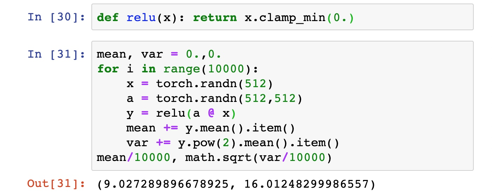

可见，经过relu激活函数，激活输出的方差减小了一半；

进一步验证发现当对初始化值缩小一半时效果最好，故He初始化可以认为是Xavier初始/2的结果。

$$w_i \sim [U(-\sqrt{6/(n_i + n_{i+1})}, \sqrt{6/(n_i + n_{i+1})})] / 2$$

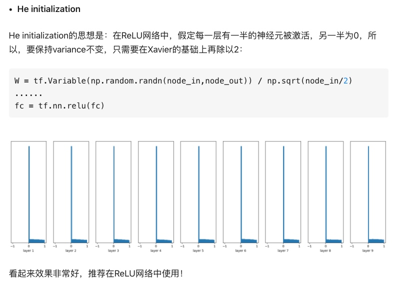

He Kaiming在2015年发布论文[Delving Deep into Rectifiers: Surpassing Human-Level Performance on ImageNet Classification](https://arxiv.org/pdf/1502.01852.pdf)，在论文中提出了新的初始化方法--He初始化，在方法旨在为包含非对称、非线性、Relu-like激活函数的模型提供初始化方法：

1. Create a tensor with the dimensions appropriate for a weight matrix at a given layer, and populate it with numbers randomly chosen from a **standard normal distribution**；(高斯分布的情形，好像不一定用高斯分布，上述xavier的均匀分布例子也可以使用)
2. Multiply each randomly chosen number by √2/√n where n is the number of incoming connections coming into a given layer from the previous layer’s output (also known as the “fan-in”)；
3. Bias tensors are initialized to zero；


<h2>5. 总结</h2>

本篇介绍了许多初始化方法，良好的初始化能够是模型收敛速度更快，收敛到更优的极小值点。当然，本篇并未涵盖所有初始化方法，包括MSRA方法等，这些初始化方法将在后续遇见时再进行补充。

