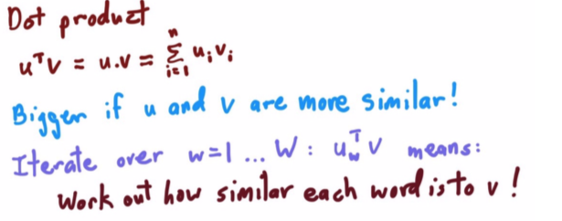
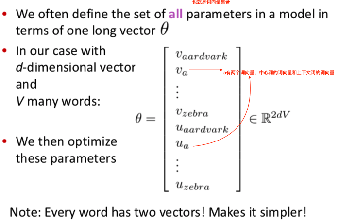

<h1>CS224N 2017 NLP with Deep Learning</h1>

<h2>lecture01: 课程介绍</h2>

<h3>1. 什么是自然语言处理？</h3>

1. NLP：
     1. 交叉学科：计算机科学，人工智能，语言学；
     2. 目标：让计算机理解和处理自然语言；
     3. 终极目标：完全理解与表示语言的意义(meaning)
         1. 完美的语言理解是一个`AI-complete`问题；
2. NLP涉及的层次/语言学对语言层次的传统描述：
     1. 
3. NLP应用：
    1. 简单应用：eg，拼写检查、关键词检索...
    2. 复杂应用：
        1. 文本挖掘：从文本中抽取特定信息；
        2. 文本分类：eg，文档的阅读难度reading level；文档的情感分析；
    3. 更复杂应用：
        1. 机器翻译Machine Translation
        2. 口语对话系统Spoken dialog systems
        3. 复杂问答系统Complex question answering

<h3>2. 人类语言的特点</h3>

1. 人类语言并不是需要你处理成有用信息的一堆海量数据，它是指向性明确的、将某条具体信息传递给其他人的通信方式；
2. 人类语言的**定义**：一个离散的discrete/符号的symbolic/标称的categorical的信号系统；
    1. 使用“符号”进行通信，eg，火箭=🚀，小提琴=🎻...
    2. 存在极少数非符号的、富有表现力的信号；
    3. （信息论）符号在通信中具有高可靠性（why most of symbol）；
3. 人类语言**沟通的具体方式**：使用多种连续的载体来承载离散的语言符号，eg，声音、手势、图片...
    1. 语言在大脑中的表示是**连续**的；
    2. 语言的传播媒介是**连续**的；
    3. 语言本身是符号/**离散**/标称的信号系统--**存在稀疏性sparsity问题**；
    4. DP4NLP核心思想：为原始语言数据寻找合适的**连续特征表示**，并使用**连续的激活模式continuous pattern of activation**来处理连续特征表示；

<h3>3. 什么是深度学习</h3>

1. Machine Learning: 90%人工发现问题关键、人工设计特征+10%机器参数优化/数值优化numeric optimization
2. Deep Learning:
    1. 机器学习的子领域、表示学习的分支；
    2. 无需人工设计特征，自动学习出原始数据的（多层）特征表示；
3. Why Deep Learning?
    1. 人工定义的特征：太过具体、不完整、耗时...
    2. 学习得到的特征：方便拓展、学习快
    3. ...
4. 深度学习的崛起：
    1. 第一个突破--语音识别：Context-Dependent Pre-trained Deep Neural Networks for Large Vocabulary Speech Recognition Dahl et al. (2010)；
    2. 第二个突破--计算机视觉：ImageNet Classification with Deep Convolutional Neural Networks by Krizhevsky, Sutskever, & Hinton, 2012, U. Toronto. 37% error red.

<h3>4. NLP难在哪</h3>

1. 人类语言存在歧义；
2. 人类语言理解需要真实世界知识、常识、上下文知识...

<h3>5. DP for NLP</h3>

1. DP4NLP：结合NLP的思想与DP的方法来解决NLP的问题
2. DP运用于：
    1. NLP的不同层级LEVELS：语音speech, 词word, 句子syntax, 语义semantics...
    2. NLP的不同工具TOOLS：词性parts-of-speech, 实体entities, 解析parsing...
    3. NLP的不同应用：machine translation, sentiment analysis, dialogue agents, question ansewring...
3. DP4NLP应用：
    1. 词向量word vectors表示词义word meaning，本质将词义映射到高维向量空间；
        1. 

    2. 词向量word vectors计算词相似度；
        1. 
    3. DP on NLP LEVELS--词素morphemes级别的特征表示：
        1. words are made of morphemes:eg, prefix + stem + suffix(un + interest + ed)...
        2. `Luong et al. 2013`: every morpheme is a vector
        3. 
    4. DP on NLP Tools--依存句法分析：
        1. 
    5. DP on NLP LEVELS--语义级别的特征表示：
        1. `Bowman et al. 2014`: every word and every phrase and every logical expression is a vector；
        2. 
    6. DP on NLP APPLICATIONS--
        1. 情感分析：RecursiveNN...
        2. QA：...
        3. 对话机器人：Google inbox suggested replies
        4. 神经机器翻译Neural Machine Translation：Sutskever et al. 2014, Bahdanau et al. 2014, Luong and Manning 2016
4. **总结：DP4NLP的所有级别的特征表示都是向量！！！**

<h2>lecture02: 词向量</h2>

<h3>1. 词表示word representations</h3>

1. 词义word meaning：
    1. 词典对词义的定义；
    2. 语言学对词义的定义：
        1. signifier（语言学符号） <=指代=>  signified(idea or thing)=denotaion（世界上的某些具体事物/指代物）；
2. 词表示方法methods of word representation：
    1. 离散表示discrete representation：
        1. 使用分类机制taxonomy表示，eg，WordNet，包含了同义词集（synonym）和上位词集（hypernym）等等；
            1. 缺点：
                1. 无法表示词的细微差异，eg，expert，good...
                2. 无法衡量词间相似度；
                3. ...
            2.  
        2. 独热表示one-hot representation：在**任意时候，只有一位为1，其余位为0**；
            1. **语料的词表vocabulary有多少个词，每个词的独热词向量就要多长**；
                1. eg，考虑一下的三个特征： ["male", "female"] ["from Europe", "from US", "from Asia"] ["uses Firefox", "uses Chrome", "uses Safari", "uses Internet Explorer"]将它换成独热编码后，应该是：
                    1. feature1=[01,10] # 词表长度为2；
                    2. feature2=[001,010,100] # 词表长度为3；
                    3. feature3=[0001,0010,0100,1000] # 词表长度为4；
            2. 优点：
                1. 单词符号的数字化，模型可以处理；
                2. 用Hash表给每个词分配一个编号就可以编程实现。这么简洁的表示方法配合上最大熵、SVM、CRF 等等算法已经很好地完成了 NLP 领域的各种主流任务。
            3. 缺点：
                1. **不考虑词间顺序**；
                2. **词间相互独立（正交），无法衡量词间相似度**；
                3. **得到的特征是离散稀疏的，维度灾难**；
                    1. eg，将世界所有城市名称作为语料库的话，那这个向量会过于稀疏，并且会造成维度灾难。
                        1. 杭州 [0,0,0,0,0,0,0,1,0,……，0,0,0,0,0,0,0] 上海 [0,0,0,0,1,0,0,0,0,……，0,0,0,0,0,0,0] 宁波 [0,0,0,1,0,0,0,0,0,……，0,0,0,0,0,0,0] 北京 [0,0,0,0,0,0,0,0,0,……，1,0,0,0,0,0,0]
                        2. 在语料库中，杭州、上海、宁波、北京各对应一个向量，向量中只有一个值为1，其余都为0。
    2. 分布式表示distributed representation：
        1. 词的分布表示distributional representation：基于分布假说的词表示方法；
            1. 分布假说：
                1. Harris 在 1954 年提出的**分布假说（Distributional Hypothesis）**为这一设想提供了理论基础：**上下文相似的词，其语义也相似**；
                2. Firth 在 1957 年对分布假说进行了进一步阐述和明确：**词的语义由其上下文决定**（a word is characterized by thecompany it keeps）。
            2. 词的分布表示的分类：
                1. 基于矩阵的分布表示；
                2. 基于聚类的分布表示；
                3. 基于神经网络的分布表示；
            3. 分布表示的核心思想：
                1. 选择一种方式表示上下文；
                2. 选择一种模型刻画某个词（下文称“目标词”）与其上下文之间的关系。
    3. **分布表示Distributional Representation与分布式表示Distributed Representation的区别(划重点)**：
        1. **分布表示Distributional Representation**：基于分布假说，使用词的上下文表示语义的词表示方法，通常基于共现计数；
        2. **分布式表示Distributed Representation**：分布式表示是若干元素的连续表示形式。分布式（distributed）描述的是把语义信息分布式地存储在向量的各个维度中，与之相对的是局部表示（local representation），如词的独热表示（one-hot representation），在高维向量中只有一个维度描述了词的语义。
        3. 参考资料：[NLP-分布表示(distributional representation)与分布式表示(distributed representation)](https://blog.csdn.net/spring_willow/article/details/81452162)；

<h3>2. Word2Vec介绍</h3>

1. 核心trick：为某一任务（语言模型任务）训练神经网络模型（神经网络语言模型），但是并不用该模型来完成该任务，而是获取模型的隐藏层权重（词向量）；
    1. 你可能在别的地方也见过这个trick，eg，无监督特征学习时，训练一个auto-encoder来使用encoder压缩特征到隐藏层，使用decoder解压回原特征，希望尽可能恢复输入特征；但是训练完后，去除decoder，只保留encoder来获得输入特征的压缩特征表示；
2. 两套算法：
    1. Skip-Grams:
        1. 中心词预测上下文词；
    2. Continuous Bag of Words(CBOW):
        1. 上下文词预测中心词；
3. 两个训练trick：
    1. Hierarchical Softmax;
    2. Negative sampling;
4. Skip-Grams详解：
    1. 目标函数：xx的最大似然<==>最小交叉熵；
        1. 最大似然：
        2. 最小交叉熵：
    2. 点积：word2vec词向量语义相似度的衡量标准；
        1. 
        2. why dot product？
            1. word vector维度相同，所以不需要cosine相似度来归一化；
            2. 内积越大，两个向量夹角越小，语义越相似；
    3. softmax函数：
        1. 
        2. 将实数映射成概率分布；
        3. 软max：类似一种max函数，softmax大幅度扭曲了原数据的数据规模，越大的值被放大得越大；
    4. Skip-Gram流程：
        1. 
            1. 输入层：中心词的one-hot encoding，size为Vx1；
            2. 隐藏层权重W：中心词词向量的look up table矩阵，size为dxV；矩阵乘法（列图像）导致，W * one-hot即选出W的某一列，即对于输入词的Word2Vec词向量；
            3. 隐藏层向量：即Word2Vec词向量，size为1xd；
            4. 共享的输出层权重W'：上下文词词向量的look up table矩阵，size为Vxd，每一行为上下文词的词向量；
            5. 输出**一个**上下文词的softmax概率分布，只有一个概率分布！！共享输出层矩阵！！（输出层输出均一样）；
    5. 参数数量：2dxV，两个不同的隐藏层权重W和输出层权重W'；
        1. 每个单词都学习了两种词向量：中心词词向量、上下文词词向量；
        2. 
    6. 求梯度：
        1. 手算：
            1. 对Vc
            2. 对Uo
        2. 机器：
            1. Full Batch Gradient Descent
            2. Stochastic Gradient Descent(SGD)

参考资料：
1. [Word2Vec Tutorial - The Skip-Gram Model](http://mccormickml.com/2016/04/19/word2vec-tutorial-the-skip-gram-model/);
2. [Word2Vec Tutorial Part 2 - Negative Sampling](http://mccormickml.com/2017/01/11/word2vec-tutorial-part-2-negative-sampling/);
3. [自然语言处理学习笔记（一）---词表示与语言模型学习](https://github.com/charosen/ClassNotes/blob/master/nlp_learning/%E8%AF%8D%E8%A1%A8%E7%A4%BA%E4%B8%8E%E8%AF%AD%E8%A8%80%E6%A8%A1%E5%9E%8B.md);

<h2>lecture03: </h2>

    
