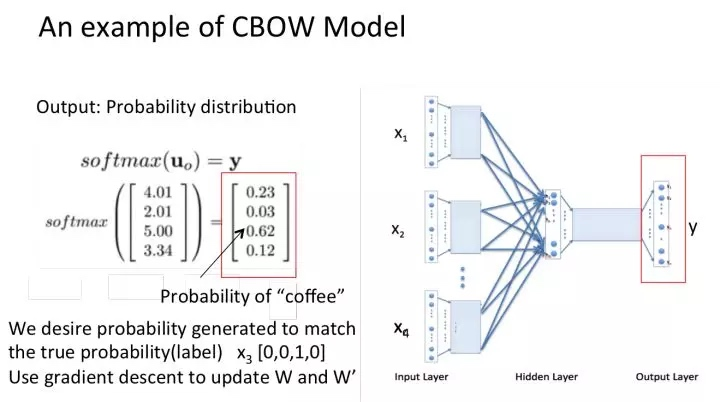

# 自然语言处理学习笔记（一）---词表示与语言模型学习

近日，实验室要求写关于中文词向量训练的自然语言处理技术报告。借着写报告的机会，本人作为nlp的小菜鸟，正好学习学习关于词表示word representation和语言模型language model的相关知识。

<h3>0. 前言</h3>

在写中文词向量训练的技术报告过程中，本人遇到了不少术语，比如*词向量、词嵌入Word Embedding、分布式表示distributed representation、分布表示distributional representation、Word2Vec、GloVe*等等。

这些术语分别代表什么？术语之间的关系是什么？这些促使我总结了这篇学习笔记。

<h3>1. 词表示Word Representation方法</h3>

词表示Word Representation方法分为**独热表示One-hot Representation**和**分布式表示Distributed Representation**。

<h4>1.0. 词的独热表示One-hot Representation
</h4>

词的独热编码是自然语言处理中最直接、最简单的词表示方法。

独热编码One-hot Encoding，又称一位有效编码，其方法是**使用N位状态寄存器**(学过数字电路的小伙伴们应该对它不陌生)**来对N个状态进行编码，每个状态都有它独立的寄存器位**，并且在**任意时候**，其中只有一位有效(**只有一位为1，其余位为0**)。

举个栗子，假设我们有四个样本（行），每个样本有三个特征（列）：

我们的feature_1有两种可能的取值，比如是男/女，这里男用1表示，女用2表示。feature_2 和feature_3各有4种取值（状态）。one-hot编码就是**保证每个样本中的单个特征只有1位处于状态1，其他的都是0**。上述状态用one-hot编码如下图所示：

考虑一下的三个特征：
["male", "female"]
["from Europe", "from US", "from Asia"]
["uses Firefox", "uses Chrome", "uses Safari", "uses Internet Explorer"]

将它换成独热编码后，应该是：
(**注意词表有多少个词，每个词的词向量就有多长**)

feature1=[01,10]  # 词表长度为2
feature2=[001,010,100]  # 词表长度为3
feature3=[0001,0010,0100,1000]  # 词表长度为4

**优缺点分析**

**优点**：

1. 单词符号的数字化，使模型可以处理；
2. 用Hash表给每个词分配一个编号就可以编程实现。这么简洁的表示方法配合上最大熵、SVM、CRF 等等算法已经很好地完成了 NLP 领域的各种主流任务。

**缺点**：

1. **不考虑词间顺序**（文本中词的顺序信息也含有语义）
2. **假设词与词相互独立，无法表示在语义层面上词与词之间的相关信息；**（在大多数情况下，词与词是相互影响的）；
3. **得到的特征是离散稀疏的**；

比如如果将世界所有城市名称作为语料库的话，那这个向量会过于稀疏，并且会造成维度灾难。

杭州 [0,0,0,0,0,0,0,1,0,……，0,0,0,0,0,0,0]
上海 [0,0,0,0,1,0,0,0,0,……，0,0,0,0,0,0,0]
宁波 [0,0,0,1,0,0,0,0,0,……，0,0,0,0,0,0,0]
北京 [0,0,0,0,0,0,0,0,0,……，1,0,0,0,0,0,0]

在语料库中，杭州、上海、宁波、北京各对应一个向量，向量中只有一个值为1，其余都为0。

参考链接：[通俗理解word2vec](https://www.jianshu.com/p/471d9bfbd72f)；

<h4>1.1. 词的分布式表示Distributed Representation</h4>

 传统的独热表示（One-hot Representation）仅仅将词符号化，不包含任何语义信息。如何将语义融入到词表示中？Harris 在 1954 年提出的**分布假说（Distributional Hypothesis）**为这一设想提供了理论基础：**上下文相似的词，其语义也相似**。Firth 在 1957 年对分布假说进行了进一步阐述和明确：**词的语义由其上下文决定**（a word is characterized by thecompany it keeps）。
 
 基于分布假说的词表示方法，根据建模的不同，主要可以分为三类：
 
 1. 基于矩阵的分布表示；
 2. 基于聚类的分布表示；
 3. 基于神经网络的分布表示。

尽管这些不同的分布表示方法使用了不同的技术手段获取词表示，但由于这些方法均基于分布假说，它们的核心思想也都由两部分组成：

1. 选择一种方式表示上下文；
2. 选择一种模型刻画某个词（下文称“目标词”）与其上下文之间的关系。

**分布表示Distributional Representation与分布式表示Distributed Representation的区别(划重点)**：
 
 + **分布表示Distributional Representation**：基于分布假说，使用词的上下文表示语义的词表示方法，通常基于共现计数；
 + **分布式表示Distributed Representation**：分布式表示是若干元素的连续表示形式。分布式（distributed）描述的是把语义信息分布式地存储在向量的各个维度中，与之相对的是局部表示（local representation），如词的独热表示（one-hot representation），在高维向量中只有一个维度描述了词的语义。

一般来说，通过矩阵降维或神经网络降维可以将语义分散存储到向量的各个维度中，因此，这类方法得到的低维向量一般都可以称作分布式表示。

参考资料：[NLP-分布表示(distributional representation)与分布式表示(distributed representation)](https://blog.csdn.net/spring_willow/article/details/81452162)

<h3>2. 语言模型</h3>

语言模型是自然语言处理中的重要概念。

语言模型分为**文法语言模型**和**统计语言模型**。

**统计语言模型**：统计语言模型把语言（词的序列）看作一个随机事件，并赋予相应的概率来描述其属于某种语言集合的可能性。

给定一个词汇集合V，对于一个由V中的词构成的序列$$S =  ⟨w_1, · · · , w_T ⟩ ∈ V_n$$，统计语言模型赋予这个序列一个概率P(S)，来衡量S符合自然语言的语法和语义规则的置信度。

语言模型就是计算一个句子的概率大小的模型，一个句子的打分概率越高，越说明他是更合乎人说出来的自然句子。

常见的统计语言模型有N元文法模型（N-gram Model），最常见的是unigram model、bigram model、trigram model等等。

形式化讲，**统计语言模型的作用是为一个长度为m的字符串确定一个概率分布** $P(w_1; w_2; :::; w_m)$，表示其存在的可能性，其中$w_1$到$w_m$依次表示这段文本中的各个词。一般在实际求解过程中，通常采用下式计算其概率值：

上面的条件使用了马尔可夫模型。

同时通过这些方法均也可以保留住一定的词序信息，这样就能把一个词的上下文信息capture住。

<h3>3. 词的分布式表示Distributed Representation</h3>

<h4>3.0. 基于矩阵的分布表示</h4>

基于矩阵的分布表示通常又称为分布语义模型，在这种表示下，矩阵中的一行，就成为了对应词的表示，这种表示描述了该词的上下文的分布。由于分布假说认为上下文相似的词，其语义也相似，因此在这种表示下，两个词的语义相似度可以直接转化为两个向量的空间距离。

常见到的Global Vector 模型（ GloVe模型）是一种对“词-词”矩阵进行分解从而得到词表示的方法，属于基于矩阵的分布表示。

<h4>3.1. 基于聚类的分布表示</h4>

基于聚类的分布表示我也还不是太清楚，所以就不做具体描述。

<h4>3.2. 基于神经网络的分布表示，词嵌入（ word embedding）</h4>

**基于神经网络的分布表示一般称为词向量、词嵌入（word embedding）**。

神经网络词向量表示技术通过神经网络技术对上下文，以及上下文与目标词之间的关系进行建模。由于神经网络较为灵活，这类方法的最大优势在于可以表示复杂的上下文。在前面基于矩阵的分布表示方法中，最常用的上下文是词。如果使用包含词序信息的 n-gram 作为上下文，当 n 增加时， n-gram 的总数会呈指数级增长，此时会遇到维数灾难问题。而神经网络在表示 n-gram 时，可以通过一些组合方式对 n 个词进行组合，参数个数仅以线性速度增长。有了这一优势，神经网络模型可以对更复杂的上下文进行建模，在词向量中包含更丰富的语义信息。

<h3>4. 词嵌入</h3>

<h4>4.0. 概念</h4>

基于神经网络的分布表示又称为词向量、词嵌入；

前面提到过，为了选择一种模型刻画某个词（下文称“目标词”）与其上下文之间的关系，我们需要在词向量中capture到一个词的上下文信息。同时，上面我们恰巧提到了统计语言模型正好具有捕捉上下文信息的能力。那么构建上下文与目标词之间的关系，最自然的一种思路就是使用语言模型。从历史上看，早期的词向量只是神经网络语言模型的副产品。

 2001年， Bengio 等人正式提出神经网络语言模型（Neural Network Language Model ，NNLM），该模型在学习语言模型的同时，也得到了词向量。所以请注意一点：**词向量可以认为是神经网络训练语言模型的副产品。**
 
<h4>4.1. 理解</h4>
 
one-hot表示法具有维度过大的缺点，那么现在将vector做一些改进：1、将vector每一个元素由整形改为浮点型，变为整个实数范围的表示；2、将原来稀疏的巨大维度压缩嵌入到一个更小维度的空间。

这也是词向量又名词嵌入的缘由了。

<h3>5. 神经网络语言模型与Word2Vec</h3>

<h4>5.0. 神经网络语言模型</h4>

神经网络语言模型大致有这么些个：

1. Neural Network Language Model ，NNLM
2. Log-Bilinear Language Model， LBL
3. Recurrent Neural Network based Language Model，RNNLM
4. Collobert 和 Weston 在2008 年提出的 C&W 模型
5. Mikolov 等人提出了 CBOW（ Continuous Bagof-Words）和 Skip-gram 模型

<h4>5.1. CBoW与Skip-Gram</h4>

**传统基于神经网络的CBoW与Skip-Gram**

word2vec模型其实就是简单化的神经网络。（不明白神经网络的请自行搜索）

输入是One-Hot Vector，Hidden Layer没有激活函数，也就是线性的单元。Output Layer维度跟Input Layer的维度一样，用的是Softmax回归。当这个模型训练好以后，我们并不会用这个训练好的模型处理新的任务，我们真正需要的是这个模型通过训练数据所学得的参数，例如隐层的权重矩阵。

这个模型是如何定义数据的输入和输出呢？一般分为CBOW(Continuous Bag-of-Words 与Skip-Gram两种模型。CBOW模型的训练输入是某一个特征词的上下文相关的词对应的词向量，而输出就是这特定的一个词的词向量。　Skip-Gram模型和CBOW的思路是反着来的，即输入是特定的一个词的词向量，而输出是特定词对应的上下文词向量。CBOW对小型数据库比较合适，而Skip-Gram在大型语料中表现更好。

**CBOW(Continuous Bag-of-Words)**

CBOW的训练模型如图所示

1. 输入层：上下文单词的onehot.  {假设单词向量空间dim为V，上下文单词个数为C}
2. 所有onehot分别乘以共享的输入权重矩阵W. {VxN矩阵，N为自己设定的数，初始化权重矩阵W}
3. 所得的向量 {因为是onehot所以为向量} 相加求平均作为隐层向量, size为1xN.
4. 乘以输出权重矩阵W' {NxV}
5. 得到向量 {1xV} 激活函数处理得到V-dim概率分布  {PS: 因为是onehot嘛，其中的每一维斗代表着一个单词}
6. 概率最大的index所指示的单词为预测出的中间词（target word）与true label的onehot做比较，误差越小越好（根据误差更新权重矩阵）

所以，需要定义loss function（一般为交叉熵代价函数），采用梯度下降算法更新W和W'。训练完毕后，输入层的每个单词与矩阵W相乘得到的向量的就是我们想要的词向量（word embedding），这个矩阵（所有单词的word embedding）也叫做look up table（其实聪明的你已经看出来了，其实这个look up table就是矩阵W自身），也就是说，任何一个单词的onehot乘以这个矩阵都将得到自己的词向量。有了look up table就可以免去训练过程直接查表得到单词的词向量了。

举个栗子：

窗口大小是2，表示选取coffe前面两个单词和后面两个单词，作为input词。

假设我们此时得到的概率分布已经达到了设定的迭代次数，那么现在我们训练出来的look up table应该为矩阵W。即，任何一个单词的one-hot表示乘以这个矩阵都将得到自己的word embedding。

**Skip-Gram**

从直观上理解，Skip-Gram是给定input word来预测上下文。
接下来我们来看看如何训练我们的神经网络。假如我们有一个句子“The dog barked at the mailman”。

首先我们选句子中间的一个词作为我们的输入词，例如我们选取“dog”作为input word；
有了input word以后，我们再定义一个叫做skip_window的参数，它代表着我们从当前input word的一侧（左边或右边）选取词的数量。如果我们设置skip_window=2，那么我们最终获得窗口中的词（包括input word在内）就是['The', 'dog'，'barked', 'at']。skip_window=2代表着选取左input word左侧2个词和右侧2个词进入我们的窗口，所以整个窗口大小span=2x2=4。另一个参数叫num_skips，它代表着我们从整个窗口中选取多少个不同的词作为我们的output word，当skip_window=2，num_skips=2时，我们将会得到两组 (input word, output word) 形式的训练数据，即 ('dog', 'barked')，('dog', 'the')。

神经网络基于这些训练数据将会输出一个概率分布，这个概率代表着我们的词典中的每个词是output word的可能性。这句话有点绕，我们来看个栗子。第二步中我们在设置skip_window和num_skips=2的情况下获得了两组训练数据。假如我们先拿一组数据 ('dog', 'barked') 来训练神经网络，那么模型通过学习这个训练样本，会告诉我们词汇表中每个单词是“barked”的概率大小。

模型的输出概率代表着到我们词典中每个词有多大可能性跟input word同时出现。举个栗子，如果我们向神经网络模型中输入一个单词“中国“，那么最终模型的输出概率中，像“英国”， ”俄罗斯“这种相关词的概率将远高于像”苹果“，”蝈蝈“非相关词的概率。因为”英国“，”俄罗斯“在文本中更大可能在”中国“的窗口中出现。我们将通过给神经网络输入文本中成对的单词来训练它完成上面所说的概率计算。

下面的图中给出了一些我们的训练样本的例子。我们选定句子“The quick brown fox jumps over lazy dog”，设定我们的窗口大小为2（window_size=2），也就是说我们仅选输入词前后各两个词和输入词进行组合。下图中，蓝色代表input word，方框内代表位于窗口内的单词。Training Samples（输入， 输出）

我们的模型将会从每对单词出现的次数中习得统计结果。例如，我们的神经网络可能会得到更多类似（“中国“，”英国“）这样的训练样本对，而对于（”英国“，”蝈蝈“）这样的组合却看到的很少。因此，当我们的模型完成训练后，给定一个单词”中国“作为输入，输出的结果中”英国“或者”俄罗斯“要比”蝈蝈“被赋予更高的概率

参考链接：[通俗理解word2vec](https://www.jianshu.com/p/471d9bfbd72f)

**Word2Vec中的trick**

1. [word2vec原理(一) CBOW与Skip-Gram模型基础](https://www.cnblogs.com/pinard/p/7160330.html)
2. [word2vec原理(二) 基于Hierarchical Softmax的模型](http://www.cnblogs.com/pinard/p/7243513.html)
3. [word2vec原理(三) 基于Negative Sampling的模型](http://www.cnblogs.com/pinard/p/7249903.html)

参考资料：
1. [刘建平的博客](https://www.cnblogs.com/pinard/category/894695.html)
2. [NLP秒懂词向量Word2vec的本质](https://zhuanlan.zhihu.com/p/26306795)--这篇知乎答复提供Word2Vec学习路径（几篇论文）

后半部分暂时还没总结和整理，主要是搬运大佬的内容

